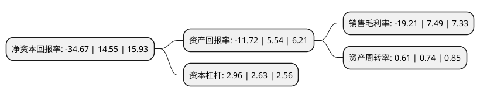

> 本页面由自动化程序生成于 2022年5月20日 01:06
> 内容可能存在错误，如有bug请提交issue至：https://github.com/Eroleice/doc-pi/issues
{.is-warning}

# 上市公司基本情况

## 基本资料

苏州金螳螂建筑装饰股份有限公司（以下简称“金螳螂”）成立于1993年01月06日，苏州市。于2006年11月20日在深交所中小板上市。

金螳螂注册资本267,134.369万元，主营业务:承接酒店，写字楼，图书馆，医院，体育场馆等公共装饰工程的设计及施工;建筑幕墙工程的制作和施工;木制品制作等以下是详细信息：

- 公司名称: 苏州金螳螂建筑装饰股份有限公司
- 股票代码: 002081.SZ
- 所在地: 江苏 - 苏州市
- 成立日期: 1993年01月06日
- 注册资本: 267,134.369万元
- 法定代表人: 王汉林
- 主营业务: 主营业务:承接酒店，写字楼，图书馆，医院，体育场馆等公共装饰工程的设计及施工;建筑幕墙工程的制作和施工;木制品制作等
- 公司官网: www.goldmantis.com
- 公司介绍: 公司是一家以室内装饰为主体，融幕墙、景观、软装、家具、机电设备安装等为一体的综合性专业化装饰集团。公司承接的项目包括公共建筑装饰和住宅装饰等，涵盖酒店装饰、商业建筑装饰、交通运输基础设施装饰、文体会展建筑装饰、住宅装饰等多种业务形态。公司拥有《建筑装修装饰工程专业承包一级》、《建筑装饰工程设计专项甲级》、《建筑工程施工总承包壹级》等资质证书，具备承接各类建筑装饰工程的资格和能力，是建筑装饰企业中资质级别最高、资质种类最多的企业之一。公司被评为“中国上市公司百强”、“最受投资者尊重上市公司”，曾被美国《福布斯》杂志授予的“亚太最佳上市公司50强”，连续多年被评为“中小板上市公司50强”、“金圆桌优秀董事会奖”，入围“ENR工程设计企业60强”，荣获“全国优秀施工企业”、“江苏省优秀装饰企业”等众多荣誉。

## 股东及高管情况

上市公司第一大股东为苏州金螳螂企业(集团)有限公司，持股652,805,330股，占比24.44%，**疑似为**上市公司实际控制人。

截至2022年03月31日，上市公司的前十大股东中，共有1名自然人股东，1名机构股东，6个产品账户，2个海外主体，其中5%以上大股东共有2名。上市公司前十大股东明细如下：

> 未能通过持股比例判定出上市公司实际控制人（持股30%以上）
> 可能存在通过间接持股、联合持股、协议控制等方式拥有实际控制权的主体，具体请参考上市公司定期公告！
{.is-warning}

> 截至2022年03月31日，上市公司前十大股东信息如下：

| 股东名称 | 持股数量（股） | 持股比例 |
| --- | --- | --- |
| 苏州金螳螂企业(集团)有限公司 | 652,805,330 | 24.44% |
| GOLDEN FEATHER CORPORATION | 635,042,264 | 23.77% |
| 香港中央结算有限公司(陆股通) | 70,734,683 | 2.65% |
| 交通银行股份有限公司-广发中证基建工程交易型开放式指数证券投资基金 | 20,602,200 | 0.77% |
| 朱兴良 | 18,327,718 | 0.69% |
| 南方基金-农业银行-南方中证金融资产管理计划 | 16,518,850 | 0.62% |
| 工银瑞信基金-农业银行-工银瑞信中证金融资产管理计划 | 16,392,350 | 0.61% |
| 大成基金-农业银行-大成中证金融资产管理计划 | 16,375,350 | 0.61% |
| 中欧基金-农业银行-中欧中证金融资产管理计划 | 16,296,950 | 0.61% |
| 广发基金-农业银行-广发中证金融资产管理计划 | 16,198,650 | 0.61% |

## 利润表分析

上市公司2021年总收入为253.74亿元，净利润为-48.75亿元，**未实现盈利**。

## 杜邦分析

> 数据列示周期：2021年 | 2020年 | 2019年
{.is-info}

上市公司的净资产收益率在近一年有所下降，下降幅度为-338.28%，其变化情况分解如下：
- 上市公司的销售毛利率在近一年下降了-356.48%，可能是生产效率的下降、商品原材料价格上涨或商品价格的下跌所致。
- 上市公司的资产周转率在近一年下降了-17.57%，可能是源自于更慢的销售回款或库存管理效果下降。
- 上市公司的财务杠杆比率在近一年上升了12.55%，可能是增加负债扩大生产规模。

