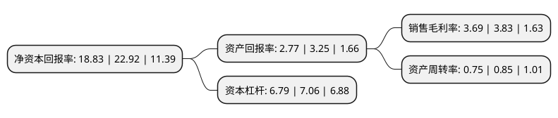

> 本页面由自动化程序生成于 2022年5月20日 01:06
> 内容可能存在错误，如有bug请提交issue至：https://github.com/Eroleice/doc-pi/issues
{.is-warning}

# 上市公司基本情况

## 基本资料

海控南海发展股份有限公司（以下简称“海南发展”）成立于1995年06月22日，深圳市。于2007年08月23日在深交所中小板上市。

海南发展注册资本80,355万元，主营业务为建筑幕墙工程设计，施工和生产，销售幕墙玻璃制品，家电玻璃等。主要产品:幕墙工程，幕墙玻璃，家电玻璃。以下是详细信息：

- 公司名称: 海控南海发展股份有限公司
- 股票代码: 002163.SZ
- 所在地: 广东 - 深圳市
- 成立日期: 1995年06月22日
- 注册资本: 80,355万元
- 法定代表人: 朱强华
- 主营业务: 主营业务为建筑幕墙工程设计，施工和生产，销售幕墙玻璃制品，家电玻璃等主要产品:幕墙工程，幕墙玻璃，家电玻璃
- 公司官网: www.sanxinglass.com
- 公司介绍: 公司是一家业务范围涵盖硅砂矿、特玻原片、特种玻璃技术及深加工、幕墙工程、通航机场、光伏工程全面发展的公司，重点发展幕墙工程与通航机场建设、光伏玻璃与光伏工程、特种玻璃技术及深加工三大产业。公司拥有国家级特种玻璃重点实验室、省级特种玻璃研发平台、国家高新技术企业，深圳市高新技术企业，具有建筑幕墙工程设计专业甲级及施工壹级资质、建筑装修装饰工程专业承包一级资质、建筑工程施工总承包三级资质，先后通过了ISO9002质量体系认证、ISO14001:2004环境体系认证、OHSAS18001职业健康体系及中国3C认证、美国IGCC认证、欧盟CE认证、防弹玻璃UL认证等。公司先后荣获“鲁班奖”、“国家优质工程奖”、“詹天佑奖”、“全国工程建筑装饰奖”、“金鹏奖”等百余项奖项。

## 股东及高管情况

上市公司第一大股东为海南省发展控股有限公司，持股259,342,070股，占比30.69%，为上市公司实际控制人。

截至2022年05月12日，上市公司的前十大股东中，共有3名自然人股东，4名机构股东，2个产品账户，1个海外主体，其中5%以上大股东共有2名。上市公司前十大股东明细如下：

> 截至2022年05月12日，上市公司前十大股东信息如下：

| 股东名称 | 持股数量（股） | 持股比例 |
| --- | --- | --- |
| 海南省发展控股有限公司 | 259,342,070 | 30.69% |
| 海南省发展控股有限公司 | 217,934,203 | 27.12% |
| 信泰人寿保险股份有限公司-传统产品 | 21,881,850 | 2.72% |
| 肖润颖 | 14,211,800 | 1.77% |
| 深圳贵航实业有限公司 | 11,217,716 | 1.4% |
| 交通银行股份有限公司-广发中证基建工程交易型开放式指数证券投资基金 | 10,098,559 | 1.26% |
| 中航通用飞机有限责任公司 | 8,035,500 | 1% |
| 丁志刚 | 5,998,300 | 0.75% |
| 香港中央结算有限公司(陆股通) | 4,693,072 | 0.58% |
| 范中 | 4,356,600 | 0.54% |

## 利润表分析

上市公司2021年总收入为43.65亿元，净利润为1.61亿元，实现盈利。

## 杜邦分析

> 数据列示周期：2021年 | 2020年 | 2019年
{.is-info}

上市公司的净资产收益率在近一年有所下降，下降幅度为-17.84%，其变化情况分解如下：
- 上市公司的销售毛利率在近一年下降了-3.66%，可能是生产效率的下降、商品原材料价格上涨或商品价格的下跌所致。
- 上市公司的资产周转率在近一年下降了-11.76%，可能是源自于更慢的销售回款或库存管理效果下降。
- 上市公司的财务杠杆比率在近一年下降了-3.82%，可能是减少负债降低财务费用。

