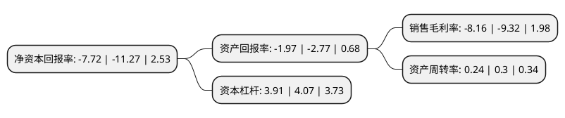

> 本页面由自动化程序生成于 2022年5月20日 01:08
> 内容可能存在错误，如有bug请提交issue至：https://github.com/Eroleice/doc-pi/issues
{.is-warning}

# 上市公司基本情况

## 基本资料

深圳洪涛集团股份有限公司（以下简称“洪涛股份”）成立于1985年01月14日，深圳市。于2009年12月22日在深交所中小板上市。

洪涛股份注册资本132,535.946万元，承接酒店，剧院会场，写字楼，图书馆，医院，体育场馆等公共装饰工程的设计及施工。以下是详细信息：

- 公司名称: 深圳洪涛集团股份有限公司
- 股票代码: 002325.SZ
- 所在地: 广东 - 深圳市
- 成立日期: 1985年01月14日
- 注册资本: 132,535.946万元
- 法定代表人: 刘年新
- 主营业务: 承接酒店，剧院会场，写字楼，图书馆，医院，体育场馆等公共装饰工程的设计及施工
- 公司官网: www.szhongtao.cn
- 公司介绍: 公司是建设部核定的全国设计、装饰双甲企业，拥有建筑装饰装修、装饰设计、建筑幕墙、城市及道路照明、建筑智能化、机电设备安装、消防设施等专业承包一级/甲级资质；公司主营业务为承接剧院会场、图书馆、酒店、写字楼、医院、体育场馆等公共装饰工程的设计及施工，按产品分为公共建筑装饰工程、住宅建筑装饰工程和设计业务三大类型。公司是“深圳知名品牌”企业，被业内誉为“大堂专业户”、“国宾馆专业户”、“大剧院专业户”，公司拥有中国建筑装饰协会授予的“全国建筑装饰行业酒店类最佳专业化装饰企业”、“全国建筑装饰行业影剧院类最佳专业化装饰企业”、“全国建筑装饰行业国宾馆类最佳专业化装饰企业”、“中国建筑装饰三十年文体场馆专业化百强企业”、“中国建筑装饰三十年酒店空间专业化百强企业”、“中国建筑装饰三十年影剧院专业化百强企业”等称号。

## 股东及高管情况

上市公司第一大股东为刘年新，持股389,705,180股，占比27.06%，**疑似为**上市公司实际控制人。

截至2022年03月31日，上市公司的前十大股东中，共有9名自然人股东，1名机构股东，其中5%以上大股东共有2名。上市公司前十大股东明细如下：

> 未能通过持股比例判定出上市公司实际控制人（持股30%以上）
> 可能存在通过间接持股、联合持股、协议控制等方式拥有实际控制权的主体，具体请参考上市公司定期公告！
{.is-warning}

> 截至2022年03月31日，上市公司前十大股东信息如下：

| 股东名称 | 持股数量（股） | 持股比例 |
| --- | --- | --- |
| 刘年新 | 389,705,180 | 27.06% |
| 新疆日月投资股份有限公司 | 83,202,943 | 5.78% |
| 彭凯 | 49,173,670 | 3.41% |
| 钟燕蓉 | 14,796,653 | 1.03% |
| 蓝歆旻 | 13,860,000 | 0.96% |
| 廖美芳 | 9,262,980 | 0.64% |
| 张秀 | 7,061,300 | 0.49% |
| 虞泳 | 6,743,689 | 0.47% |
| 王松林 | 6,017,316 | 0.42% |
| 陈远芬 | 5,681,298 | 0.39% |

## 利润表分析

上市公司2021年总收入为25.9亿元，净利润为-2.12亿元，**未实现盈利**。

## 杜邦分析

> 数据列示周期：2021年 | 2020年 | 2019年
{.is-info}

上市公司的净资产收益率在近一年有所下降，下降幅度为-31.5%，其变化情况分解如下：
- 上市公司的销售毛利率在近一年下降了-12.45%，可能是生产效率的下降、商品原材料价格上涨或商品价格的下跌所致。
- 上市公司的资产周转率在近一年下降了-20%，可能是源自于更慢的销售回款或库存管理效果下降。
- 上市公司的财务杠杆比率在近一年下降了-3.93%，可能是减少负债降低财务费用。

