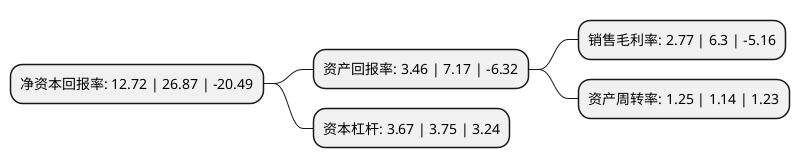

> 本页面由自动化程序生成于 2022年5月20日 01:11
> 内容可能存在错误，如有bug请提交issue至：https://github.com/Eroleice/doc-pi/issues
{.is-warning}

# 上市公司基本情况

## 基本资料

东易日盛家居装饰集团股份有限公司（以下简称“东易日盛”）成立于1996年11月28日，北京市。于2014年02月19日在深交所中小板上市。

东易日盛注册资本41,953.698万元，居室装饰设计，工程施工，配套木作产品研发，生产及全国性家装品牌特许经营。以下是详细信息：

- 公司名称: 东易日盛家居装饰集团股份有限公司
- 股票代码: 002713.SZ
- 所在地: 北京 - 北京市
- 成立日期: 1996年11月28日
- 注册资本: 41,953.698万元
- 法定代表人: 陈辉
- 主营业务: 居室装饰设计，工程施工，配套木作产品研发，生产及全国性家装品牌特许经营
- 公司官网: www.dyrs.cn
- 公司介绍: 公司主要从事面对个人客户的整体家装设计、工程施工、主材代理、自产的木作产品配套、软装设计及精装后的家居产品等系列服务。区别于仅以设计、施工为主要服务内容的传统家装模式，也不同于单一以整合产品为主的各类家装模式，公司的“有机整体家装解决方案”相较于传统家装概念在深度和广度上都进行了创造性延伸，主要表现为：通过以生活方式规划为入口，以风格创意设计为主线，以家装产品开发、装饰材料、装饰产品系统配套为依托，以家装服务、工程施工为手段，对家庭装饰的各个环节进行有机整合，最终实现完美、和谐的装饰效果，安全、环保的空间环境，进而创造出更加美好的生活方式。公司一直专注家装产业的创新发展，启动科技化转型，已拥有多项专利，是家装行业中较早通过国家认证的高新技术企业、国家装配式建筑产业基地。

## 股东及高管情况

上市公司第一大股东为天津东易天正投资有限公司，持股201,864,583股，占比48.12%，为上市公司实际控制人。

截至2022年03月31日，上市公司的前十大股东中，共有2名自然人股东，5名机构股东，3个产品账户，其中5%以上大股东共有6名。上市公司前十大股东明细如下：

> 截至2022年03月31日，上市公司前十大股东信息如下：

| 股东名称 | 持股数量（股） | 持股比例 |
| --- | --- | --- |
| 天津东易天正投资有限公司 | 201,864,583 | 48.12% |
| 天津东易天正投资有限公司 | 195,664,583 | 46.6382% |
| 上海玖鹏资产管理中心(有限合伙)-玖鹏大鹏精选20号私募证券投资基金 | 25,150,000 | 5.99% |
| 上海玖鹏资产管理中心(有限合伙)-玖鹏大鹏精选20号私募证券投资基金 | 25,150,000 | 5.99% |
| 小米科技(武汉)有限公司 | 21,000,000 | 5.01% |
| 小米科技(武汉)有限公司 | 21,000,000 | 5.01% |
| 天津晨鑫信息咨询有限公司 | 13,133,191 | 3.13% |
| 山西证券股份有限公司约定购回专用账户 | 8,390,000 | 2% |
| 李永红 | 5,760,000 | 1.37% |
| 陈辉 | 5,711,520 | 1.36% |

## 利润表分析

上市公司2021年总收入为42.91亿元，净利润为1.19亿元，实现盈利。

## 杜邦分析

> 数据列示周期：2021年 | 2020年 | 2019年
{.is-info}

上市公司的净资产收益率在近一年有所下降，下降幅度为-52.66%，其变化情况分解如下：
- 上市公司的销售毛利率在近一年下降了-56.03%，可能是生产效率的下降、商品原材料价格上涨或商品价格的下跌所致。
- 上市公司的资产周转率在近一年上升了9.65%，可能是源自于更快的销售回款或库存管理效果提升。
- 上市公司的财务杠杆比率在近一年下降了-2.13%，可能是减少负债降低财务费用。

