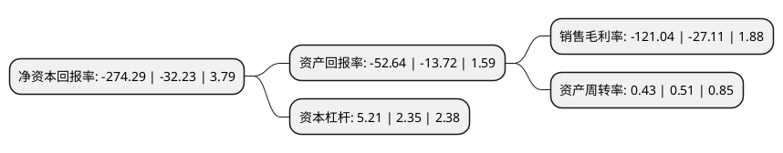

> 本页面由自动化程序生成于 2022年5月20日 01:12
> 内容可能存在错误，如有bug请提交issue至：https://github.com/Eroleice/doc-pi/issues
{.is-warning}

# 上市公司基本情况

## 基本资料

江西奇信集团股份有限公司（以下简称“*ST奇信”）成立于1995年05月12日，新余市。于2015年12月22日在深交所中小板上市。

*ST奇信注册资本22,500万元，主要从事建筑装饰工程的设计与施工业务。主要产品有:装饰(公共建筑装饰，住宅精装修)，设计等。以下是详细信息：

- 公司名称: 江西奇信集团股份有限公司
- 股票代码: 002781.SZ
- 所在地: 江西 - 新余市
- 成立日期: 1995年05月12日
- 注册资本: 22,500万元
- 法定代表人: 雷鸣
- 主营业务: 主要从事建筑装饰工程的设计与施工业务主要产品有:装饰(公共建筑装饰，住宅精装修)，设计等
- 公司官网: www.qxholding.com
- 公司介绍: 公司是我国建筑装饰行业处于领先地位的企业之一，主要从事建筑装饰工程的设计与施工业务，拥有建筑装饰工程甲级、建筑幕墙工程设计专项甲级、建筑装修装饰工程专业承包壹级、建筑幕墙工程专业承包壹级等资质。公司承建的装饰工程涉及市政、酒店、学校、医院、商场、高级写字楼、花园别墅等，工程项目跨越全国版图。公司先后通过了GB/T19001-2008质量管理体系、GB/T24001-2004环境管理体系、GB/T28001-2011职业健康安全管理体系的标准认证。公司长期致力于人才培养与团队建设，拥有一批技术实力雄厚、经验丰富的设计施工人才，并与深圳大学、深圳职业技术学院、惠州学院等多所高等院校建立了校企合作，成立了实习基地和培训基地。公司承接的项目先后获得‘鲁班奖’、国家优质工程奖银奖、‘全国建筑工程装饰奖’、‘全国建筑装饰科技创新奖’等多项国家级奖项。公司将紧紧围绕装饰一体化产业，加大设计研究中心、产品技术开发、营销网络、产业基地等方面的投入，为客户提供优质、安全、健康和舒适的室内外设计、装饰工程服务，巩固并提高公司在国内同行业中的领先地位。

## 股东及高管情况

上市公司第一大股东为新余市投资控股集团有限公司，持股67,477,500股，占比29.99%，**疑似为**上市公司实际控制人。

截至2022年05月17日，上市公司的前十大股东中，共有6名自然人股东，3名机构股东，1个海外主体，其中5%以上大股东共有5名。上市公司前十大股东明细如下：

> 未能通过持股比例判定出上市公司实际控制人（持股30%以上）
> 可能存在通过间接持股、联合持股、协议控制等方式拥有实际控制权的主体，具体请参考上市公司定期公告！
{.is-warning}

> 截至2022年05月17日，上市公司前十大股东信息如下：

| 股东名称 | 持股数量（股） | 持股比例 |
| --- | --- | --- |
| 新余市投资控股集团有限公司 | 67,477,500 | 29.99% |
| 新余市投资控股集团有限公司 | 67,477,500 | 29.99% |
| 新余高新区智大投资有限公司 | 24,999,349 | 11.1108% |
| 叶家豪 | 20,940,839 | 9.31% |
| 叶家豪 | 20,940,839 | 9.31% |
| 叶洪孝 | 1,381,865 | 0.61% |
| 陈秀华 | 1,068,900 | 0.48% |
| 刘文 | 999,600 | 0.44% |
| 张伟元 | 850,000 | 0.38% |
| UBS AG | 792,796 | 0.35% |

## 利润表分析

上市公司2021年总收入为14.53亿元，净利润为-17.6亿元，**未实现盈利**。

## 杜邦分析

> 数据列示周期：2021年 | 2020年 | 2019年
{.is-info}

上市公司的净资产收益率在近一年有所上升，上升幅度为751.04%，其变化情况分解如下：
- 上市公司的销售毛利率在近一年上升了346.48%，可能是生产效率的提升、商品原材料价格下跌或商品价格的上涨所致。
- 上市公司的资产周转率在近一年下降了-15.69%，可能是源自于更慢的销售回款或库存管理效果下降。
- 上市公司的财务杠杆比率在近一年上升了121.7%，可能是增加负债扩大生产规模。

