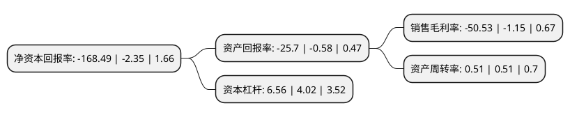

> 本页面由自动化程序生成于 2022年5月20日 01:12
> 内容可能存在错误，如有bug请提交issue至：https://github.com/Eroleice/doc-pi/issues
{.is-warning}

# 上市公司基本情况

## 基本资料

深圳市建艺装饰集团股份有限公司（以下简称“建艺集团”）成立于1994年01月03日，深圳市。于2016年03月11日在深交所中小板上市。

建艺集团注册资本15,962.351万元，主要为写字楼，政府机关，星级酒店，文教体卫建筑，交通基建建筑等公共建筑及住宅(面向地产商)提供室内建筑装饰的施工和设计服务。以下是详细信息：

- 公司名称: 深圳市建艺装饰集团股份有限公司
- 股票代码: 002789.SZ
- 所在地: 广东 - 深圳市
- 成立日期: 1994年01月03日
- 注册资本: 15,962.351万元
- 法定代表人: 张有文
- 主营业务: 主要为写字楼，政府机关，星级酒店，文教体卫建筑，交通基建建筑等公共建筑及住宅(面向地产商)提供室内建筑装饰的施工和设计服务
- 公司官网: www.jyzs.com.cn
- 公司介绍: 公司是集施工、设计、资源矿产、科技工业园、高新技术建材产业、投融资为一体的规模化实体企业集团，是国家高新技术企业。公司主营建筑装饰设计与施工，主要为写字楼、政府机关、星级酒店、文教体卫建筑、交通基建建筑等公共建筑及住宅(面向地产商)提供室内建筑装饰的施工和设计服务。公司注重质量管理，于2003年即通过ISO9001(质量)、ISO14001(环境)、OHSAS18001(职业健康安全管理)体系认证。公司拥有《建筑装修装饰工程专业承包壹级》、《建筑装饰工程设计专项甲级》等资质证书。公司是“中国建筑装饰百强企业”、“中国建筑装饰三十年优秀装饰施工企业”、“中国建筑装饰设计机构五十强企业”、“广东省优秀企业”、“广东省守合同重信用企业”、“深圳知名品牌企业”、“广东省诚信示范企业”、“中国装饰行业诚信AAA企业”。

## 股东及高管情况

上市公司第一大股东为珠海正方集团有限公司，持股47,811,853股，占比29.95%，**疑似为**上市公司实际控制人。

截至2022年03月31日，上市公司的前十大股东中，共有8名自然人股东，2名机构股东，其中5%以上大股东共有2名。上市公司前十大股东明细如下：

> 未能通过持股比例判定出上市公司实际控制人（持股30%以上）
> 可能存在通过间接持股、联合持股、协议控制等方式拥有实际控制权的主体，具体请参考上市公司定期公告！
{.is-warning}

> 截至2022年03月31日，上市公司前十大股东信息如下：

| 股东名称 | 持股数量（股） | 持股比例 |
| --- | --- | --- |
| 珠海正方集团有限公司 | 47,811,853 | 29.95% |
| 刘海云 | 33,722,151 | 21.13% |
| 郝成刚 | 4,125,151 | 2.58% |
| 刘珊 | 3,400,000 | 2.13% |
| 孙昀 | 2,289,917 | 1.43% |
| 崔晓路 | 1,700,000 | 1.07% |
| 阎永平 | 1,608,027 | 1.01% |
| 西藏中盈成长网络科技有限公司 | 1,332,800 | 0.83% |
| 钱海平 | 1,275,000 | 0.8% |
| 巫小平 | 985,400 | 0.62% |

## 利润表分析

上市公司2021年总收入为19.47亿元，净利润为-9.85亿元，**未实现盈利**。

## 杜邦分析

> 数据列示周期：2021年 | 2020年 | 2019年
{.is-info}

上市公司的净资产收益率在近一年有所上升，上升幅度为7069.79%，其变化情况分解如下：
- 上市公司的销售毛利率在近一年上升了4293.91%，可能是生产效率的提升、商品原材料价格下跌或商品价格的上涨所致。
- 上市公司的资产周转率在近一年下降了0%，可能是源自于更慢的销售回款或库存管理效果下降。
- 上市公司的财务杠杆比率在近一年上升了63.18%，可能是增加负债扩大生产规模。

