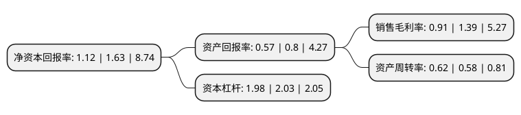

> 本页面由自动化程序生成于 2022年5月20日 01:12
> 内容可能存在错误，如有bug请提交issue至：https://github.com/Eroleice/doc-pi/issues
{.is-warning}

# 上市公司基本情况

## 基本资料

深圳市郑中设计股份有限公司（以下简称“郑中设计”）成立于1994年12月26日，深圳市。于2016年09月08日在深交所中小板上市。

郑中设计注册资本27,002.369万元，主营业务为高端建筑装饰工程的设计与施工。主要产品:高端星级酒店，高品质住宅，高档写字楼等。以下是详细信息：

- 公司名称: 深圳市郑中设计股份有限公司
- 股票代码: 002811.SZ
- 所在地: 广东 - 深圳市
- 成立日期: 1994年12月26日
- 注册资本: 27,002.369万元
- 法定代表人: 刘云贵
- 主营业务: 主营业务为高端建筑装饰工程的设计与施工主要产品:高端星级酒店，高品质住宅，高档写字楼等
- 公司官网: www.atgcn.com
- 公司介绍: 公司从成立之初即专注于高端星级酒店的装饰设计与工程建设，拥有超过数百家高端星级酒店建筑装饰设计、装饰工程建设或装饰配套服务的成功经验，在该领域拥有突出的竞争优势。公司已成为中国高端公共建筑装饰行业的领先企业之一，是高端星级酒店特别是国际品牌酒店装饰领域的领军品牌(“ATG亚泰”品牌)。公司的建筑装饰代表作品包括多家国际顶尖品牌酒店。凭借在高端星级酒店装饰领域的专业优势，公司目前从事的业务已经拓展至高品质住宅、高档写字楼、豪华会所、商业综合体等其他高端公共建筑装饰领域。公司具有《建筑装饰工程设计专项甲级》和《建筑装修装饰工程专业承包壹级》资质。公司具有完善的装饰配套服务能力，承接了大量的交钥匙工程，积累了丰富的装饰设计、装饰工程建设和装饰配套服务一体化工程管理经验。公司倡导工程质量、项目环境和施工人员的和谐共进，已经通过ISO9001:2008质量管理、ISO14001:2004环境管理和GB/T28001-2001职业健康安全管理三大体系认证。

## 股东及高管情况

上市公司第一大股东为深圳市亚泰一兆投资有限公司，持股141,961,723股，占比52.57%，为上市公司实际控制人。

截至2022年03月31日，上市公司的前十大股东中，共有8名自然人股东，2名机构股东，其中5%以上大股东共有2名。上市公司前十大股东明细如下：

> 截至2022年03月31日，上市公司前十大股东信息如下：

| 股东名称 | 持股数量（股） | 持股比例 |
| --- | --- | --- |
| 深圳市亚泰一兆投资有限公司 | 141,961,723 | 52.57% |
| 郑忠 | 30,516,750 | 11.3% |
| 唐旭 | 5,135,300 | 1.9% |
| 林霖 | 4,789,125 | 1.77% |
| 邱卉 | 2,946,225 | 1.09% |
| 李新义 | 2,400,000 | 0.89% |
| 邱艾 | 2,247,750 | 0.83% |
| 新余善思投资管理中心(有限合伙)-青岛鑫诚洪泰智造投资中心(有限合伙) | 1,968,000 | 0.73% |
| 金福昌 | 1,251,666 | 0.46% |
| 周敏云 | 976,150 | 0.36% |

## 利润表分析

上市公司2021年总收入为19.04亿元，净利润为0.17亿元，实现盈利。

## 杜邦分析

> 数据列示周期：2021年 | 2020年 | 2019年
{.is-info}

上市公司的净资产收益率在近一年有所下降，下降幅度为-31.29%，其变化情况分解如下：
- 上市公司的销售毛利率在近一年下降了-34.53%，可能是生产效率的下降、商品原材料价格上涨或商品价格的下跌所致。
- 上市公司的资产周转率在近一年上升了6.9%，可能是源自于更快的销售回款或库存管理效果提升。
- 上市公司的财务杠杆比率在近一年下降了-2.46%，可能是减少负债降低财务费用。

