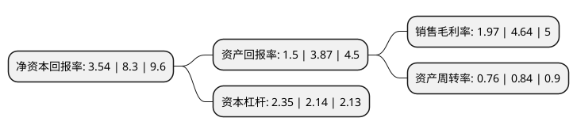

> 本页面由自动化程序生成于 2022年5月20日 01:12
> 内容可能存在错误，如有bug请提交issue至：https://github.com/Eroleice/doc-pi/issues
{.is-warning}

# 上市公司基本情况

## 基本资料

深圳市中装建设集团股份有限公司（以下简称“中装建设”）成立于1994年04月29日，深圳市。于2016年11月29日在深交所中小板上市。

中装建设注册资本72,054.181万元，主营业务:以室内外装饰为主，融合幕墙，建筑智能化，园林等为一体的大型综合装饰服务提供商，主要承接办公楼，商业建筑，高档酒店，文教体卫设施，交通基础设施等公共建筑和普通住宅，别墅等住宅建筑的装饰施工和设计业务。以下是详细信息：

- 公司名称: 深圳市中装建设集团股份有限公司
- 股票代码: 002822.SZ
- 所在地: 广东 - 深圳市
- 成立日期: 1994年04月29日
- 注册资本: 72,054.181万元
- 法定代表人: 庄展诺
- 主营业务: 主营业务:以室内外装饰为主，融合幕墙，建筑智能化，园林等为一体的大型综合装饰服务提供商，主要承接办公楼，商业建筑，高档酒店，文教体卫设施，交通基础设施等公共建筑和普通住宅，别墅等住宅建筑的装饰施工和设计业务
- 公司官网: www.zhongzhuang.com
- 公司介绍: 公司是一家以室内外装饰为主，融合幕墙、建筑智能化、园林等为一体的大型综合装饰服务提供商，主要承接办公楼、商业建筑、高档酒店、文教体卫设施、交通基础设施等公共建筑和普通住宅、别墅等住宅建筑的装饰施工和设计业务。公司拥有建筑装修装饰工程专业承包壹级、建筑幕墙工程专业承包壹级、建筑装饰工程设计专项甲级、建筑幕墙工程专业承包壹级、电子与智能化工程专业承包壹级、建筑机电安装工程专业承包壹级、防水防腐保温工程专业承包壹级等全面的业务资质和优秀的施工能力。公司是国家高新技术企业、公司企业信用评价AAA级信用企业、广东省守合同重信用企业、广东省诚信示范企业、中国建筑装饰行业百强企业、中国建筑幕墙行业50强企业、中国建筑装饰设计机构五十强企业、广东省企业500强、广东省优秀自主品牌，“深圳知名品牌”。公司先后通过了ISO9001质量管理体系、GB/T50430质量管理体系、ISO14001环境管理体系和GB/T28001职业健康安全管理体系认证。

## 股东及高管情况

上市公司第一大股东为庄小红，持股176,057,928股，占比24.43%，**疑似为**上市公司实际控制人。

截至2022年03月31日，上市公司的前十大股东中，共有6名自然人股东，2名机构股东，1个产品账户，1个海外主体，其中5%以上大股东共有2名。上市公司前十大股东明细如下：

> 未能通过持股比例判定出上市公司实际控制人（持股30%以上）
> 可能存在通过间接持股、联合持股、协议控制等方式拥有实际控制权的主体，具体请参考上市公司定期公告！
{.is-warning}

> 截至2022年03月31日，上市公司前十大股东信息如下：

| 股东名称 | 持股数量（股） | 持股比例 |
| --- | --- | --- |
| 庄小红 | 176,057,928 | 24.43% |
| 庄展诺 | 73,009,350 | 10.13% |
| 广州市玄元投资管理有限公司-玄元百顺1号私募证券投资基金 | 12,821,600 | 1.78% |
| 严勇 | 8,768,217 | 1.22% |
| 刘广华 | 7,900,000 | 1.1% |
| 南京鼎润天成投资合伙企业(有限合伙) | 5,259,685 | 0.73% |
| 邓会生 | 4,397,714 | 0.61% |
| JPMORGAN CHASE BANK,NATIONAL ASSOCIATION | 3,965,689 | 0.55% |
| 黄孝文 | 3,950,000 | 0.55% |
| 中国国际金融香港资产管理有限公司-客户资金2 | 2,712,145 | 0.38% |

## 利润表分析

上市公司2021年总收入为62.78亿元，净利润为1.23亿元，实现盈利。

## 杜邦分析

> 数据列示周期：2021年 | 2020年 | 2019年
{.is-info}

上市公司的净资产收益率在近一年有所下降，下降幅度为-57.35%，其变化情况分解如下：
- 上市公司的销售毛利率在近一年下降了-57.54%，可能是生产效率的下降、商品原材料价格上涨或商品价格的下跌所致。
- 上市公司的资产周转率在近一年下降了-9.52%，可能是源自于更慢的销售回款或库存管理效果下降。
- 上市公司的财务杠杆比率在近一年上升了9.81%，可能是增加负债扩大生产规模。

