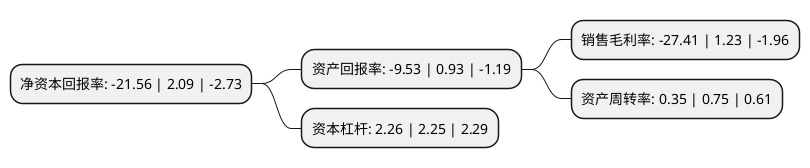

> 本页面由自动化程序生成于 2022年5月20日 01:12
> 内容可能存在错误，如有bug请提交issue至：https://github.com/Eroleice/doc-pi/issues
{.is-warning}

# 上市公司基本情况

## 基本资料

深圳市美芝装饰设计工程股份有限公司（以下简称“美芝股份”）成立于1984年11月22日，深圳市。于2017年03月20日在深交所中小板上市。

美芝股份注册资本13,531.281万元，主营业务:为建筑装饰工程的设计与施工，在公共建筑装饰市场具有领先优势。主要产品:提供建筑装饰施工和设计服务。以下是详细信息：

- 公司名称: 深圳市美芝装饰设计工程股份有限公司
- 股票代码: 002856.SZ
- 所在地: 广东 - 深圳市
- 成立日期: 1984年11月22日
- 注册资本: 13,531.281万元
- 法定代表人: 杨水森
- 主营业务: 主营业务:为建筑装饰工程的设计与施工，在公共建筑装饰市场具有领先优势主要产品:提供建筑装饰施工和设计服务
- 公司官网: www.szmeizhi.com
- 公司介绍: 公司是一家集建筑装饰、建筑幕墙、建筑机电、电子与智能化、机电设备安装、消防设施、园林绿化等专业化为一体的建筑装饰设计施工企业，主要为交通运输机构、文化产业、金融地产、政府机构、高端星级酒店集团等大型客户，提供跨领域全方位的综合工程服务，业务格局以深圳总部为核心覆盖全国各地。公司具有建筑装修装饰工程专业承包壹级、建筑机电安装工程专业承包壹级、电子与智能化工程专业承包壹级、建筑幕墙工程专业承包壹级、消防设施工程专业承包壹级、建筑幕墙工程设计专项甲级、建筑装饰工程设计专项甲级、广东省洁净工程专业承包(洁净室施工建造工程甲级)等多项专业壹级/甲级资质，在资质等级方面处于行业领先水平。经过多年的精耕细作，已经形成以深圳总部为核心，辐射全国的市场格局，在跨领域项目实施、设计研发、技术与施工质量、品牌建设、市场开拓等方面具有突出优势，是中国建筑装饰行业具有较强市场综合竞争力的企业之一。公司屡获“中国建设工程鲁班奖(国家优质工程)”、“全国建筑工程装饰奖”、“全国建筑装饰行业科技示范工程科技创新奖”、“全国建筑装饰行业科技创新成果”、“全国建筑装饰行业科技示范工程奖”等国家级、省级、市级工程奖项。

## 股东及高管情况

上市公司第一大股东为深圳山汇投资管理有限公司-广东怡建股权投资合伙企业(有限合伙)，持股40,580,300股，占比29.99%，**疑似为**上市公司实际控制人。

截至2022年03月31日，上市公司的前十大股东中，共有6名自然人股东，2名机构股东，1个产品账户，1个海外主体，其中5%以上大股东共有2名。上市公司前十大股东明细如下：

> 未能通过持股比例判定出上市公司实际控制人（持股30%以上）
> 可能存在通过间接持股、联合持股、协议控制等方式拥有实际控制权的主体，具体请参考上市公司定期公告！
{.is-warning}

> 截至2022年03月31日，上市公司前十大股东信息如下：

| 股东名称 | 持股数量（股） | 持股比例 |
| --- | --- | --- |
| 深圳山汇投资管理有限公司-广东怡建股权投资合伙企业(有限合伙) | 40,580,300 | 29.99% |
| 李苏华 | 30,319,700 | 22.41% |
| 横琴广金美好基金管理有限公司-广金美好薛定谔五号私募证券投资基金 | 3,500,000 | 2.59% |
| 王数红 | 2,500,000 | 1.85% |
| 黄晓媚 | 2,394,131 | 1.77% |
| 高华-汇丰-GOLDMAN, SACHS & CO.LLC | 1,981,100 | 1.46% |
| 唐福良 | 1,750,000 | 1.29% |
| 方灿荣 | 1,590,300 | 1.18% |
| 杨水森 | 675,000 | 0.5% |
| 华泰证券股份有限公司 | 631,517 | 0.47% |

## 利润表分析

上市公司2021年总收入为5.87亿元，净利润为-1.62亿元，**未实现盈利**。

## 杜邦分析

> 数据列示周期：2021年 | 2020年 | 2019年
{.is-info}

上市公司的净资产收益率在近一年有所下降，下降幅度为-1131.58%，其变化情况分解如下：
- 上市公司的销售毛利率在近一年下降了-2328.46%，可能是生产效率的下降、商品原材料价格上涨或商品价格的下跌所致。
- 上市公司的资产周转率在近一年下降了-53.33%，可能是源自于更慢的销售回款或库存管理效果下降。
- 上市公司的财务杠杆比率在近一年上升了0.44%，可能是增加负债扩大生产规模。

