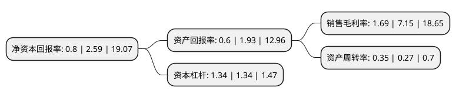

> 本页面由自动化程序生成于 2022年5月20日 01:13
> 内容可能存在错误，如有bug请提交issue至：https://github.com/Eroleice/doc-pi/issues
{.is-warning}

# 上市公司基本情况

## 基本资料

豪尔赛科技集团股份有限公司（以下简称“豪尔赛”）成立于2000年06月07日，北京市。于2019年10月28日在深交所中小板上市。

豪尔赛注册资本15,035.993万元，为照明工程施工及与之相关的照明工程设计，研发，照明产品销售。豪尔赛专注于标志性/超高层建筑，文旅表演/艺术景观，城市空间照明等景观照明领域。以下是详细信息：

- 公司名称: 豪尔赛科技集团股份有限公司
- 股票代码: 002963.SZ
- 所在地: 北京 - 北京市
- 成立日期: 2000年06月07日
- 注册资本: 15,035.993万元
- 法定代表人: 戴宝林
- 主营业务: 为照明工程施工及与之相关的照明工程设计，研发，照明产品销售豪尔赛专注于标志性/超高层建筑，文旅表演/艺术景观，城市空间照明等景观照明领域
- 公司官网: www.haoersai.com
- 公司介绍: 公司成立于2000年6月7日，公司主营业务为照明工程施工及与之相关的照明工程设计、研发、照明产品销售。公司专注于标志性/超高层建筑、文旅表演/艺术景观、城市空间照明等景观照明领域，公司为高新技术企业，拥有行业领先的照明工程设计能力和精湛的照明工程施工能力，已取得我国照明工程行业的最高等级资质——《城市及道路照明工程专业承包壹级》和《照明工程设计专项甲级》。经过多年发展，公司已发展成为我国照明工程行业的领先企业，在行业内具有较高的市场知名度。

## 股东及高管情况

上市公司第一大股东为刘清梅，持股35,128,385股，占比23.36%，**疑似为**上市公司实际控制人。

截至2022年03月31日，上市公司的前十大股东中，共有8名自然人股东，2名机构股东，其中5%以上大股东共有3名。上市公司前十大股东明细如下：

> 未能通过持股比例判定出上市公司实际控制人（持股30%以上）
> 可能存在通过间接持股、联合持股、协议控制等方式拥有实际控制权的主体，具体请参考上市公司定期公告！
{.is-warning}

> 截至2022年03月31日，上市公司前十大股东信息如下：

| 股东名称 | 持股数量（股） | 持股比例 |
| --- | --- | --- |
| 刘清梅 | 35,128,385 | 23.36% |
| 戴宝林 | 35,128,385 | 23.36% |
| 上海高好投资合伙企业(有限合伙) | 8,591,772 | 5.71% |
| 高荣荣 | 5,790,000 | 3.85% |
| 戴聪棋 | 1,359,458 | 0.9% |
| 李斯和 | 1,253,000 | 0.83% |
| 李秀清 | 1,252,900 | 0.83% |
| 李志谦 | 1,252,500 | 0.83% |
| 杭州龙玺投资合伙企业(有限合伙) | 1,157,400 | 0.77% |
| 胡银桃 | 1,053,000 | 0.7% |

## 利润表分析

上市公司2021年总收入为7.87亿元，净利润为0.13亿元，实现盈利。

## 杜邦分析

> 数据列示周期：2021年 | 2020年 | 2019年
{.is-info}

上市公司的净资产收益率在近一年有所下降，下降幅度为-69.11%，其变化情况分解如下：
- 上市公司的销售毛利率在近一年下降了-76.36%，可能是生产效率的下降、商品原材料价格上涨或商品价格的下跌所致。
- 上市公司的资产周转率在近一年上升了29.63%，可能是源自于更快的销售回款或库存管理效果提升。
- 上市公司的财务杠杆比率在近一年下降了0%，可能是减少负债降低财务费用。

