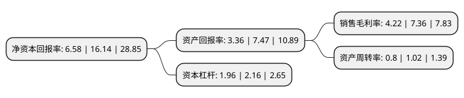

> 本页面由自动化程序生成于 2022年5月20日 01:13
> 内容可能存在错误，如有bug请提交issue至：https://github.com/Eroleice/doc-pi/issues
{.is-warning}

# 上市公司基本情况

## 基本资料

深圳中天精装股份有限公司（以下简称“中天精装”）成立于2000年09月28日，深圳市。于2020年06月10日在深交所中小板上市。

中天精装注册资本15,140万元，公司主要从事批量精装修业务，具体业务包括建筑装饰工程施工，建筑装饰工程设计等方面。以下是详细信息：

- 公司名称: 深圳中天精装股份有限公司
- 股票代码: 002989.SZ
- 所在地: 广东 - 深圳市
- 成立日期: 2000年09月28日
- 注册资本: 15,140万元
- 法定代表人: 乔荣健
- 主营业务: 公司主要从事批量精装修业务，具体业务包括建筑装饰工程施工，建筑装饰工程设计等方面
- 公司官网: www.ztjzgf.net
- 公司介绍: 公司是国内领先的批量精装修服务提供商，主要为国内大型房地产商提供住宅批量精装修服务，具体业务包括建筑装饰工程施工、建筑装饰工程设计等方面。公司在住宅批量精装修领域具有较强的市场竞争力，经过在批量精装修领域的十几年的积累，公司有较强的实力、以较高的品质满足客户多样的批量精装修服务要求，与大型地产商的供应商，建立了良好的合作关系，公司在批量精装修领域积累了较强的市场影响力和认可度，获得中国建筑装饰协会评选的“中国建筑装饰行业百强企业”称号；连续三年获得中国建筑装饰协会颁发的企业信用等级AAA级证书；取得《高新技术企业证书》等多项荣誉。

## 股东及高管情况

上市公司第一大股东为深圳市中天健投资有限公司，持股44,000,000股，占比29.06%，**疑似为**上市公司实际控制人。

截至2022年03月31日，上市公司的前十大股东中，共有2名自然人股东，5名机构股东，3个海外主体，其中5%以上大股东共有5名。上市公司前十大股东明细如下：

> 未能通过持股比例判定出上市公司实际控制人（持股30%以上）
> 可能存在通过间接持股、联合持股、协议控制等方式拥有实际控制权的主体，具体请参考上市公司定期公告！
{.is-warning}

> 截至2022年03月31日，上市公司前十大股东信息如下：

| 股东名称 | 持股数量（股） | 持股比例 |
| --- | --- | --- |
| 深圳市中天健投资有限公司 | 44,000,000 | 29.06% |
| 深圳市中天安投资有限公司 | 36,000,000 | 23.78% |
| 乔荣健 | 12,080,000 | 7.98% |
| 张安 | 9,716,000 | 6.42% |
| 深圳市天人合一投资合伙企业(有限合伙) | 8,000,000 | 5.28% |
| 深圳市顺其自然投资合伙企业(有限合伙) | 3,510,000 | 2.32% |
| 瑞士信贷(香港)有限公司 | 2,073,903 | 1.37% |
| MORGAN STANLEY & CO. INTERNATIONAL PLC. | 1,945,938 | 1.29% |
| MERRILL LYNCH INTERNATIONAL | 1,388,309 | 0.92% |
| JPMORGAN CHASE BANK,NATIONAL ASSOCIATION | 1,039,504 | 0.69% |

## 利润表分析

上市公司2021年总收入为25.67亿元，净利润为1.08亿元，实现盈利。

## 杜邦分析

> 数据列示周期：2021年 | 2020年 | 2019年
{.is-info}

上市公司的净资产收益率在近一年有所下降，下降幅度为-59.23%，其变化情况分解如下：
- 上市公司的销售毛利率在近一年下降了-42.66%，可能是生产效率的下降、商品原材料价格上涨或商品价格的下跌所致。
- 上市公司的资产周转率在近一年下降了-21.57%，可能是源自于更慢的销售回款或库存管理效果下降。
- 上市公司的财务杠杆比率在近一年下降了-9.26%，可能是减少负债降低财务费用。

