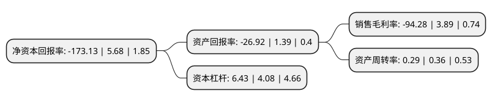

> 本页面由自动化程序生成于 2022年5月20日 01:15
> 内容可能存在错误，如有bug请提交issue至：https://github.com/Eroleice/doc-pi/issues
{.is-warning}

# 上市公司基本情况

## 基本资料

北京嘉寓门窗幕墙股份有限公司（以下简称“嘉寓股份”）成立于1987年01月05日，北京市。于2010年09月02日在深交所创业板上市。

嘉寓股份注册资本71,676万元，本公司主要从事节能门窗幕墙的研发设计，生产加工，安装及服务业务。主要产品包括多系列3铝合金节能门窗和各种类型的建筑节能幕墙。以下是详细信息：

- 公司名称: 北京嘉寓门窗幕墙股份有限公司
- 股票代码: 300117.SZ
- 所在地: 北京 - 北京市
- 成立日期: 1987年01月05日
- 注册资本: 71,676万元
- 法定代表人: 田新甲
- 主营业务: 本公司主要从事节能门窗幕墙的研发设计，生产加工，安装及服务业务主要产品包括多系列3铝合金节能门窗和各种类型的建筑节能幕墙
- 公司官网: www.jayugroup.com
- 公司介绍: 公司是集研发、设计、生产、施工于一体的建筑节能、智能、光热光伏、门窗幕墙系统提供商，主营业务分为节能门窗幕墙、太阳能光伏和高端智能装备三大板块。多年的专业经验，使嘉寓对建筑节能、新能源利用领域具有深厚的行业经验与技术积累。公司是国家重点高新技术企业、北京市企业技术中心；是行业AAA级信用企业、中国门窗幕墙十佳品牌、中国幕墙行业50强、中国门窗幕墙创新企业、中国房地产500强品牌；也是“中国具有投资价值公司百强榜”、“中国家居产业网友喜爱品牌”、“中国家居产业影响力品牌”上榜企业。公司参编了《铝合金门窗》、《建筑光伏系统技术指导》、《建筑门窗耐火完整性试验方法及判定要求》、《绿色建材评价标准门窗及配件》、《绿色建材评价标准幕墙》等多项国家及地方行业标准。

## 股东及高管情况

上市公司第一大股东为嘉寓新新投资(集团)有限公司，持股280,872,006股，占比39.1863%，为上市公司实际控制人。

截至2022年04月11日，上市公司的前十大股东中，共有4名自然人股东，5名机构股东，1个海外主体，其中5%以上大股东共有5名。上市公司前十大股东明细如下：

> 截至2022年04月11日，上市公司前十大股东信息如下：

| 股东名称 | 持股数量（股） | 持股比例 |
| --- | --- | --- |
| 嘉寓新新投资(集团)有限公司 | 280,872,006 | 39.1863% |
| 嘉寓新新投资(集团)有限公司 | 280,842,006 | 39.18% |
| 嘉寓新新投资(集团)有限公司 | 280,607,006 | 39.15% |
| 嘉寓新新投资(集团)有限公司 | 280,607,006 | 39.15% |
| 嘉寓新新投资(集团)有限公司 | 280,137,006 | 39.0838% |
| 雷小雪 | 14,900,000 | 2.08% |
| UBS AG | 2,375,018 | 0.33% |
| 王燕 | 1,090,000 | 0.15% |
| 范玮 | 1,056,800 | 0.15% |
| 李华忠 | 1,017,492 | 0.14% |

## 利润表分析

上市公司2021年总收入为14.29亿元，净利润为-13.48亿元，**未实现盈利**。

## 杜邦分析

> 数据列示周期：2021年 | 2020年 | 2019年
{.is-info}

上市公司的净资产收益率在近一年有所下降，下降幅度为-3148.06%，其变化情况分解如下：
- 上市公司的销售毛利率在近一年下降了-2523.65%，可能是生产效率的下降、商品原材料价格上涨或商品价格的下跌所致。
- 上市公司的资产周转率在近一年下降了-19.44%，可能是源自于更慢的销售回款或库存管理效果下降。
- 上市公司的财务杠杆比率在近一年上升了57.6%，可能是增加负债扩大生产规模。

