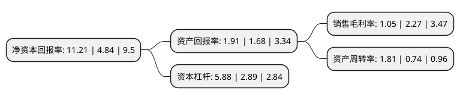

> 本页面由自动化程序生成于 2022年5月20日 01:19
> 内容可能存在错误，如有bug请提交issue至：https://github.com/Eroleice/doc-pi/issues
{.is-warning}

# 上市公司基本情况

## 基本资料

深圳市维业装饰集团股份有限公司（以下简称“维业股份”）成立于1994年10月18日，深圳市。于2017年03月16日在深交所创业板上市。

维业股份注册资本20,805.67万元，主要从事建筑装饰工程的设计与施工。主要服务有装饰施工业务，装饰设计业务，木制品销售。以下是详细信息：

- 公司名称: 深圳市维业装饰集团股份有限公司
- 股票代码: 300621.SZ
- 所在地: 广东 - 深圳市
- 成立日期: 1994年10月18日
- 注册资本: 20,805.67万元
- 法定代表人: 张宏勇
- 主营业务: 主要从事建筑装饰工程的设计与施工主要服务有装饰施工业务，装饰设计业务，木制品销售
- 公司官网: www.szweiye.com
- 公司介绍: 公司是一家以建筑装饰设计与施工为主的综合性企业集团，主要为大型房地产、政府机构、大型企业、高档酒店等提供装饰设计和施工服务。承接的项目包括公共建筑装饰、住宅精装修及建筑装饰设计等，涵盖大型场馆、星级酒店、商业综合体、文教体卫设施、交通基础设施等公共建筑和普通住宅、高档别墅等建筑的装饰设计与施工业务。公司拥有建筑装饰施工设计等多项专业壹级、甲级资质，控股子公司闽东建工拥有建筑工程施工总承包一级、市政公用工程施工总承包一级、古建筑工程专业承包一级、城市及道路照明工程专业承包一级、环保工程专业承包一级等多项专业资质。公司是中国建筑装饰“AAA级信用企业”，广东省“守合同重信用企业”，“国家守合同重信用”，先后通过ISO9001质量管理体系、ISO14001环境管理体系、GB/T28001职业健康安全管理体系认证。获得了多项包括鲁班奖在内的国家及省市级工程奖，被中国建装饰协会评为“中国建筑装饰30年行业开创型企业”、“改革开放30年建筑装饰行业发展突出贡献企业”、“酒店空间、展陈类、商业办公专业化百强企业”。

## 股东及高管情况

上市公司第一大股东为珠海华发实体产业投资控股有限公司，持股62,411,589股，占比29.99%，**疑似为**上市公司实际控制人。

截至2022年03月31日，上市公司的前十大股东中，共有7名自然人股东，3名机构股东，其中5%以上大股东共有3名。上市公司前十大股东明细如下：

> 未能通过持股比例判定出上市公司实际控制人（持股30%以上）
> 可能存在通过间接持股、联合持股、协议控制等方式拥有实际控制权的主体，具体请参考上市公司定期公告！
{.is-warning}

> 截至2022年03月31日，上市公司前十大股东信息如下：

| 股东名称 | 持股数量（股） | 持股比例 |
| --- | --- | --- |
| 珠海华发实体产业投资控股有限公司 | 62,411,589 | 29.99% |
| 云南众英集企业管理中心(有限合伙) | 27,582,550 | 13.26% |
| 深圳市维业控股有限公司 | 17,337,411 | 8.33% |
| 张汉清 | 7,638,856 | 3.67% |
| 张汉伟 | 6,750,000 | 3.24% |
| 张汉洪 | 2,250,000 | 1.08% |
| 胡志炜 | 2,065,305 | 0.99% |
| 雷一庄 | 1,375,110 | 0.66% |
| 雷立军 | 875,183 | 0.42% |
| 彭金萃 | 809,450 | 0.39% |

## 杜邦分析

> 数据列示周期：2021年 | 2020年 | 2019年
{.is-info}

上市公司的净资产收益率在近一年有所上升，上升幅度为131.61%，其变化情况分解如下：
- 上市公司的销售毛利率在近一年下降了-53.74%，可能是生产效率的下降、商品原材料价格上涨或商品价格的下跌所致。
- 上市公司的资产周转率在近一年上升了144.59%，可能是源自于更快的销售回款或库存管理效果提升。
- 上市公司的财务杠杆比率在近一年上升了103.46%，可能是增加负债扩大生产规模。

