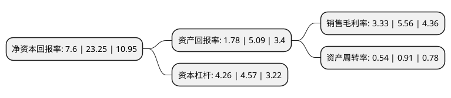

> 本页面由自动化程序生成于 2022年5月20日 01:25
> 内容可能存在错误，如有bug请提交issue至：https://github.com/Eroleice/doc-pi/issues
{.is-warning}

# 上市公司基本情况

## 基本资料

上海创兴资源开发股份有限公司（以下简称“创兴资源”）成立于1996年08月25日，上海市。于1999年05月27日在上交所主板上市。

创兴资源注册资本42,537.3万元，主要业务:主题乐园场馆，高端酒店及住宅的工程施工总承包，室内装修总承包，工程项目相关的BIM建模咨询服务和商品销售以下是详细信息：

- 公司名称: 上海创兴资源开发股份有限公司
- 股票代码: 600193.SH
- 所在地: 上海 - 上海市
- 成立日期: 1996年08月25日
- 注册资本: 42,537.3万元
- 法定代表人: 顾简兵
- 主营业务: 主题乐园场馆，高端酒店及住宅的工程施工总承包，室内装修总承包，工程项目相关的BIM建模咨询服务和商品销售
- 公司官网: null
- 公司介绍: 公司原主营业务为铁矿石开发，后转型进入建筑装饰行业。目前公司承接的项目主要为主题乐园场馆、高端酒店及住宅的工程施工总承包、室内装修总承包、工程项目相关的BIM建模咨询服务和商品销售，拥有建筑装修装饰工程专业承包二级资质、建筑工程施工总承包二级资质。公司一般通过商业谈判或是参与工程招投标与客户签订业务合同，根据客户要求组织设计、施工，部分工程业务分包给有良好合作基础的供应商。公司现阶段与客户业务合作关系稳固。

## 股东及高管情况

上市公司第一大股东为厦门百汇兴投资有限公司，持股62,540,594股，占比14.7%，**疑似为**上市公司实际控制人。

截至2022年03月31日，上市公司的前十大股东中，共有6名自然人股东，4名机构股东，其中5%以上大股东共有3名。上市公司前十大股东明细如下：

> 未能通过持股比例判定出上市公司实际控制人（持股30%以上）
> 可能存在通过间接持股、联合持股、协议控制等方式拥有实际控制权的主体，具体请参考上市公司定期公告！
{.is-warning}

> 截至2022年03月31日，上市公司前十大股东信息如下：

| 股东名称 | 持股数量（股） | 持股比例 |
| --- | --- | --- |
| 厦门百汇兴投资有限公司 | 62,540,594 | 14.7% |
| 漳州大洋投资股份有限公司 | 43,514,518 | 10.23% |
| 厦门博纳科技有限公司 | 33,002,806 | 7.76% |
| 桑日百汇兴投资有限公司 | 7,480,000 | 1.76% |
| 邱淑君 | 4,057,264 | 0.95% |
| 李奕奇 | 3,288,300 | 0.77% |
| 吴业能 | 3,249,200 | 0.76% |
| 郑宝华 | 2,620,000 | 0.62% |
| 沈燕 | 2,530,000 | 0.59% |
| 杨小荷 | 2,411,214 | 0.57% |

## 利润表分析

上市公司2021年总收入为6.9亿元，净利润为0.23亿元，实现盈利。

## 杜邦分析

> 数据列示周期：2021年 | 2020年 | 2019年
{.is-info}

上市公司的净资产收益率在近一年有所下降，下降幅度为-67.31%，其变化情况分解如下：
- 上市公司的销售毛利率在近一年下降了-40.11%，可能是生产效率的下降、商品原材料价格上涨或商品价格的下跌所致。
- 上市公司的资产周转率在近一年下降了-40.66%，可能是源自于更慢的销售回款或库存管理效果下降。
- 上市公司的财务杠杆比率在近一年下降了-6.78%，可能是减少负债降低财务费用。

