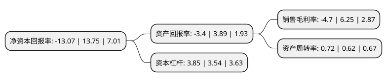

> 本页面由自动化程序生成于 2022年5月20日 01:31
> 内容可能存在错误，如有bug请提交issue至：https://github.com/Eroleice/doc-pi/issues
{.is-warning}

# 上市公司基本情况

## 基本资料

江河创建集团股份有限公司（以下简称“江河集团”）成立于1999年02月04日，北京市。于2011年08月18日在上交所主板上市。

江河集团注册资本115,405万元，公司主营业务是主要从事建筑幕墙系统的研发设计，生产制造，工程施工和技术服务。主要产品为幕墙系统相关产品，包括建筑幕墙及附属建筑门窗，金属屋面(包括玻璃采光顶)，建筑遮阳和幕墙钢结构。以下是详细信息：

- 公司名称: 江河创建集团股份有限公司
- 股票代码: 601886.SH
- 所在地: 北京 - 北京市
- 成立日期: 1999年02月04日
- 注册资本: 115,405万元
- 法定代表人: 刘载望
- 主营业务: 公司主营业务是主要从事建筑幕墙系统的研发设计，生产制造，工程施工和技术服务主要产品为幕墙系统相关产品，包括建筑幕墙及附属建筑门窗，金属屋面(包括玻璃采光顶)，建筑遮阳和幕墙钢结构
- 公司官网: www.jangho.com
- 公司介绍: 公司主营业务分为建筑装饰业务和医疗健康业务两大板块，建筑装饰板块包括建筑幕墙、室内装饰和室内设计，在医疗健康板块，公司定位于医疗内容(服务)提供商，以眼科、第三方检验等专科领域为主要方向，致力于提供高品质医疗健康服务。公司以“为了人类的生存环境和健康福祉”为企业使命，致力于提供绿色建筑系统和高品质医疗健康服务，坚持“双主业，多元化”发展战略，旗下拥有JANGHO江河幕墙、Sundart承达集团(HK.1568)、港源装饰、港源幕墙、SLD梁志天设计集团(HK.2262)、Vision、江河泽明等行业知名品牌，业务遍布全球多个国家和地区，在建筑幕墙、室内装饰与设计、眼科医疗等专业领域居世界领先水平。公司是国家高新技术企业、国家技术创新示范企业、国家级知识产权优势企业，国家认定企业技术中心、博士后科研工作站，位居中国上市公司500强、中国民营企业500强。

## 股东及高管情况

上市公司第一大股东为北京江河源控股有限公司，持股315,645,200股，占比27.35%，**疑似为**上市公司实际控制人。

截至2022年03月31日，上市公司的前十大股东中，共有2名自然人股东，4名机构股东，4个产品账户，其中5%以上大股东共有3名。上市公司前十大股东明细如下：

> 未能通过持股比例判定出上市公司实际控制人（持股30%以上）
> 可能存在通过间接持股、联合持股、协议控制等方式拥有实际控制权的主体，具体请参考上市公司定期公告！
{.is-warning}

> 截至2022年03月31日，上市公司前十大股东信息如下：

| 股东名称 | 持股数量（股） | 持股比例 |
| --- | --- | --- |
| 北京江河源控股有限公司 | 315,645,200 | 27.35% |
| 刘载望 | 289,307,866 | 25.07% |
| 天津江河汇众企业管理合伙企业(有限合伙) | 156,137,600 | 13.53% |
| 北京城建集团有限责任公司 | 27,240,000 | 2.36% |
| 交通银行股份有限公司-广发中证基建工程交易型开放式指数证券投资基金 | 6,574,200 | 0.57% |
| 中国农业银行-华夏平稳增长混合型证券投资基金 | 5,313,300 | 0.46% |
| 深圳市万顺通资产管理有限公司-万顺通13号私募证券投资基金 | 5,000,050 | 0.43% |
| 中国工商银行股份有限公司-交银施罗德趋势优先混合型证券投资基金 | 4,458,022 | 0.39% |
| 刘风莲 | 4,000,000 | 0.35% |
| 华泰金融控股(香港)有限公司-自有资金 | 3,503,247 | 0.3% |

## 利润表分析

上市公司2021年总收入为207.89亿元，净利润为-9.78亿元，**未实现盈利**。

## 杜邦分析

> 数据列示周期：2021年 | 2020年 | 2019年
{.is-info}

上市公司的净资产收益率在近一年有所下降，下降幅度为-195.05%，其变化情况分解如下：
- 上市公司的销售毛利率在近一年下降了-175.2%，可能是生产效率的下降、商品原材料价格上涨或商品价格的下跌所致。
- 上市公司的资产周转率在近一年上升了16.13%，可能是源自于更快的销售回款或库存管理效果提升。
- 上市公司的财务杠杆比率在近一年上升了8.76%，可能是增加负债扩大生产规模。

