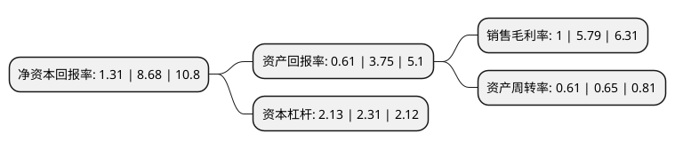

> 本页面由自动化程序生成于 2022年5月20日 01:32
> 内容可能存在错误，如有bug请提交issue至：https://github.com/Eroleice/doc-pi/issues
{.is-warning}

# 上市公司基本情况

## 基本资料

森特士兴集团股份有限公司（以下简称“森特股份”）成立于2001年12月05日，北京市。于2016年12月16日在上交所主板上市。

森特股份注册资本53,879.998万元，主营业务:研发，生产，销售绿色，环保，节能新型建材并提供相关工程设计，生产，安装和售后等一体化服务，主要承接金属围护系统工程(屋面系统，墙面系统)和声屏障系统工程，提供从工程咨询，设计，专用材料供应和加工制作到安装施工全过程的工程承包服务;主要产品:金属复合幕墙板，金属屋墙面单层板(铝镁锰合金板，镀制烤漆板)和隔吸声屏障板。以下是详细信息：

- 公司名称: 森特士兴集团股份有限公司
- 股票代码: 603098.SH
- 所在地: 北京 - 北京市
- 成立日期: 2001年12月05日
- 注册资本: 53,879.998万元
- 法定代表人: 刘爱森
- 主营业务: 主营业务:研发，生产，销售绿色，环保，节能新型建材并提供相关工程设计，生产，安装和售后等一体化服务，主要承接金属围护系统工程(屋面系统，墙面系统)和声屏障系统工程，提供从工程咨询，设计，专用材料供应和加工制作到安装施工全过程的工程承包服务;主要产品:金属复合幕墙板，金属屋墙面单层板(铝镁锰合金板，镀制烤漆板)和隔吸声屏障板
- 公司官网: www.centerint.com
- 公司介绍: 公司专注于为客户提供高端金属建筑围护系统、声屏障系统和钢结构工程的设计、制造、安装施工一体化服务；集团所属原森特(北京)国际建筑系统有限公司，主要承揽新型钢结构高铁站、会展中心、博览会展馆、文化体育场馆、机场候机楼、交通枢纽等大型公共建筑的金属屋面、墙面系统；公司拥有钢结构工程专业承包一级资质，通过了ISO9001质量管理体系认证、ISO14001环境管理体系认证、GB/T28001职业健康安全管理体系认证、美国FM认证；同时也是中国钢结构协会会员企业，高新技术企业，全国首批国家级征信企业，北京市建设行业诚信企业，2010年被授予全国高科技低碳钢结构产业化示范基地。公司具备独立承接钢结构工程、围护系统工程、环保工程的咨询、设计、制做、施工的丰富经验，凭借着精湛的专业技术、科学的企业管理、丰富的行业经验、敬业的经营团队。公司设有技术中心，建立完善的技术创新机制，以企业为主体，加强产学研合作，促进技术开发和科技成果转化。技术中心下设检测中心，拥有先进的检测设备，能对金属结构的理化性能、板材厚度、涂层厚度等指标进行科学的测量，有力的保证了产品质量。

## 股东及高管情况

上市公司第一大股东为刘爱森，持股135,226,381股，占比25.1%，**疑似为**上市公司实际控制人。

截至2022年03月31日，上市公司的前十大股东中，共有3名自然人股东，3名机构股东，4个产品账户，其中5%以上大股东共有3名。上市公司前十大股东明细如下：

> 未能通过持股比例判定出上市公司实际控制人（持股30%以上）
> 可能存在通过间接持股、联合持股、协议控制等方式拥有实际控制权的主体，具体请参考上市公司定期公告！
{.is-warning}

> 截至2022年03月31日，上市公司前十大股东信息如下：

| 股东名称 | 持股数量（股） | 持股比例 |
| --- | --- | --- |
| 刘爱森 | 135,226,381 | 25.1% |
| 隆基绿能科技股份有限公司 | 130,805,407 | 24.28% |
| 北京士兴盛亚投资有限公司 | 57,662,696 | 10.7% |
| 新华都实业集团股份有限公司 | 21,610,406 | 4.01% |
| 翁家恩 | 20,930,000 | 3.88% |
| 朱雀基金-陕西煤业股份有限公司-陕煤朱雀新能源产业单一资产管理计划 | 16,756,858 | 3.11% |
| 招商银行股份有限公司-朱雀恒心一年持有期混合型证券投资基金 | 10,778,906 | 2% |
| 上海盎泽投资管理有限公司-盎泽大盈一号私募证券投资基金 | 7,277,238 | 1.35% |
| 招商银行股份有限公司-朱雀产业臻选混合型证券投资基金 | 6,565,075 | 1.22% |
| 陈发树 | 6,249,542 | 1.16% |

## 利润表分析

上市公司2021年总收入为31.39亿元，净利润为0.31亿元，实现盈利。

## 杜邦分析

> 数据列示周期：2021年 | 2020年 | 2019年
{.is-info}

上市公司的净资产收益率在近一年有所下降，下降幅度为-84.91%，其变化情况分解如下：
- 上市公司的销售毛利率在近一年下降了-82.73%，可能是生产效率的下降、商品原材料价格上涨或商品价格的下跌所致。
- 上市公司的资产周转率在近一年下降了-6.15%，可能是源自于更慢的销售回款或库存管理效果下降。
- 上市公司的财务杠杆比率在近一年下降了-7.79%，可能是减少负债降低财务费用。

