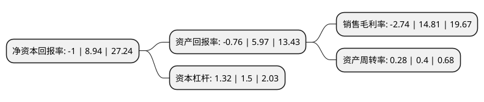

> 本页面由自动化程序生成于 2022年5月20日 01:36
> 内容可能存在错误，如有bug请提交issue至：https://github.com/Eroleice/doc-pi/issues
{.is-warning}

# 上市公司基本情况

## 基本资料

北京新时空科技股份有限公司（以下简称“时空科技”）成立于2004年02月20日，北京市。于2020年08月21日在上交所主板上市。

时空科技注册资本9,925.16万元，主营业务为照明工程系统集成服务，主要应用于文旅灯光秀和常规景观照明等领域。以下是详细信息：

- 公司名称: 北京新时空科技股份有限公司
- 股票代码: 605178.SH
- 所在地: 北京 - 北京市
- 成立日期: 2004年02月20日
- 注册资本: 9,925.16万元
- 法定代表人: 宫殿海
- 主营业务: 主营业务为照明工程系统集成服务，主要应用于文旅灯光秀和常规景观照明等领域
- 公司官网: www.nnlighting.com
- 公司介绍: 公司是一家照明工程行业的优秀企业，是集文旅表演创意和智慧照明系统研发于一体的行业知名企业,主营业务为照明工程系统集成服务，公司拥有城市及道路照明工程专业承包壹级资质、照明工程设计专项甲级资质及水景喷泉设计施工甲壹级三项行业内的重要资质。公司专注于城市公共空间的复兴，经过多年发展，公司主营业务由传统单一、静态的常规景观照明拓展至以视听体验一体化为主的文旅灯光秀，主要为利用声、光、电技术融合历史文化、传统风俗等诸多内容和多样化表现形式的动态灯光秀(含城市微电影、水景喷泉、人光互动、3D及4D表演)等，以创新性技术引领发展，打造城市新空间、带来新体验、创造新价值，开拓了将城市照明跃迁为文化旅游及智慧照明概念的“夜游经济”新模式。

## 股东及高管情况

上市公司第一大股东为宫殿海，持股37,168,589股，占比37.45%，为上市公司实际控制人。

截至2022年03月31日，上市公司的前十大股东中，共有8名自然人股东，1名机构股东，1个产品账户，其中5%以上大股东共有2名。上市公司前十大股东明细如下：

> 截至2022年03月31日，上市公司前十大股东信息如下：

| 股东名称 | 持股数量（股） | 持股比例 |
| --- | --- | --- |
| 宫殿海 | 37,168,589 | 37.45% |
| 杨耀华 | 12,905,760 | 13% |
| 中国-比利时直接股权投资基金 | 4,619,700 | 4.65% |
| 袁晓东 | 4,517,016 | 4.55% |
| 闫石 | 2,968,325 | 2.99% |
| 广东温氏投资有限公司 | 2,159,668 | 2.18% |
| 刘继勋 | 1,677,749 | 1.69% |
| 池龙伟 | 1,161,518 | 1.17% |
| 王志刚 | 1,032,461 | 1.04% |
| 唐正 | 1,032,461 | 1.04% |

## 利润表分析

上市公司2021年总收入为7.45亿元，净利润为-0.21亿元，**未实现盈利**。

## 杜邦分析

> 数据列示周期：2021年 | 2020年 | 2019年
{.is-info}

上市公司的净资产收益率在近一年有所下降，下降幅度为-111.19%，其变化情况分解如下：
- 上市公司的销售毛利率在近一年下降了-118.5%，可能是生产效率的下降、商品原材料价格上涨或商品价格的下跌所致。
- 上市公司的资产周转率在近一年下降了-30%，可能是源自于更慢的销售回款或库存管理效果下降。
- 上市公司的财务杠杆比率在近一年下降了-12%，可能是减少负债降低财务费用。

