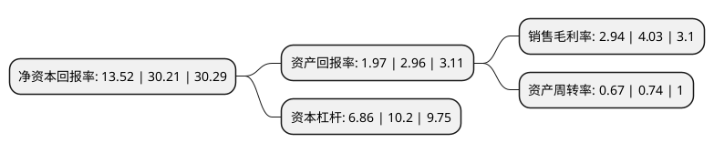

> 本页面由自动化程序生成于 2022年5月20日 01:37
> 内容可能存在错误，如有bug请提交issue至：https://github.com/Eroleice/doc-pi/issues
{.is-warning}

# 上市公司基本情况

## 基本资料

德才装饰股份有限公司（以下简称“德才股份”）成立于1999年08月26日，青岛市。于2021年07月06日在上交所主板上市。

德才股份注册资本10,000万元，建筑装饰及房屋建筑工程的设计与施工。以下是详细信息：

- 公司名称: 德才装饰股份有限公司
- 股票代码: 605287.SH
- 所在地: 山东 - 青岛市
- 成立日期: 1999年08月26日
- 注册资本: 10,000万元
- 法定代表人: 叶德才
- 主营业务: 建筑装饰及房屋建筑工程的设计与施工
- 公司官网: www.qddecai.com.cn
- 公司介绍: 公司是综合性建筑类企业，主营业务系建筑装饰及房屋建筑工程的设计与施工,公司及其子公司拥有《建筑装饰工程设计专项甲级》、《建筑装修装饰工程专业承包壹级》、《建筑幕墙工程设计专项甲级》、《建筑幕墙工程专业承包壹级》、《建筑行业(建筑工程)设计甲级》、《房屋建筑工程施工总承包壹级》、《市政公用工程施工总承包壹级》等十五个壹级(甲级)资质证书，公司是中国建筑装饰协会副会长单位、中国民族建筑研究会副会长单位，曾获得中国建筑装饰协会AAA级信用企业，国家级守合同重信用企业，全国建筑装饰行业百家优秀科技创新型企业，中国建筑装饰百强企业、中国建筑装饰设计机构五十强企业、中国建筑幕墙行业百强企业、中国民族建筑业百强企业、中国建筑装饰优秀专业化设计机构、中国民族建筑优秀企业等多项称号。公司先后通过了“质量管理体系认证”、“环境管理体系认证”、“职业健康安全管理体系认证”、“知识产权管理体系认证”，成为“四证一体化”的建筑装饰高新技术企业。

## 股东及高管情况

上市公司第一大股东为叶德才，持股28,651,364股，占比28.65%，**疑似为**上市公司实际控制人。

截至2022年03月31日，上市公司的前十大股东中，共有2名自然人股东，6名机构股东，2个产品账户，其中5%以上大股东共有4名。上市公司前十大股东明细如下：

> 未能通过持股比例判定出上市公司实际控制人（持股30%以上）
> 可能存在通过间接持股、联合持股、协议控制等方式拥有实际控制权的主体，具体请参考上市公司定期公告！
{.is-warning}

> 截至2022年03月31日，上市公司前十大股东信息如下：

| 股东名称 | 持股数量（股） | 持股比例 |
| --- | --- | --- |
| 叶德才 | 28,651,364 | 28.65% |
| 青岛城世基金管理有限公司-青岛城高世纪基金投资管理中心(有限合伙) | 9,886,364 | 9.89% |
| 红塔创新投资股份有限公司 | 8,250,000 | 8.25% |
| 青岛德才君和投资有限公司 | 5,679,545 | 5.68% |
| 青岛地铁金融控股有限公司 | 3,750,000 | 3.75% |
| 北京新华联产业投资有限公司 | 3,735,000 | 3.74% |
| 西藏赢股投资管理有限公司-珠海赢股股权投资基金(有限合伙) | 3,477,273 | 3.48% |
| 金石投资有限公司 | 3,340,909 | 3.34% |
| 西藏赢悦投资管理有限公司 | 3,340,909 | 3.34% |
| 叶得森 | 2,843,182 | 2.84% |

## 利润表分析

上市公司2021年总收入为50.39亿元，净利润为1.48亿元，实现盈利。

## 杜邦分析

> 数据列示周期：2021年 | 2020年 | 2019年
{.is-info}

上市公司的净资产收益率在近一年有所下降，下降幅度为-55.25%，其变化情况分解如下：
- 上市公司的销售毛利率在近一年下降了-27.05%，可能是生产效率的下降、商品原材料价格上涨或商品价格的下跌所致。
- 上市公司的资产周转率在近一年下降了-9.46%，可能是源自于更慢的销售回款或库存管理效果下降。
- 上市公司的财务杠杆比率在近一年下降了-32.75%，可能是减少负债降低财务费用。

