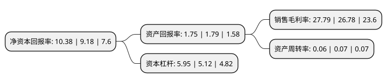

> 本页面由自动化程序生成于 2022年5月20日 01:01
> 内容可能存在错误，如有bug请提交issue至：https://github.com/Eroleice/doc-pi/issues
{.is-warning}

# 上市公司基本情况

## 基本资料

申万宏源集团股份有限公司（以下简称“申万宏源”）成立于1996年09月16日，乌鲁木齐市。于2015年01月26日在深交所主板上市。

申万宏源注册资本2,503,994.456万元，主营业务:金融投资，股权投资等以下是详细信息：

- 公司名称: 申万宏源集团股份有限公司
- 股票代码: 000166.SZ
- 所在地: 新疆 - 乌鲁木齐市
- 成立日期: 1996年09月16日
- 注册资本: 2,503,994.456万元
- 法定代表人: 黄昊
- 主营业务: 主营业务:金融投资，股权投资等
- 公司官网: www.swhygh.com
- 公司介绍: 公司采用“投资控股集团+证券子公司”的双层架构，将在巩固和扩大原有证券业务优势的同时，进一步吸纳银行、保险、信托和租赁等金融业务资源，建设以资本市场为依托的投资与金融全产业链，实现不同类型业务之间客户共享和客户需求的深度挖掘，为实体经济提供综合化的全面金融服务，最终实现成为中投旗下金融资产证券化重要平台的目标定位。集团公司努力发展成为以资本市场为依托的国内一流投资控股集团，证券子公司努力将发展成为具有国际竞争力、品牌影响力和系统重要性的现代投资银行。

## 股东及高管情况

上市公司第一大股东为中国建银投资有限责任公司，持股6,596,306,947股，占比26.34%，**疑似为**上市公司实际控制人。

截至2022年03月31日，上市公司的前十大股东中，共有7名机构股东，1个产品账户，2个海外主体，其中5%以上大股东共有3名。上市公司前十大股东明细如下：

> 未能通过持股比例判定出上市公司实际控制人（持股30%以上）
> 可能存在通过间接持股、联合持股、协议控制等方式拥有实际控制权的主体，具体请参考上市公司定期公告！
{.is-warning}

> 截至2022年03月31日，上市公司前十大股东信息如下：

| 股东名称 | 持股数量（股） | 持股比例 |
| --- | --- | --- |
| 中国建银投资有限责任公司 | 6,596,306,947 | 26.34% |
| 中央汇金投资有限责任公司 | 5,020,606,527 | 20.05% |
| 香港中央结算(代理人)有限公司 | 2,503,800,170 | 10% |
| 上海久事(集团)有限公司 | 1,205,533,389 | 4.81% |
| 四川发展(控股)有限责任公司 | 1,121,543,633 | 4.48% |
| 中国光大集团股份公司 | 999,000,000 | 3.99% |
| 中国证券金融股份有限公司 | 635,215,426 | 2.54% |
| 新疆金融投资有限公司 | 460,642,216 | 1.84% |
| 香港中央结算有限公司(陆股通) | 287,846,928 | 1.15% |
| 中国建设银行股份有限公司-国泰中证全指证券公司交易型开放式指数证券投资基金 | 237,518,680 | 0.95% |

## 利润表分析

上市公司2021年总收入为343.07亿元，净利润为95.34亿元，实现盈利。

## 杜邦分析

> 数据列示周期：2021年 | 2020年 | 2019年
{.is-info}

上市公司的净资产收益率在近一年有所上升，上升幅度为13.07%，其变化情况分解如下：
- 上市公司的销售毛利率在近一年上升了3.77%，可能是生产效率的提升、商品原材料价格下跌或商品价格的上涨所致。
- 上市公司的资产周转率在近一年下降了-14.29%，可能是源自于更慢的销售回款或库存管理效果下降。
- 上市公司的财务杠杆比率在近一年上升了16.21%，可能是增加负债扩大生产规模。

