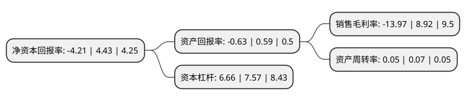

> 本页面由自动化程序生成于 2022年5月20日 01:03
> 内容可能存在错误，如有bug请提交issue至：https://github.com/Eroleice/doc-pi/issues
{.is-warning}

# 上市公司基本情况

## 基本资料

广东锦龙发展股份有限公司（以下简称“锦龙股份”）成立于1997年04月09日，东莞市。于1997年04月15日在深交所主板上市。

锦龙股份注册资本89,600万元，主营业务:证券业务以下是详细信息：

- 公司名称: 广东锦龙发展股份有限公司
- 股票代码: 000712.SZ
- 所在地: 广东 - 东莞市
- 成立日期: 1997年04月09日
- 注册资本: 89,600万元
- 法定代表人: 张丹丹
- 主营业务: 主营业务:证券业务
- 公司官网: www.jlgf.com
- 公司介绍: 公司是深圳证券交易所挂牌交易的上市公司。2000年公司进行了重大资产重组，转制为民营控股的上市公司，现公司第一大股东为东莞市新世纪科教拓展有限公司。公司主要经营业务为证券公司业务，公司持有中山证券70.96%股权，持有东莞证券40%股份，参股华联期货有限公司3%股权、东莞农村商业银行股份有限公司0.77%股份、广东清远农村商业银行股份有限公司0.06%股份。公司主要依托中山证券和东莞证券开展证券业务，中山证券和东莞证券的业务范围涵盖了经纪、投资咨询、财务顾问、承销与保荐、证券自营、资产管理、基金代销、期货IB、直接投资、融资融券等领域。

## 股东及高管情况

上市公司第一大股东为东莞市新世纪科教拓展有限公司，持股250,000,000股，占比27.9%，**疑似为**上市公司实际控制人。

截至2022年03月31日，上市公司的前十大股东中，共有5名自然人股东，2名机构股东，2个产品账户，1个海外主体，其中5%以上大股东共有3名。上市公司前十大股东明细如下：

> 未能通过持股比例判定出上市公司实际控制人（持股30%以上）
> 可能存在通过间接持股、联合持股、协议控制等方式拥有实际控制权的主体，具体请参考上市公司定期公告！
{.is-warning}

> 截至2022年03月31日，上市公司前十大股东信息如下：

| 股东名称 | 持股数量（股） | 持股比例 |
| --- | --- | --- |
| 东莞市新世纪科教拓展有限公司 | 250,000,000 | 27.9% |
| 朱凤廉 | 132,110,504 | 14.74% |
| 杨志茂 | 66,300,000 | 7.4% |
| 黄海晓 | 11,130,440 | 1.24% |
| 中国建设银行股份有限公司-国泰中证全指证券公司交易型开放式指数证券投资基金 | 9,988,442 | 1.11% |
| 中国建设银行股份有限公司-华宝中证全指证券公司交易型开放式指数证券投资基金 | 6,166,324 | 0.69% |
| 香港中央结算有限公司(陆股通) | 4,565,538 | 0.51% |
| 黄雪林 | 4,040,769 | 0.45% |
| 北京龙宇坊商业管理有限公司 | 3,722,800 | 0.42% |
| 郑权 | 2,923,502 | 0.33% |

## 利润表分析

上市公司2021年总收入为10.06亿元，净利润为-1.41亿元，**未实现盈利**。

## 杜邦分析

> 数据列示周期：2021年 | 2020年 | 2019年
{.is-info}

上市公司的净资产收益率在近一年有所下降，下降幅度为-195.03%，其变化情况分解如下：
- 上市公司的销售毛利率在近一年下降了-256.61%，可能是生产效率的下降、商品原材料价格上涨或商品价格的下跌所致。
- 上市公司的资产周转率在近一年下降了-28.57%，可能是源自于更慢的销售回款或库存管理效果下降。
- 上市公司的财务杠杆比率在近一年下降了-12.02%，可能是减少负债降低财务费用。

