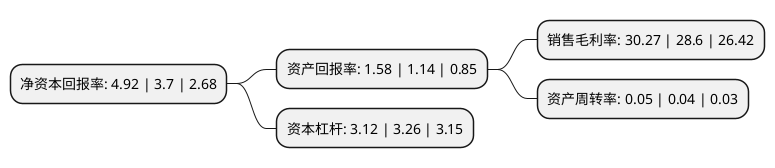

> 本页面由自动化程序生成于 2022年5月20日 01:03
> 内容可能存在错误，如有bug请提交issue至：https://github.com/Eroleice/doc-pi/issues
{.is-warning}

# 上市公司基本情况

## 基本资料

国元证券股份有限公司（以下简称“国元证券”）成立于1997年06月06日，合肥市。于1997年06月16日在深交所主板上市。

国元证券注册资本436,377.789万元，主营业务:经纪业务，自营投资业务，投行业务，资产管理业务，基金管理业务，期货业务，境外业务国元黄山1号集合资产管理计划，国元黄山2号集合资产管理计划以下是详细信息：

- 公司名称: 国元证券股份有限公司
- 股票代码: 000728.SZ
- 所在地: 安徽 - 合肥市
- 成立日期: 1997年06月06日
- 注册资本: 436,377.789万元
- 法定代表人: 俞仕新
- 主营业务: 主营业务:经纪业务，自营投资业务，投行业务，资产管理业务，基金管理业务，期货业务，境外业务国元黄山1号集合资产管理计划，国元黄山2号集合资产管理计划
- 公司官网: www.gyzq.com.cn
- 公司介绍: 公司是由原安徽省国际信托投资公司和安徽省信托投资公司作为主发起人，于2001年10月成立。2007年10月30日以股权分置改革为契机，公司借壳“北京化二”成功在深圳证券交易所上市。公司牌照齐全，主要业务有经纪业务、投行业务、自营投资业务、资产管理业务、证券信用业务，公司坚持稳健经营，严守风控合规，传统业务与创新业务同步推进，既迎接了牛市的全面考验，也成功抵御了突发的市场风险。近年来，公司未发生债务违约的情况，有着良好的信用记录和社会声誉。同时，公司还与国内主要商业银行均保持着良好的合作关系，并已获得了商业银行较大规模综合授信，可用于解决公司的短、中、长期的资金需求。

## 股东及高管情况

上市公司第一大股东为安徽国元金融控股集团有限责任公司，持股939,150,449股，占比21.5215%，**疑似为**上市公司实际控制人。

截至2022年04月29日，上市公司的前十大股东中，共有9名机构股东，1个海外主体，其中5%以上大股东共有6名。上市公司前十大股东明细如下：

> 未能通过持股比例判定出上市公司实际控制人（持股30%以上）
> 可能存在通过间接持股、联合持股、协议控制等方式拥有实际控制权的主体，具体请参考上市公司定期公告！
{.is-warning}

> 截至2022年04月29日，上市公司前十大股东信息如下：

| 股东名称 | 持股数量（股） | 持股比例 |
| --- | --- | --- |
| 安徽国元金融控股集团有限责任公司 | 939,150,449 | 21.5215% |
| 安徽国元信托有限责任公司 | 581,769,601 | 13.33% |
| 安徽国元信托有限责任公司 | 578,142,601 | 13.25% |
| 安徽国元信托有限责任公司 | 578,142,601 | 13.25% |
| 建安投资控股集团有限公司 | 236,682,425 | 5.42% |
| 建安投资控股集团有限公司 | 236,682,425 | 5.42% |
| 安徽省安粮集团有限公司 | 134,722,998 | 3.09% |
| 安徽皖维高新材料股份有限公司 | 118,576,969 | 2.72% |
| 广东省高速公路发展股份有限公司 | 103,482,582 | 2.37% |
| 香港中央结算有限公司(陆股通) | 71,239,268 | 1.63% |

## 利润表分析

上市公司2021年总收入为61.09亿元，净利润为19.1亿元，实现盈利。

## 杜邦分析

> 数据列示周期：2020年 | 2019年 | 2018年
{.is-info}

上市公司的净资产收益率在近一年有所上升，上升幅度为32.97%，其变化情况分解如下：
- 上市公司的销售毛利率在近一年上升了5.84%，可能是生产效率的提升、商品原材料价格下跌或商品价格的上涨所致。
- 上市公司的资产周转率在近一年上升了25%，可能是源自于更快的销售回款或库存管理效果提升。
- 上市公司的财务杠杆比率在近一年下降了-4.29%，可能是减少负债降低财务费用。

