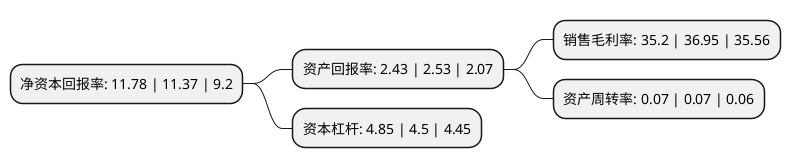

> 本页面由自动化程序生成于 2022年5月20日 01:03
> 内容可能存在错误，如有bug请提交issue至：https://github.com/Eroleice/doc-pi/issues
{.is-warning}

# 上市公司基本情况

## 基本资料

广发证券股份有限公司（以下简称“广发证券”）成立于1994年01月21日，广州市。于1997年06月11日在深交所主板上市。

广发证券注册资本762,108.766万元，主营业务:证券经纪以下是详细信息：

- 公司名称: 广发证券股份有限公司
- 股票代码: 000776.SZ
- 所在地: 广东 - 广州市
- 成立日期: 1994年01月21日
- 注册资本: 762,108.766万元
- 法定代表人: 林传辉
- 主营业务: 主营业务:证券经纪
- 公司官网: www.gf.com.cn
- 公司介绍: 公司是国内首批综合类证券公司。公司先后于2010年和2015年分别在深圳证券交易所及香港联合交易所主板上市。公司是定位于专注中国优质企业及富裕人群，拥有行业领先创新能力的资本市场综合服务商。公司提供多元化业务以满足企业、个人(尤其是富裕人群)及机构投资者、金融机构及政府客户的多样化需求。公司拥有投资银行、财富管理、交易及机构客户服务、投资管理等全业务牌照，各项主要业务相对均衡发展，均取得了靠前的行业排名。同时，公司控股广发期货、广发基金、广发控股香港、广发信德、广发乾和及广发资管，投资参股易方达基金(并列第一大股东)、证通公司、中证信用增进股份有限公司和中证机构间报价系统股份有限公司，并积极探索发展融资租赁、PPP和QDLP等业务，形成了初步的金融集团化架构。

## 股东及高管情况

上市公司第一大股东为香港中央结算(代理人)有限公司，持股1,700,187,060股，占比22.31%，**疑似为**上市公司实际控制人。

截至2022年03月31日，上市公司的前十大股东中，共有4名机构股东，4个产品账户，2个海外主体，其中5%以上大股东共有4名。上市公司前十大股东明细如下：

> 未能通过持股比例判定出上市公司实际控制人（持股30%以上）
> 可能存在通过间接持股、联合持股、协议控制等方式拥有实际控制权的主体，具体请参考上市公司定期公告！
{.is-warning}

> 截至2022年03月31日，上市公司前十大股东信息如下：

| 股东名称 | 持股数量（股） | 持股比例 |
| --- | --- | --- |
| 香港中央结算(代理人)有限公司 | 1,700,187,060 | 22.31% |
| 吉林敖东药业集团股份有限公司 | 1,252,297,867 | 16.43% |
| 辽宁成大股份有限公司 | 1,250,154,088 | 16.4% |
| 中山公用事业集团股份有限公司 | 686,754,216 | 9.01% |
| 中国证券金融股份有限公司 | 227,870,638 | 2.99% |
| 香港中央结算有限公司(陆股通) | 104,578,539 | 1.37% |
| 中国建设银行股份有限公司-国泰中证全指证券公司交易型开放式指数证券投资基金 | 58,554,813 | 0.77% |
| 中国建设银行股份有限公司-华宝中证全指证券公司交易型开放式指数证券投资基金 | 44,199,818 | 0.58% |
| 全国社保基金一一一组合 | 27,260,718 | 0.36% |
| 全国社保基金一一二组合 | 24,699,494 | 0.32% |

## 利润表分析

上市公司2021年总收入为342.49亿元，净利润为120.54亿元，实现盈利。

## 杜邦分析

> 数据列示周期：2021年 | 2020年 | 2019年
{.is-info}

上市公司的净资产收益率在近一年有所上升，上升幅度为3.61%，其变化情况分解如下：
- 上市公司的销售毛利率在近一年下降了-4.74%，可能是生产效率的下降、商品原材料价格上涨或商品价格的下跌所致。
- 上市公司的资产周转率在近一年下降了0%，可能是源自于更慢的销售回款或库存管理效果下降。
- 上市公司的财务杠杆比率在近一年上升了7.78%，可能是增加负债扩大生产规模。

