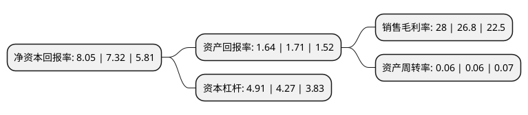

> 本页面由自动化程序生成于 2022年5月20日 01:03
> 内容可能存在错误，如有bug请提交issue至：https://github.com/Eroleice/doc-pi/issues
{.is-warning}

# 上市公司基本情况

## 基本资料

长江证券股份有限公司（以下简称“长江证券”）成立于1997年07月24日，武汉市。于1997年07月31日在深交所主板上市。

长江证券注册资本552,995.05万元，主营业务:证券经纪以下是详细信息：

- 公司名称: 长江证券股份有限公司
- 股票代码: 000783.SZ
- 所在地: 湖北 - 武汉市
- 成立日期: 1997年07月24日
- 注册资本: 552,995.05万元
- 法定代表人: 金才玖
- 主营业务: 主营业务:证券经纪
- 公司官网: www.cjsc.com
- 公司介绍: 公司是总部设在武汉、业务网络覆盖全国的一家综合类上市证券公司。公司秉承以“追求卓越”为核心价值观的企业文化，凭借齐备的业务资格、优良的业务资质、和强大的业务能力，致力于成为提供全面理财服务的一流金融企业。公司业务资质齐全，涵盖证券经纪、证券投资、证券承销、资产管理、股权投资、资本中介等诸多领域，可为广大客户提供全方位综合金融服务。近年来，公司屡获“中国证券行业十大影响力品牌”、“最具发展力券商”、“最具成长性证券公司”、“中国上市公司价值百强”、“中国证券市场20年最具影响力证券公司”、“中国最佳证券经纪商”等多项殊荣，在行业和市场上树立了良好的品牌形象。

## 股东及高管情况

上市公司第一大股东为新理益集团有限公司，持股823,332,320股，占比14.89%，**疑似为**上市公司实际控制人。

截至2022年03月31日，上市公司的前十大股东中，共有10名机构股东，其中5%以上大股东共有3名。上市公司前十大股东明细如下：

> 未能通过持股比例判定出上市公司实际控制人（持股30%以上）
> 可能存在通过间接持股、联合持股、协议控制等方式拥有实际控制权的主体，具体请参考上市公司定期公告！
{.is-warning}

> 截至2022年03月31日，上市公司前十大股东信息如下：

| 股东名称 | 持股数量（股） | 持股比例 |
| --- | --- | --- |
| 新理益集团有限公司 | 823,332,320 | 14.89% |
| 湖北能源集团股份有限公司 | 529,609,894 | 9.58% |
| 三峡资本控股有限责任公司 | 332,925,399 | 6.02% |
| 国华人寿保险股份有限公司-分红三号 | 242,173,322 | 4.38% |
| 上海海欣集团股份有限公司 | 228,416,100 | 4.13% |
| 武汉城市建设集团有限公司 | 200,000,000 | 3.62% |
| 湖北省宏泰国有资本投资运营集团有限公司 | 178,000,000 | 3.22% |
| 中国葛洲坝集团股份有限公司 | 135,879,152 | 2.46% |
| 长江产业投资集团有限公司 | 100,000,000 | 1.81% |
| 湖北省鄂旅投创业投资有限责任公司 | 100,000,000 | 1.81% |

## 利润表分析

上市公司2021年总收入为86.23亿元，净利润为24.14亿元，实现盈利。

## 杜邦分析

> 数据列示周期：2021年 | 2020年 | 2019年
{.is-info}

上市公司的净资产收益率在近一年有所上升，上升幅度为9.97%，其变化情况分解如下：
- 上市公司的销售毛利率在近一年上升了4.48%，可能是生产效率的提升、商品原材料价格下跌或商品价格的上涨所致。
- 上市公司的资产周转率在近一年下降了0%，可能是源自于更慢的销售回款或库存管理效果下降。
- 上市公司的财务杠杆比率在近一年上升了14.99%，可能是增加负债扩大生产规模。

