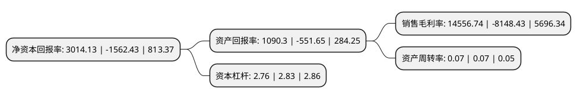

> 本页面由自动化程序生成于 2022年5月20日 01:11
> 内容可能存在错误，如有bug请提交issue至：https://github.com/Eroleice/doc-pi/issues
{.is-warning}

# 上市公司基本情况

## 基本资料

国盛金融控股集团股份有限公司（以下简称“国盛金控”）成立于1995年08月17日，佛山市。于2012年04月16日在深交所中小板上市。

国盛金控注册资本193,508.465万元，主营业务:证券业务，投资业务，金融科技业务。以下是详细信息：

- 公司名称: 国盛金融控股集团股份有限公司
- 股票代码: 002670.SZ
- 所在地: 广东 - 佛山市
- 成立日期: 1995年08月17日
- 注册资本: 193,508.465万元
- 法定代表人: 杜力
- 主营业务: 主营业务:证券业务，投资业务，金融科技业务
- 公司官网: www.gsfins.com
- 公司介绍: 公司于2012年在深圳证券交易所上市。通过内生式与外延式双向发展，以“资本+创新”为双轮驱动，逐步建设成为综合性金融服务集团。公司以证券业务平台为核心，以金融科技为支撑，以投资业务为纽带，链接资金与资产两端，充分发挥金融领域战略协同效应，打造全产业链金融产品与服务体系。国盛证券有限责任公司是国盛金控旗下全资子公司，业务牌照齐全，下辖期货、资管、直投三家子公司，为客户提供一站式综合金融服务。国盛证券以“全方位发展、全国性布局、全时性服务”为发展目标，业务布局完善，协同效应显著，致力于成为具有核心竞争力、国内一流的综合性金融服务公司。国盛金控旗下全资控股深圳国盛投资、香港国盛投资等投资平台。极盛科技是国盛金控旗下全资科技类子公司，通过大数据、云计算、人工智能等前沿技术手段，聚焦信息协同、多资产交易、智能数据服务等金融领域业务应用。极盛科技积极践行金融科技大数据及智能化战略，不断提高数据处理水平，促进业务创新，提升业务效率。

## 股东及高管情况

上市公司第一大股东为张家港财智投资中心(有限合伙)，持股330,157,746股，占比17.06%，**疑似为**上市公司实际控制人。

截至2022年03月31日，上市公司的前十大股东中，共有9名机构股东，1个产品账户，其中5%以上大股东共有5名。上市公司前十大股东明细如下：

> 未能通过持股比例判定出上市公司实际控制人（持股30%以上）
> 可能存在通过间接持股、联合持股、协议控制等方式拥有实际控制权的主体，具体请参考上市公司定期公告！
{.is-warning}

> 截至2022年03月31日，上市公司前十大股东信息如下：

| 股东名称 | 持股数量（股） | 持股比例 |
| --- | --- | --- |
| 张家港财智投资中心(有限合伙) | 330,157,746 | 17.06% |
| 雪松国际信托股份有限公司 | 311,734,019 | 16.11% |
| 深圳前海财智远大投资中心(有限合伙) | 258,384,325 | 13.35% |
| 西藏迅杰新科科技有限公司 | 210,654,997 | 10.89% |
| 北京凤凰财鑫股权投资中心(有限合伙) | 143,546,846 | 7.42% |
| 江西赣粤高速公路股份有限公司 | 78,500,053 | 4.06% |
| 北京岫晞股权投资中心(有限合伙) | 33,000,042 | 1.71% |
| 北京凤凰财智创新投资中心(有限合伙) | 32,997,360 | 1.71% |
| 江西省财政投资管理公司 | 30,502,517 | 1.58% |
| 中国建设银行股份有限公司-国泰中证全指证券公司交易型开放式指数证券投资基金 | 21,003,266 | 1.09% |

## 利润表分析

上市公司2021年总收入为23.47亿元，净利润为0.76亿元，实现盈利。

## 杜邦分析

> 数据列示周期：2021年 | 2020年 | 2019年
{.is-info}

上市公司的净资产收益率在近一年有所下降，下降幅度为-292.91%，其变化情况分解如下：
- 上市公司的销售毛利率在近一年下降了-278.64%，可能是生产效率的下降、商品原材料价格上涨或商品价格的下跌所致。
- 上市公司的资产周转率在近一年下降了0%，可能是源自于更慢的销售回款或库存管理效果下降。
- 上市公司的财务杠杆比率在近一年下降了-2.47%，可能是减少负债降低财务费用。

