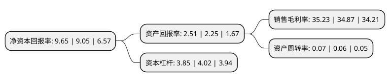

> 本页面由自动化程序生成于 2022年5月20日 01:11
> 内容可能存在错误，如有bug请提交issue至：https://github.com/Eroleice/doc-pi/issues
{.is-warning}

# 上市公司基本情况

## 基本资料

国信证券股份有限公司（以下简称“国信证券”）成立于1994年06月30日，深圳市。于2014年12月29日在深交所中小板上市。

国信证券注册资本961,242.938万元，主营业务:证券经纪，投资银行，证券自营，资产管理以及资本中介等业务，通过全资子公司从事直接投资业务，期货业务，境外业务等。以下是详细信息：

- 公司名称: 国信证券股份有限公司
- 股票代码: 002736.SZ
- 所在地: 广东 - 深圳市
- 成立日期: 1994年06月30日
- 注册资本: 961,242.938万元
- 法定代表人: 张纳沙
- 主营业务: 主营业务:证券经纪，投资银行，证券自营，资产管理以及资本中介等业务，通过全资子公司从事直接投资业务，期货业务，境外业务等
- 公司官网: www.guosen.com.cn
- 公司介绍: 公司是全国性大型综合类证券公司。公司主要通过总部下设机构以及下属分公司、营业部从事证券经纪及财富管理、投资银行、投资与交易、资产管理以及资本中介等业务；通过全资子公司国信弘盛、国信期货、国信香港分别开展私募基金、期货和境外金融服务等业务。公司坚持创新发展与合规风控“双轮驱动”的战略，全面推进业务差异化服务创新和客户适当性管理规范，积极拓宽全方位综合服务边界，构建跨平台服务体系，大力培育创新性业务。

## 股东及高管情况

上市公司第一大股东为深圳市投资控股有限公司，持股3,223,114,384股，占比33.53%，为上市公司实际控制人。

截至2022年03月31日，上市公司的前十大股东中，共有7名机构股东，2个产品账户，1个海外主体，其中5%以上大股东共有3名。上市公司前十大股东明细如下：

> 截至2022年03月31日，上市公司前十大股东信息如下：

| 股东名称 | 持股数量（股） | 持股比例 |
| --- | --- | --- |
| 深圳市投资控股有限公司 | 3,223,114,384 | 33.53% |
| 华润深国投信托有限公司 | 2,106,726,267 | 21.92% |
| 云南合和(集团)股份有限公司 | 1,611,627,813 | 16.77% |
| 全国社会保障基金理事会 | 456,690,209 | 4.75% |
| 北京城建投资发展股份有限公司 | 282,550,000 | 2.94% |
| 一汽股权投资(天津)有限公司 | 256,579,219 | 2.67% |
| 香港中央结算有限公司(陆股通) | 78,989,522 | 0.82% |
| 中国证券金融股份有限公司 | 75,086,423 | 0.78% |
| 中国建设银行股份有限公司-国泰中证全指证券公司交易型开放式指数证券投资基金 | 60,146,592 | 0.63% |
| 中央汇金资产管理有限责任公司 | 48,429,503 | 0.5% |

## 利润表分析

上市公司2021年总收入为238.18亿元，净利润为101.17亿元，实现盈利。

## 杜邦分析

> 数据列示周期：2020年 | 2019年 | 2018年
{.is-info}

上市公司的净资产收益率在近一年有所上升，上升幅度为6.63%，其变化情况分解如下：
- 上市公司的销售毛利率在近一年上升了1.03%，可能是生产效率的提升、商品原材料价格下跌或商品价格的上涨所致。
- 上市公司的资产周转率在近一年上升了16.67%，可能是源自于更快的销售回款或库存管理效果提升。
- 上市公司的财务杠杆比率在近一年下降了-4.23%，可能是减少负债降低财务费用。

