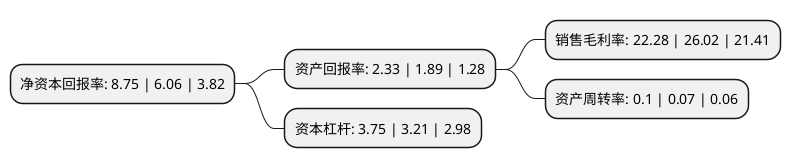

> 本页面由自动化程序生成于 2022年5月20日 01:13
> 内容可能存在错误，如有bug请提交issue至：https://github.com/Eroleice/doc-pi/issues
{.is-warning}

# 上市公司基本情况

## 基本资料

长城证券股份有限公司（以下简称“长城证券”）成立于1996年05月02日，深圳市。于2018年10月26日在深交所中小板上市。

长城证券注册资本310,340.535万元，主要业务包括经纪业务，金融研究，投行业务，证券投资业务，资产管理业务，场外市场业务，期货业务，基金管理业务，直接投资业务等。以下是详细信息：

- 公司名称: 长城证券股份有限公司
- 股票代码: 002939.SZ
- 所在地: 广东 - 深圳市
- 成立日期: 1996年05月02日
- 注册资本: 310,340.535万元
- 法定代表人: 张巍
- 主营业务: 主要业务包括经纪业务，金融研究，投行业务，证券投资业务，资产管理业务，场外市场业务，期货业务，基金管理业务，直接投资业务等
- 公司官网: www.cgws.com
- 公司介绍: 公司是一家资质齐全、业务覆盖全国的综合类证券公司，形成了多功能协调发展的金融业务体系。经营范围覆盖证券经纪，证券投资咨询，与证券交易、证券投资活动有关的财务顾问，证券承销与保荐，证券自营，证券资产管理，融资融券，证券投资基金代销，代销金融产品等。公司强调长城证券的企业公民社会责任，是对社会、股东、员工负责的企业，追求面向社会的透明化经营管理的公众公司；强调规范管理强化风控为公司发展主轴，致力成为可持续发展的百年老店；强调资源整合、创新进取、与国际接轨，走有特色品牌发展之路的国际公司。

## 股东及高管情况

上市公司第一大股东为华能资本服务有限公司，持股1,439,224,420股，占比46.38%，为上市公司实际控制人。

截至2022年03月31日，上市公司的前十大股东中，共有6名机构股东，3个产品账户，1个海外主体，其中5%以上大股东共有3名。上市公司前十大股东明细如下：

> 截至2022年03月31日，上市公司前十大股东信息如下：

| 股东名称 | 持股数量（股） | 持股比例 |
| --- | --- | --- |
| 华能资本服务有限公司 | 1,439,224,420 | 46.38% |
| 深圳能源集团股份有限公司 | 393,972,330 | 12.69% |
| 深圳新江南投资有限公司 | 383,437,823 | 12.36% |
| 香港中央结算有限公司(陆股通) | 23,763,579 | 0.77% |
| 福建湄洲湾控股有限公司 | 20,177,504 | 0.65% |
| 宁夏恒利通经贸有限公司 | 18,739,115 | 0.6% |
| 中国建设银行股份有限公司-国泰中证全指证券公司交易型开放式指数证券投资基金 | 17,984,399 | 0.58% |
| 中国工商银行股份有限公司-华夏核心制造混合型证券投资基金 | 16,725,147 | 0.54% |
| 新疆生产建设兵团国有资产经营有限责任公司 | 15,093,728 | 0.49% |
| 中国建设银行股份有限公司-华宝中证全指证券公司交易型开放式指数证券投资基金 | 13,668,176 | 0.44% |

## 杜邦分析

> 数据列示周期：2020年 | 2019年 | 2018年
{.is-info}

上市公司的净资产收益率在近一年有所上升，上升幅度为44.39%，其变化情况分解如下：
- 上市公司的销售毛利率在近一年下降了-14.37%，可能是生产效率的下降、商品原材料价格上涨或商品价格的下跌所致。
- 上市公司的资产周转率在近一年上升了42.86%，可能是源自于更快的销售回款或库存管理效果提升。
- 上市公司的财务杠杆比率在近一年上升了16.82%，可能是增加负债扩大生产规模。

