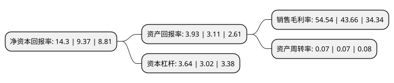

> 本页面由自动化程序生成于 2022年5月20日 01:13
> 内容可能存在错误，如有bug请提交issue至：https://github.com/Eroleice/doc-pi/issues
{.is-warning}

# 上市公司基本情况

## 基本资料

华林证券股份有限公司（以下简称“华林证券”）成立于1997年06月18日，拉萨市。于2019年01月17日在深交所中小板上市。

华林证券注册资本270,000万元，证券经纪业务，投资银行业务，自营业务，资产管理业务，信用交易业务。以下是详细信息：

- 公司名称: 华林证券股份有限公司
- 股票代码: 002945.SZ
- 所在地: 西藏 - 拉萨市
- 成立日期: 1997年06月18日
- 注册资本: 270,000万元
- 法定代表人: 林立
- 主营业务: 证券经纪业务，投资银行业务，自营业务，资产管理业务，信用交易业务
- 公司官网: www.chinalin.com
- 公司介绍: 公司是国内首批成立的证券公司之一，拥有证券业务全牌照。公司管理总部位于深圳，目前已在全国范围内开立分支机构超百家，覆盖全国主要大中城市。公司主营业务涵盖：证券经纪、投资银行、资产管理、投资管理、信用业务等。其中，证券经纪业务逐年扩大，投资银行业务常年稳居市场前列，其他业务均衡发展，屡获业界殊荣，公司各项业务收入结构日趋均衡，资本回报水平位居行业前列。公司一方面在坚持依法合规强化内部风险控制的基础上，充分挖掘客户的实际业务需求，整合经纪、投行、资管等各业务条线优势，集中发力，不断提高市场竞争力；另一方面，坚持市场化、高效、规范的企业运作机制，不断加强人才队伍建设，通过建立健全的内部管理机制，不断优化提升公司运营管理水平。公司推出的“华林公益行”足迹遍布全国，以实际行动践行企业社会责任。终坚持业务发展与合规经营并重，以客户为中心，构建以投资、投行业务为特色，财富管理业务为重要依托，资产管理业务和资本中介业务为重要驱动，其他业务为补充的综合服务体系，满足客户多元化的需求。经过多年不懈努力，公司差异化竞争能力和品牌影响力不断提升，发展成为了特色鲜明、线上线下融合的全国性综合券商。

## 股东及高管情况

上市公司第一大股东为深圳市立业集团有限公司，持股1,740,397,076股，占比64.46%，为上市公司实际控制人。

截至2022年03月31日，上市公司的前十大股东中，共有1名自然人股东，4名机构股东，4个产品账户，1个海外主体，其中5%以上大股东共有3名。上市公司前十大股东明细如下：

> 截至2022年03月31日，上市公司前十大股东信息如下：

| 股东名称 | 持股数量（股） | 持股比例 |
| --- | --- | --- |
| 深圳市立业集团有限公司 | 1,740,397,076 | 64.46% |
| 深圳市怡景食品饮料有限公司 | 484,789,089 | 17.96% |
| 深圳市希格玛计算机技术有限公司 | 204,813,835 | 7.59% |
| 青岛幂加和私募基金管理有限责任公司-幂加和价值成长私募证券投资基金 | 29,898,389 | 1.11% |
| 香港中央结算有限公司(陆股通) | 8,469,512 | 0.31% |
| 兴业银行股份有限公司-南方金融主题灵活配置混合型证券投资基金 | 7,159,400 | 0.27% |
| 中国建设银行股份有限公司-国泰中证全指证券公司交易型开放式指数证券投资基金 | 6,738,034 | 0.25% |
| 中国建设银行股份有限公司-华宝中证全指证券公司交易型开放式指数证券投资基金 | 4,048,995 | 0.15% |
| 金虹 | 1,792,000 | 0.07% |
| 华泰证券股份有限公司 | 1,660,378 | 0.06% |

## 利润表分析

上市公司2021年总收入为13.95亿元，净利润为4.83亿元，实现盈利。

## 杜邦分析

> 数据列示周期：2020年 | 2019年 | 2018年
{.is-info}

上市公司的净资产收益率在近一年有所上升，上升幅度为52.61%，其变化情况分解如下：
- 上市公司的销售毛利率在近一年上升了24.92%，可能是生产效率的提升、商品原材料价格下跌或商品价格的上涨所致。
- 上市公司的资产周转率在近一年下降了0%，可能是源自于更慢的销售回款或库存管理效果下降。
- 上市公司的财务杠杆比率在近一年上升了20.53%，可能是增加负债扩大生产规模。

