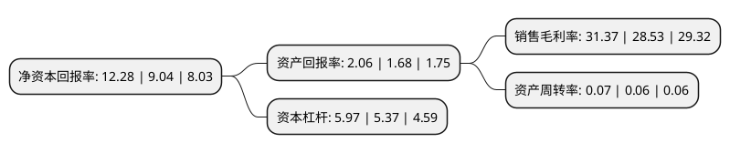

> 本页面由自动化程序生成于 2022年5月20日 01:23
> 内容可能存在错误，如有bug请提交issue至：https://github.com/Eroleice/doc-pi/issues
{.is-warning}

# 上市公司基本情况

## 基本资料

中信证券股份有限公司（以下简称“中信证券”）成立于1995年10月25日，深圳市。于2003年01月06日在上交所主板上市。

中信证券注册资本1,482,054.683万元，1，投资银行:股权融资业务，债券及结构化融资业务，财务顾问业务。2，经纪业务。3，交易4，资产管理5，投资6，研究业务以下是详细信息：

- 公司名称: 中信证券股份有限公司
- 股票代码: 600030.SH
- 所在地: 广东 - 深圳市
- 成立日期: 1995年10月25日
- 注册资本: 1,482,054.683万元
- 法定代表人: 张佑君
- 主营业务: 1，投资银行:股权融资业务，债券及结构化融资业务，财务顾问业务2，经纪业务3，交易4，资产管理5，投资6，研究业务
- 公司官网: www.cs.ecitic.com
- 公司介绍: 公司是国内规模最大的证券公司。主营业务范围为：证券经纪；证券投资咨询；与证券交易、证券投资活动有关的财务顾问；证券承销与保荐；证券自营；证券资产管理；融资融券；证券投资基金代销；为期货公司提供中间介绍业务。中信证券在若干业务领域保持或取得领先地位。公司紧紧围绕服务实体经济这一个中心，进一步完善融资安排者、财富管理者、交易服务与流动性提供者、市场重要投资者和风险管理者五大角色，不断重塑并巩固核心竞争力。公司依托第一大股东与中信银行、中信信托、信诚人寿保险等公司共同组成中信控股之综合经营模式，并与中信国际金融控股共同为客户提供境内外全面金融服务。

## 股东及高管情况

上市公司第一大股东为香港中央结算(代理人)有限公司，持股2,619,030,046股，占比17.67%，**疑似为**上市公司实际控制人。

截至2022年03月31日，上市公司的前十大股东中，共有4名机构股东，4个产品账户，2个海外主体，其中5%以上大股东共有2名。上市公司前十大股东明细如下：

> 未能通过持股比例判定出上市公司实际控制人（持股30%以上）
> 可能存在通过间接持股、联合持股、协议控制等方式拥有实际控制权的主体，具体请参考上市公司定期公告！
{.is-warning}

> 截至2022年03月31日，上市公司前十大股东信息如下：

| 股东名称 | 持股数量（股） | 持股比例 |
| --- | --- | --- |
| 香港中央结算(代理人)有限公司 | 2,619,030,046 | 17.67% |
| 中国中信有限公司 | 2,299,650,108 | 15.52% |
| 广州越秀金融控股集团有限公司 | 626,191,828 | 4.23% |
| 香港中央结算有限公司(陆股通) | 587,775,207 | 3.97% |
| 广州越秀金融控股集团股份有限公司 | 305,155,945 | 2.06% |
| 中国建设银行股份有限公司-国泰中证全指证券公司交易型开放式指数证券投资基金 | 207,805,399 | 1.4% |
| 中央汇金资产管理有限责任公司 | 205,146,964 | 1.38% |
| 大成基金-农业银行-大成中证金融资产管理计划 | 176,785,150 | 1.19% |
| 华夏基金-农业银行-华夏中证金融资产管理计划 | 166,143,027 | 1.12% |
| 中欧基金-农业银行-中欧中证金融资产管理计划 | 161,205,735 | 1.09% |

## 利润表分析

上市公司2021年总收入为765.23亿元，净利润为240.05亿元，实现盈利。

## 杜邦分析

> 数据列示周期：2021年 | 2020年 | 2019年
{.is-info}

上市公司的净资产收益率在近一年有所上升，上升幅度为35.84%，其变化情况分解如下：
- 上市公司的销售毛利率在近一年上升了9.95%，可能是生产效率的提升、商品原材料价格下跌或商品价格的上涨所致。
- 上市公司的资产周转率在近一年上升了16.67%，可能是源自于更快的销售回款或库存管理效果提升。
- 上市公司的财务杠杆比率在近一年上升了11.17%，可能是增加负债扩大生产规模。

