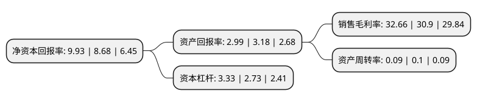

> 本页面由自动化程序生成于 2022年5月20日 01:24
> 内容可能存在错误，如有bug请提交issue至：https://github.com/Eroleice/doc-pi/issues
{.is-warning}

# 上市公司基本情况

## 基本资料

国金证券股份有限公司（以下简称“国金证券”）成立于1996年12月20日，成都市。于1997年08月07日在上交所主板上市。

国金证券注册资本302,435.931万元，主营业务:证券经纪业务，投资银行业务，证券投资业务，资产管理业务。以下是详细信息：

- 公司名称: 国金证券股份有限公司
- 股票代码: 600109.SH
- 所在地: 四川 - 成都市
- 成立日期: 1996年12月20日
- 注册资本: 302,435.931万元
- 法定代表人: 冉云
- 主营业务: 主营业务:证券经纪业务，投资银行业务，证券投资业务，资产管理业务
- 公司官网: www.gjzq.com.cn
- 公司介绍: 公司是一家资产质量优良、专业团队精干、创新能力突出、服务特色鲜明的上市证券公司，是沪深300指数、上证180指数、上证180金融股指数和上证中型企业指数成份股。公司结合个人、机构以及企业客户的投融资需求，通过开展证券经纪业务、投资银行业务、资产管理业务、信用交易业务、新三板业务及境外业务等，为其提供多元化、多层次的证券金融服务。公司尊崇“责任、和谐、共赢”的企业核心价值观，秉承“规范管理、稳健经营、深化服务、科学创新”的经营理念及“专业创造价值，诚信铸就未来”的服务理念，打造了一支专业化、高素质的职业人才团队，取得了良好的经营业绩。

## 股东及高管情况

上市公司第一大股东为长沙涌金(集团)有限公司，持股547,075,232股，占比14.69%，**疑似为**上市公司实际控制人。

截至2022年05月10日，上市公司的前十大股东中，共有7名机构股东，2个产品账户，1个海外主体，其中5%以上大股东共有4名。上市公司前十大股东明细如下：

> 未能通过持股比例判定出上市公司实际控制人（持股30%以上）
> 可能存在通过间接持股、联合持股、协议控制等方式拥有实际控制权的主体，具体请参考上市公司定期公告！
{.is-warning}

> 截至2022年05月10日，上市公司前十大股东信息如下：

| 股东名称 | 持股数量（股） | 持股比例 |
| --- | --- | --- |
| 长沙涌金(集团)有限公司 | 547,075,232 | 14.69% |
| 成都产业资本控股集团有限公司 | 364,619,975 | 9.79% |
| 涌金投资控股有限公司 | 249,256,738 | 6.69% |
| 成都交子金融控股集团有限公司 | 197,182,660 | 5.29% |
| 中国证券金融股份有限公司 | 74,115,645 | 2.45% |
| 香港中央结算有限公司(陆股通) | 70,041,538 | 2.32% |
| 成都交子金融控股集团有限公司 | 48,800,097 | 1.61% |
| 中欧基金-农业银行-中欧中证金融资产管理计划 | 30,200,900 | 1% |
| 中国建设银行股份有限公司-华宝中证全指证券公司交易型开放式指数证券投资基金 | 29,456,549 | 0.97% |
| 华泰证券股份有限公司 | 21,787,420 | 0.72% |

## 利润表分析

上市公司2021年总收入为71.26亿元，净利润为23.27亿元，实现盈利。

## 杜邦分析

> 数据列示周期：2021年 | 2020年 | 2019年
{.is-info}

上市公司的净资产收益率在近一年有所上升，上升幅度为14.4%，其变化情况分解如下：
- 上市公司的销售毛利率在近一年上升了5.7%，可能是生产效率的提升、商品原材料价格下跌或商品价格的上涨所致。
- 上市公司的资产周转率在近一年下降了-10%，可能是源自于更慢的销售回款或库存管理效果下降。
- 上市公司的财务杠杆比率在近一年上升了21.98%，可能是增加负债扩大生产规模。

