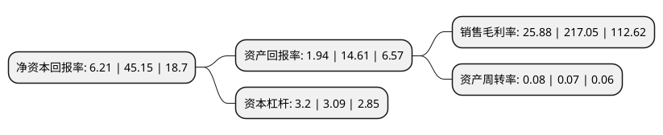

> 本页面由自动化程序生成于 2022年5月20日 01:24
> 内容可能存在错误，如有bug请提交issue至：https://github.com/Eroleice/doc-pi/issues
{.is-warning}

# 上市公司基本情况

## 基本资料

华创阳安股份有限公司（以下简称“华创阳安”）成立于1998年07月21日，北京市。于1998年09月18日在上交所主板上市。

华创阳安注册资本173,955.665万元，主要业务:证券业务和塑料管型材业务以下是详细信息：

- 公司名称: 华创阳安股份有限公司
- 股票代码: 600155.SH
- 所在地: 北京 - 北京市
- 成立日期: 1998年07月21日
- 注册资本: 173,955.665万元
- 法定代表人: 陶永泽
- 主营业务: 证券业务和塑料管型材业务
- 公司官网: www.baoshuogufen.cn
- 公司介绍: 公司主营业务包括证券服务业和塑料管型材业务。公司主要依托华创证券开展证券业务，通过管型材子公司经营塑料管型材。华创证券基本实现立足贵州，以北京、上海、深圳、杭州、南京、成都为基地的全国性业务和队伍布局，成为资质齐全、功能完善的综合性券商。华创证券为首批获得中国证监会互联网证券试点资格证券公司之一，首创“互联网+底层资本市场”非标资产证券化服务模式，并成为入选上交所理事会第一家中西部券商。公司生产的宝硕牌塑料管型材产品具有一定的品牌知名度，拥有的“宝硕”牌中国驰名商标，产品品质得到市场广泛认可。由于河北及相邻省份塑料管型材产品产能较低，公司产品在此区域市场占有率具备一定优势。公司以引进国外先进的设备为主，工艺设备配备具有国际领先水平，在技术工艺及生产装备上具有一定的竞争优势。

## 股东及高管情况

上市公司第一大股东为新希望化工投资有限公司，持股152,527,837股，占比8.77%，**疑似为**上市公司实际控制人。

截至2022年04月06日，上市公司的前十大股东中，共有9名机构股东，1个产品账户，其中5%以上大股东共有5名。上市公司前十大股东明细如下：

> 未能通过持股比例判定出上市公司实际控制人（持股30%以上）
> 可能存在通过间接持股、联合持股、协议控制等方式拥有实际控制权的主体，具体请参考上市公司定期公告！
{.is-warning}

> 上市公司第一大股东持股不超过10%，请检查是否存在公司控制权风险！
{.is-danger}

> 截至2022年04月06日，上市公司前十大股东信息如下：

| 股东名称 | 持股数量（股） | 持股比例 |
| --- | --- | --- |
| 新希望化工投资有限公司 | 152,527,837 | 8.77% |
| 上海杉融实业有限公司 | 118,636,428 | 6.82% |
| 南方希望实业有限公司 | 111,524,163 | 6.41% |
| 贵州现代物流产业(集团)有限责任公司 | 108,007,375 | 6.21% |
| 中国贵州茅台酒厂(集团)有限责任公司 | 89,781,311 | 5.16% |
| 贵州盘江精煤股份有限公司 | 71,573,796 | 4.11% |
| 华创阳安股份有限公司-第三期员工持股计划 | 49,413,730 | 2.84% |
| 贵州同行企业管理中心(有限合伙) | 49,351,211 | 2.84% |
| 贵州同道企业管理服务中心(有限合伙) | 49,142,462 | 2.82% |
| 北京东方君盛投资管理有限公司 | 39,115,576 | 2.25% |

## 利润表分析

上市公司2021年总收入为37.65亿元，净利润为9.74亿元，实现盈利。

## 杜邦分析

> 数据列示周期：2021年 | 2020年 | 2019年
{.is-info}

上市公司的净资产收益率在近一年有所下降，下降幅度为-86.25%，其变化情况分解如下：
- 上市公司的销售毛利率在近一年下降了-88.08%，可能是生产效率的下降、商品原材料价格上涨或商品价格的下跌所致。
- 上市公司的资产周转率在近一年上升了14.29%，可能是源自于更快的销售回款或库存管理效果提升。
- 上市公司的财务杠杆比率在近一年上升了3.56%，可能是增加负债扩大生产规模。

