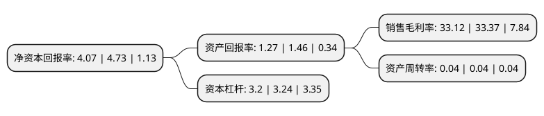

> 本页面由自动化程序生成于 2022年5月20日 01:26
> 内容可能存在错误，如有bug请提交issue至：https://github.com/Eroleice/doc-pi/issues
{.is-warning}

# 上市公司基本情况

## 基本资料

西南证券股份有限公司（以下简称“西南证券”）成立于1990年06月07日，重庆市。于2001年01月09日在上交所主板上市。

西南证券注册资本664,510.912万元，主营业务:证券经纪;证券承销与保荐;证券自营;证券资产管理;证券投资咨询;与证券交易，证券投资活动有关的财务顾问;证券投资基金代销等证券业务;融资融券，集合资产管理，代办系统主办券商等创新业务，并通过设立子公司开展直接股权投资业务;转融通，中小企业私募债券承销，债券质押式报价回购，约定购回式证券交易，参与利率互换交易等多项创新业务;代销金融产品业务资格，保险资金受托管理业务资格，股票质押式回购业务资格以及为期货公司提供中间介绍业务资格等。以下是详细信息：

- 公司名称: 西南证券股份有限公司
- 股票代码: 600369.SH
- 所在地: 重庆 - 重庆市
- 成立日期: 1990年06月07日
- 注册资本: 664,510.912万元
- 法定代表人: 吴坚
- 主营业务: 主营业务:证券经纪;证券承销与保荐;证券自营;证券资产管理;证券投资咨询;与证券交易，证券投资活动有关的财务顾问;证券投资基金代销等证券业务;融资融券，集合资产管理，代办系统主办券商等创新业务，并通过设立子公司开展直接股权投资业务;转融通，中小企业私募债券承销，债券质押式报价回购，约定购回式证券交易，参与利率互换交易等多项创新业务;代销金融产品业务资格，保险资金受托管理业务资格，股票质押式回购业务资格以及为期货公司提供中间介绍业务资格等
- 公司官网: www.swsc.com.cn
- 公司介绍: 公司是西部地区成立最早的一家综合类证券公司，也是唯一一家注册地在重庆的全国性综合类券商，2009年2月，公司通过资产重组，借壳ST长运上市。经营范围包括证券经纪，证券投资咨询，与证券交易、证券投资活动有关的财务顾问，证券承销与保荐，证券自营，证券资产管理，融资融券，证券投资基金代销，代销金融产品，为期货公司提供中间介绍业务，股票期权做市。公司作为全国性、综合性大型券商，近年来不断拓展业务广度和深度，加快完善海外业务平台，不断强化综合金融服务能力，基本构建全牌照、一体化、跨地域的全业务链体系。

## 股东及高管情况

上市公司第一大股东为重庆渝富资本运营集团有限公司，持股1,853,443,610股，占比27.89%，**疑似为**上市公司实际控制人。

截至2022年03月31日，上市公司的前十大股东中，共有9名机构股东，1个产品账户，其中5%以上大股东共有3名。上市公司前十大股东明细如下：

> 未能通过持股比例判定出上市公司实际控制人（持股30%以上）
> 可能存在通过间接持股、联合持股、协议控制等方式拥有实际控制权的主体，具体请参考上市公司定期公告！
{.is-warning}

> 截至2022年03月31日，上市公司前十大股东信息如下：

| 股东名称 | 持股数量（股） | 持股比例 |
| --- | --- | --- |
| 重庆渝富资本运营集团有限公司 | 1,853,443,610 | 27.89% |
| 重庆市城市建设投资(集团)有限公司 | 689,293,065 | 10.37% |
| 重庆市江北嘴中央商务区投资集团有限公司 | 400,500,000 | 6.03% |
| 中国建银投资有限责任公司 | 328,427,012 | 4.94% |
| 重庆高速公路集团有限公司 | 275,167,400 | 4.14% |
| 重庆发展投资有限公司 | 200,000,000 | 3.01% |
| 重庆市地产集团有限公司 | 120,000,000 | 1.81% |
| 招商财富资管-招商银行-招商财富-招商银行-渝富4号专项资产管理计划 | 104,768,242 | 1.58% |
| 重庆水务环境控股集团有限公司 | 100,000,000 | 1.5% |
| 中国证券金融股份有限公司 | 97,060,204 | 1.46% |

## 杜邦分析

> 数据列示周期：2021年 | 2020年 | 2018年
{.is-info}

上市公司的净资产收益率在近一年有所下降，下降幅度为-13.95%，其变化情况分解如下：
- 上市公司的销售毛利率在近一年下降了-0.75%，可能是生产效率的下降、商品原材料价格上涨或商品价格的下跌所致。
- 上市公司的资产周转率在近一年下降了0%，可能是源自于更慢的销售回款或库存管理效果下降。
- 上市公司的财务杠杆比率在近一年下降了-1.23%，可能是减少负债降低财务费用。

