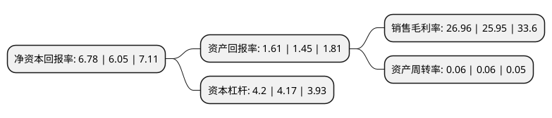

> 本页面由自动化程序生成于 2022年5月20日 01:29
> 内容可能存在错误，如有bug请提交issue至：https://github.com/Eroleice/doc-pi/issues
{.is-warning}

# 上市公司基本情况

## 基本资料

财达证券股份有限公司（以下简称“财达证券”）成立于2002年04月25日，石家庄市。于2021年05月07日在上交所主板上市。

财达证券注册资本324,500万元，证券经纪;证券投资咨询;与证券交易，证券投资活动有关的财务顾问;证券承销与保荐;证券自营;证券资产管理;融资融券;证券投资基金代销;为期货公司提供中间介绍业务;代销金融产品。以下是详细信息：

- 公司名称: 财达证券股份有限公司
- 股票代码: 600906.SH
- 所在地: 河北 - 石家庄市
- 成立日期: 2002年04月25日
- 注册资本: 324,500万元
- 法定代表人: 翟建强
- 主营业务: 证券经纪;证券投资咨询;与证券交易，证券投资活动有关的财务顾问;证券承销与保荐;证券自营;证券资产管理;融资融券;证券投资基金代销;为期货公司提供中间介绍业务;代销金融产品
- 公司官网: www.s10000.com
- 公司介绍: 公司是唯一一家河北省内注册的法人证券公司,主要从事证券经纪、证券投资咨询、证券承销与保荐、证券自营、证券资产管理、融资融券、证券投资基金代销、与证券交易、证券投资活动有关的财务顾问、代销金融产品、为期货公司提供中间介绍业务。本公司控股子公司财达期货主要从事商品期货经纪、金融期货经纪、资产管理业务(金融资产除外)、期货投资咨询业务。财达期货子公司财达投资主要从事基差交易、仓单服务和合作套保等业务,经过十余年的发展，公司已成为具有独特区域优势的综合性证券公司，公司先后被授予“河北省金融贡献奖”，“先进纳税人”称号以及“河北省五一奖状”，多次被评为“河北省明星企业”、“诚信纳税A级企业”、“河北省诚信企业”、“河北十大和谐企业”、“河北省最具影响力企业”，荣获“最具发展潜力证券公司”、“中国证券投资者调查十佳证券公司”、“河北网民最信赖的证券品牌”、“河北省服务名牌”、“冀商最喜爱证券公司”等诸多荣誉称号。2019年，公司在证券公司分类评价中被评为B类BBB级。

## 股东及高管情况

上市公司第一大股东为唐山钢铁集团有限责任公司，持股1,052,631,050股，占比32.44%，为上市公司实际控制人。

截至2022年03月31日，上市公司的前十大股东中，共有9名机构股东，1名其他股东，其中5%以上大股东共有3名。上市公司前十大股东明细如下：

> 截至2022年03月31日，上市公司前十大股东信息如下：

| 股东名称 | 持股数量（股） | 持股比例 |
| --- | --- | --- |
| 唐山钢铁集团有限责任公司 | 1,052,631,050 | 32.44% |
| 河北省国有资产控股运营有限公司 | 441,780,550 | 13.61% |
| 河北港口集团有限公司 | 340,000,000 | 10.48% |
| 邯郸市鹏博贸易集团有限公司 | 119,772,000 | 3.69% |
| 河北国傲投资集团有限公司 | 100,000,000 | 3.08% |
| 唐山港口实业集团有限公司 | 80,000,000 | 2.47% |
| 唐山金海资产开发投资有限公司 | 67,088,000 | 2.07% |
| 河钢集团投资控股有限公司 | 62,280,000 | 1.92% |
| 泊头市天润纺织有限公司 | 60,000,000 | 1.85% |
| 秦皇岛市财信资产管理中心 | 58,150,400 | 1.79% |

## 利润表分析

上市公司2021年总收入为25.24亿元，净利润为6.8亿元，实现盈利。

## 杜邦分析

> 数据列示周期：2021年 | 2020年 | 2019年
{.is-info}

上市公司的净资产收益率在近一年有所上升，上升幅度为12.07%，其变化情况分解如下：
- 上市公司的销售毛利率在近一年上升了3.89%，可能是生产效率的提升、商品原材料价格下跌或商品价格的上涨所致。
- 上市公司的资产周转率在近一年下降了0%，可能是源自于更慢的销售回款或库存管理效果下降。
- 上市公司的财务杠杆比率在近一年上升了0.72%，可能是增加负债扩大生产规模。

