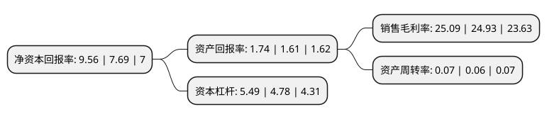

> 本页面由自动化程序生成于 2022年5月20日 01:29
> 内容可能存在错误，如有bug请提交issue至：https://github.com/Eroleice/doc-pi/issues
{.is-warning}

# 上市公司基本情况

## 基本资料

中泰证券股份有限公司（以下简称“中泰证券”）成立于2001年05月15日，济南市。于2020年06月03日在上交所主板上市。

中泰证券注册资本696,862.576万元，主营业务范围主要包括:证券经纪;证券投资咨询;与证券交易，证券投资活动有关的财务顾问;证券承销与保荐;证券自营;融资融券;证券投资基金代销;代销金融产品;股票期权做市等。以下是详细信息：

- 公司名称: 中泰证券股份有限公司
- 股票代码: 600918.SH
- 所在地: 山东 - 济南市
- 成立日期: 2001年05月15日
- 注册资本: 696,862.576万元
- 法定代表人: 李峰
- 主营业务: 主营业务范围主要包括:证券经纪;证券投资咨询;与证券交易，证券投资活动有关的财务顾问;证券承销与保荐;证券自营;融资融券;证券投资基金代销;代销金融产品;股票期权做市等
- 公司官网: www.zts.com.cn
- 公司介绍: 公司是全国大型综合类券商，多年来，公司积极致力于为广大投资者提供证券代理买卖、投资咨询、财务顾问、证券发行与承销、收购兼并、资产重组、资产管理、融资融券、金融产品代销、证券投资基金代销、股指期货中间介绍等全方位的专业化证券投、融资服务。公司按照“各种专业化证券业务协同发展”的战略目标，全力推进包括经纪、信用、投行、资产管理、金融创新等在内的全牌照业务体系建设。经纪业务，秉持“以客户为中心”的核心服务理念，拥有一支专业的财富管理队伍，帮助客户实现资产保值、增值的目标，打造综合金融服务平台，有效满足了客户日益增长的财富管理需求。信用业务，公司通过融资融券、股票质押回购、约定购回等方式为客户提供便捷、多元化的融资服务。公司先后荣获“金钥匙奖”“中国最具成长性证券经纪商”“中国最佳证券经纪商”“最具成长性投行”“最具创新力证券公司”“优秀保荐机构”“金牛投行进步奖”“证券公司投资者教育与服务优秀单位”“中国最佳中小板、创业板保荐机构”“中国区突破债券投行君鼎奖”等称号。

## 股东及高管情况

上市公司第一大股东为莱芜钢铁集团有限公司，持股3,231,288,900股，占比46.37%，为上市公司实际控制人。

截至2022年03月31日，上市公司的前十大股东中，共有10名机构股东，其中5%以上大股东共有2名。上市公司前十大股东明细如下：

> 截至2022年03月31日，上市公司前十大股东信息如下：

| 股东名称 | 持股数量（股） | 持股比例 |
| --- | --- | --- |
| 莱芜钢铁集团有限公司 | 3,231,288,900 | 46.37% |
| 山东能源集团有限公司 | 458,091,900 | 6.57% |
| 山东省鲁信投资控股集团有限公司 | 277,566,330 | 3.98% |
| 新汶矿业集团有限责任公司 | 241,737,300 | 3.47% |
| 山东永通实业有限公司 | 201,344,500 | 2.89% |
| 德州禹佐投资中心(有限合伙) | 178,293,200 | 2.56% |
| 济南西城投资发展有限公司 | 165,633,542 | 2.38% |
| 山东省国有资产投资控股有限公司 | 120,871,800 | 1.73% |
| 泰安点石资产管理有限公司 | 79,581,600 | 1.14% |
| 宁波梅山保税港区丰海投资有限公司 | 60,435,900 | 0.87% |

## 利润表分析

上市公司2021年总收入为131.49亿元，净利润为32.99亿元，实现盈利。

## 杜邦分析

> 数据列示周期：2021年 | 2020年 | 2019年
{.is-info}

上市公司的净资产收益率在近一年有所上升，上升幅度为24.32%，其变化情况分解如下：
- 上市公司的销售毛利率在近一年上升了0.64%，可能是生产效率的提升、商品原材料价格下跌或商品价格的上涨所致。
- 上市公司的资产周转率在近一年上升了16.67%，可能是源自于更快的销售回款或库存管理效果提升。
- 上市公司的财务杠杆比率在近一年上升了14.85%，可能是增加负债扩大生产规模。

