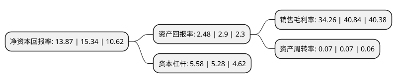

> 本页面由自动化程序生成于 2022年5月20日 01:30
> 内容可能存在错误，如有bug请提交issue至：https://github.com/Eroleice/doc-pi/issues
{.is-warning}

# 上市公司基本情况

## 基本资料

中信建投证券股份有限公司（以下简称“中信建投”）成立于2005年11月02日，北京市。于2018年06月20日在上交所主板上市。

中信建投注册资本775,669.48万元，主营业务:主要提供包括股权融资，债务融资和财务顾问在内的投资银行服务，包括经纪及财务管理，融资融券和回购业务在内的财富管理服务，及包括股票销售及交易，固定收益销售及交易，投资研究，主经纪商和QFII业务在内的交易及机构客户服务。以下是详细信息：

- 公司名称: 中信建投证券股份有限公司
- 股票代码: 601066.SH
- 所在地: 北京 - 北京市
- 成立日期: 2005年11月02日
- 注册资本: 775,669.48万元
- 法定代表人: 王常青
- 主营业务: 主营业务:主要提供包括股权融资，债务融资和财务顾问在内的投资银行服务，包括经纪及财务管理，融资融券和回购业务在内的财富管理服务，及包括股票销售及交易，固定收益销售及交易，投资研究，主经纪商和QFII业务在内的交易及机构客户服务
- 公司官网: www.csc108.com
- 公司介绍: 公司是经中国证监会批准设立的全国性大型综合证券公司。主要业务范围包括：证券承销与保荐、证券经纪、与证券交易和证券投资活动有关的财务顾问、证券投资咨询、证券自营、证券资产管理、证券投资基金代销、为期货公司提供中间介绍业务、融资融券业务、代销金融产品业务、保险兼业代理业务、期权做市业务、证券投资基金托管、销售贵金属制品以及监管部门批准的其它业务。自成立以来，中信建投证券各项业务快速发展，在企业融资、收购兼并、证券经纪、证券金融、固定收益、资产管理、股票及衍生品交易等领域形成了自身特色和核心业务优势，并搭建了研究咨询、信息技术、运营管理、风险管理、合规管理等专业高效的业务支持体系。

## 股东及高管情况

上市公司第一大股东为北京金融控股集团有限公司，持股2,684,309,017股，占比34.61%，为上市公司实际控制人。

截至2022年03月31日，上市公司的前十大股东中，共有6名机构股东，2个产品账户，2个海外主体，其中5%以上大股东共有3名。上市公司前十大股东明细如下：

> 截至2022年03月31日，上市公司前十大股东信息如下：

| 股东名称 | 持股数量（股） | 持股比例 |
| --- | --- | --- |
| 北京金融控股集团有限公司 | 2,684,309,017 | 34.61% |
| 中央汇金投资有限责任公司 | 2,386,052,459 | 30.76% |
| 香港中央结算(代理人)有限公司 | 909,120,618 | 11.72% |
| 中信证券股份有限公司 | 382,849,268 | 4.94% |
| 镜湖控股有限公司 | 351,647,000 | 4.53% |
| 西藏腾云投资管理有限公司 | 113,556,653 | 1.46% |
| 香港中央结算有限公司(陆股通) | 46,876,584 | 0.6% |
| 福建贵安新天地旅游文化投资有限公司 | 38,861,100 | 0.5% |
| 中国建设银行股份有限公司-国泰中证全指证券公司交易型开放式指数证券投资基金 | 26,802,562 | 0.35% |
| 中国建设银行股份有限公司-华宝中证全指证券公司交易型开放式指数证券投资基金 | 19,591,218 | 0.25% |

## 利润表分析

上市公司2021年总收入为298.72亿元，净利润为102.35亿元，实现盈利。

## 杜邦分析

> 数据列示周期：2021年 | 2020年 | 2019年
{.is-info}

上市公司的净资产收益率在近一年有所下降，下降幅度为-9.58%，其变化情况分解如下：
- 上市公司的销售毛利率在近一年下降了-16.11%，可能是生产效率的下降、商品原材料价格上涨或商品价格的下跌所致。
- 上市公司的资产周转率在近一年下降了0%，可能是源自于更慢的销售回款或库存管理效果下降。
- 上市公司的财务杠杆比率在近一年上升了5.68%，可能是增加负债扩大生产规模。

