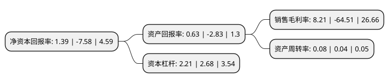

> 本页面由自动化程序生成于 2022年5月20日 01:30
> 内容可能存在错误，如有bug请提交issue至：https://github.com/Eroleice/doc-pi/issues
{.is-warning}

# 上市公司基本情况

## 基本资料

太平洋证券股份有限公司（以下简称“太平洋”）成立于2004年01月06日，昆明市。于2007年12月28日在上交所主板上市。

太平洋注册资本681,631.637万元，证券承销和上市推荐，证券自营买卖，证券代理买卖等业务。以下是详细信息：

- 公司名称: 太平洋证券股份有限公司
- 股票代码: 601099.SH
- 所在地: 云南 - 昆明市
- 成立日期: 2004年01月06日
- 注册资本: 681,631.637万元
- 法定代表人: 李长伟
- 主营业务: 证券承销和上市推荐，证券自营买卖，证券代理买卖等业务
- 公司官网: www.tpyzq.com
- 公司介绍: 公司前身太平洋证券有限责任公司为化解云南证券风险在云南昆明注册成立，2007年太平洋证券在上海证券交易所上市。公司营业网点逐年增加并布局全国，涵盖全国直辖市及除港澳、台以外的所有省区，并在北京、上海、深圳设立了区域业务中心。公司构建了全牌照、全业务线的业务体系，已逐步由偏居一隅的地方性证券公司发展成为全国性的中等规模券商。2017年10月，公司在美国纳斯达克交易所挂牌的太平洋特别并购公司与目标公司顺利完成合并，为中国企业赴美上市开辟了一条新的融资渠道。同时正在积极推进收购泰国证券公司，申请设立中国香港子公司，布局东南亚市场，不断推进公司国际业务战略布局的进程。

## 股东及高管情况

上市公司第一大股东为北京嘉裕投资有限公司，持股744,039,975股，占比10.92%，**疑似为**上市公司实际控制人。

截至2022年03月31日，上市公司的前十大股东中，共有4名机构股东，5个产品账户，1个海外主体，其中5%以上大股东共有1名。上市公司前十大股东明细如下：

> 未能通过持股比例判定出上市公司实际控制人（持股30%以上）
> 可能存在通过间接持股、联合持股、协议控制等方式拥有实际控制权的主体，具体请参考上市公司定期公告！
{.is-warning}

> 截至2022年03月31日，上市公司前十大股东信息如下：

| 股东名称 | 持股数量（股） | 持股比例 |
| --- | --- | --- |
| 北京嘉裕投资有限公司 | 744,039,975 | 10.92% |
| 大连天盛硕博科技有限公司 | 292,500,000 | 4.29% |
| 中国建设银行股份有限公司-国泰中证全指证券公司交易型开放式指数证券投资基金 | 143,778,105 | 2.11% |
| 中国建设银行股份有限公司-华宝中证全指证券公司交易型开放式指数证券投资基金 | 102,466,377 | 1.5% |
| 深圳市天翼咨询有限公司 | 61,050,093 | 0.9% |
| 嘉实基金-农业银行-嘉实中证金融资产管理计划 | 42,371,560 | 0.62% |
| 中国银行股份有限公司-南方中证全指证券公司交易型开放式指数证券投资基金 | 35,182,915 | 0.52% |
| 香港中央结算有限公司(陆股通) | 26,592,387 | 0.39% |
| 国泰君安证券股份有限公司-天弘中证全指证券公司交易型开放式指数证券投资基金 | 17,571,500 | 0.26% |
| 福建长德蛋白科技有限公司 | 15,959,437 | 0.23% |

## 利润表分析

上市公司2021年总收入为16.3亿元，净利润为1.33亿元，实现盈利。

## 杜邦分析

> 数据列示周期：2021年 | 2020年 | 2019年
{.is-info}

上市公司的净资产收益率在近一年有所下降，下降幅度为-118.34%，其变化情况分解如下：
- 上市公司的销售毛利率在近一年下降了-112.73%，可能是生产效率的下降、商品原材料价格上涨或商品价格的下跌所致。
- 上市公司的资产周转率在近一年上升了100%，可能是源自于更快的销售回款或库存管理效果提升。
- 上市公司的财务杠杆比率在近一年下降了-17.54%，可能是减少负债降低财务费用。

