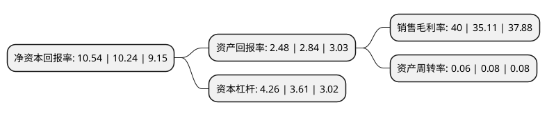

> 本页面由自动化程序生成于 2022年5月20日 01:30
> 内容可能存在错误，如有bug请提交issue至：https://github.com/Eroleice/doc-pi/issues
{.is-warning}

# 上市公司基本情况

## 基本资料

财通证券股份有限公司（以下简称“财通证券”）成立于2003年06月11日，杭州市。于2017年10月24日在上交所主板上市。

财通证券注册资本358,901.475万元，主要从事证券经纪业务，投资银行业务，资产管理业务，证券自营业务，证券信用业务以及研究业务。此外，公司通过子公司财通证券资管开展证券资产管理业务;通过子公司财通资本开展私募基金管理等相关业务;通过子公司财通创新开展另类投资等相关业务;通过子公司财通香港开展境外证券经纪业务和资产管理业务;通过参股公司永安期货开展商品期货经纪，金融期货经纪，期货投资咨询，资产管理业务;通过参股公司财通基金开展基金管理业务。以下是详细信息：

- 公司名称: 财通证券股份有限公司
- 股票代码: 601108.SH
- 所在地: 浙江 - 杭州市
- 成立日期: 2003年06月11日
- 注册资本: 358,901.475万元
- 法定代表人: 黄伟建
- 主营业务: 主要从事证券经纪业务，投资银行业务，资产管理业务，证券自营业务，证券信用业务以及研究业务此外，公司通过子公司财通证券资管开展证券资产管理业务;通过子公司财通资本开展私募基金管理等相关业务;通过子公司财通创新开展另类投资等相关业务;通过子公司财通香港开展境外证券经纪业务和资产管理业务;通过参股公司永安期货开展商品期货经纪，金融期货经纪，期货投资咨询，资产管理业务;通过参股公司财通基金开展基金管理业务
- 公司官网: www.ctsec.com
- 公司介绍: 公司是一家经中国证券监督管理委员会批准设立的综合性证券公司。公司经营证券经纪、证券投资咨询、证券自营、证券承销与保荐、融资融券、证券投资基金代销、代销金融产品等业务以及中国证监会核准的其他业务。此外，公司下属公司财通证券资产管理有限公司经营证券资产管理业务；浙江财通资本投资有限公司经营私募基金管理等业务；财通证券(香港)有限公司经营境外证券经纪业务和资产管理等业务；浙江财通创新投资有限公司经营股权投资、金融产品投资等另类投资业务；永安期货股份有限公司主要经营商品期货经纪、金融期货经纪、期货投资咨询、资产管理等业务；财通基金管理有限公司经营基金管理业务。

## 股东及高管情况

上市公司第一大股东为浙江省金融控股有限公司，持股1,354,300,610股，占比29.16%，**疑似为**上市公司实际控制人。

截至2022年04月18日，上市公司的前十大股东中，共有7名机构股东，2个产品账户，1个海外主体，其中5%以上大股东共有1名。上市公司前十大股东明细如下：

> 未能通过持股比例判定出上市公司实际控制人（持股30%以上）
> 可能存在通过间接持股、联合持股、协议控制等方式拥有实际控制权的主体，具体请参考上市公司定期公告！
{.is-warning}

> 截至2022年04月18日，上市公司前十大股东信息如下：

| 股东名称 | 持股数量（股） | 持股比例 |
| --- | --- | --- |
| 浙江省金融控股有限公司 | 1,354,300,610 | 29.16% |
| 浙江省财务开发有限责任公司 | 150,477,846 | 3.24% |
| 台州市金融投资集团有限公司 | 137,208,071 | 2.95% |
| 景宁跃泰科技有限公司 | 102,893,700 | 2.22% |
| 维科控股集团股份有限公司 | 80,110,000 | 1.73% |
| 中国建设银行股份有限公司-国泰中证全指证券公司交易型开放式指数证券投资基金 | 65,265,235 | 1.41% |
| 莱恩达集团有限公司 | 63,555,168 | 1.37% |
| 香港中央结算有限公司(陆股通) | 62,754,346 | 1.35% |
| 回音必集团有限公司 | 48,628,558 | 1.05% |
| 中国建设银行股份有限公司-华宝中证全指证券公司交易型开放式指数证券投资基金 | 48,510,488 | 1.04% |

## 利润表分析

上市公司2021年总收入为64.07亿元，净利润为25.63亿元，实现盈利。

## 杜邦分析

> 数据列示周期：2021年 | 2020年 | 2019年
{.is-info}

上市公司的净资产收益率在近一年有所上升，上升幅度为2.93%，其变化情况分解如下：
- 上市公司的销售毛利率在近一年上升了13.93%，可能是生产效率的提升、商品原材料价格下跌或商品价格的上涨所致。
- 上市公司的资产周转率在近一年下降了-25%，可能是源自于更慢的销售回款或库存管理效果下降。
- 上市公司的财务杠杆比率在近一年上升了18.01%，可能是增加负债扩大生产规模。

