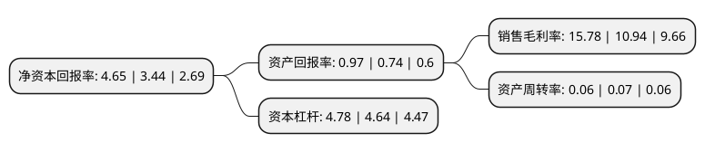

> 本页面由自动化程序生成于 2022年5月20日 01:30
> 内容可能存在错误，如有bug请提交issue至：https://github.com/Eroleice/doc-pi/issues
{.is-warning}

# 上市公司基本情况

## 基本资料

天风证券股份有限公司（以下简称“天风证券”）成立于2000年03月29日，武汉市。于2018年10月19日在上交所主板上市。

天风证券注册资本866,575.746万元，主营业务:证券期货相关业务。证券经纪;证券投资咨询;与证券交易，证券投资活动有关的财务顾问;证券投资基金代销;证券承销与保荐;证券自营;证券资产管理;融资融券;代销金融产品;为期货公司提供中间介绍业务。以下是详细信息：

- 公司名称: 天风证券股份有限公司
- 股票代码: 601162.SH
- 所在地: 湖北 - 武汉市
- 成立日期: 2000年03月29日
- 注册资本: 866,575.746万元
- 法定代表人: 余磊
- 主营业务: 主营业务:证券期货相关业务证券经纪;证券投资咨询;与证券交易，证券投资活动有关的财务顾问;证券投资基金代销;证券承销与保荐;证券自营;证券资产管理;融资融券;代销金融产品;为期货公司提供中间介绍业务
- 公司官网: www.tfzq.com
- 公司介绍: 公司成立于2000年，总部设于湖北省武汉市，是一家拥有全牌照的全国性综合类证券公司。公司从事证券经纪，证券投资咨询，与证券交易、证券投资活动有关的财务顾问，证券投资基金代销，证券承销与保荐，证券自营，证券资产管理，融资融券，代销金融产品，为期货公司提供中间介绍业务。在全国重点区域和城市设有15家分公司及近百家证券营业部；拥有多家全资及控股一级子公司，包括1家境外子公司，综合规模已跃居中等券商行列。

## 股东及高管情况

上市公司第一大股东为武汉商贸集团有限公司，持股685,968,942股，占比7.92%，**疑似为**上市公司实际控制人。

截至2022年03月31日，上市公司的前十大股东中，共有10名机构股东，其中5%以上大股东共有3名。上市公司前十大股东明细如下：

> 未能通过持股比例判定出上市公司实际控制人（持股30%以上）
> 可能存在通过间接持股、联合持股、协议控制等方式拥有实际控制权的主体，具体请参考上市公司定期公告！
{.is-warning}

> 上市公司第一大股东持股不超过10%，请检查是否存在公司控制权风险！
{.is-danger}

> 截至2022年03月31日，上市公司前十大股东信息如下：

| 股东名称 | 持股数量（股） | 持股比例 |
| --- | --- | --- |
| 武汉商贸集团有限公司 | 685,968,942 | 7.92% |
| 人福医药集团股份公司 | 680,087,537 | 7.85% |
| 湖北省联合发展投资集团有限公司 | 519,359,753 | 5.99% |
| 宁波信达天赢投资合伙企业(有限合伙) | 240,498,500 | 2.78% |
| 陕西大德投资集团有限责任公司 | 204,310,077 | 2.36% |
| 武汉金融控股(集团)有限公司 | 195,599,022 | 2.26% |
| 广东恒健国际投资有限公司 | 195,599,022 | 2.26% |
| 中航信托股份有限公司 | 194,864,100 | 2.25% |
| 武汉高科国有控股集团有限公司 | 148,186,629 | 1.71% |
| 西安港资本管理有限公司 | 147,312,100 | 1.7% |

## 利润表分析

上市公司2021年总收入为44.05亿元，净利润为5.97亿元，实现盈利。

## 杜邦分析

> 数据列示周期：2020年 | 2019年 | 2018年
{.is-info}

上市公司的净资产收益率在近一年有所上升，上升幅度为35.17%，其变化情况分解如下：
- 上市公司的销售毛利率在近一年上升了44.24%，可能是生产效率的提升、商品原材料价格下跌或商品价格的上涨所致。
- 上市公司的资产周转率在近一年下降了-14.29%，可能是源自于更慢的销售回款或库存管理效果下降。
- 上市公司的财务杠杆比率在近一年上升了3.02%，可能是增加负债扩大生产规模。

