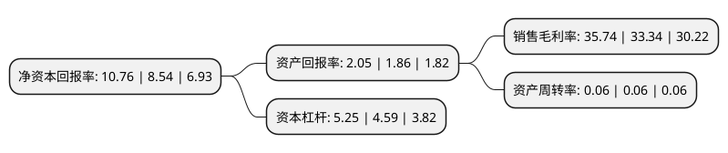

> 本页面由自动化程序生成于 2022年5月20日 01:30
> 内容可能存在错误，如有bug请提交issue至：https://github.com/Eroleice/doc-pi/issues
{.is-warning}

# 上市公司基本情况

## 基本资料

国泰君安证券股份有限公司（以下简称“国泰君安”）成立于1999年08月18日，上海市。于2015年06月26日在上交所主板上市。

国泰君安注册资本890,667.163万元，主要业务是机构金融，个人金融，投资管理及国际业务。以下是详细信息：

- 公司名称: 国泰君安证券股份有限公司
- 股票代码: 601211.SH
- 所在地: 上海 - 上海市
- 成立日期: 1999年08月18日
- 注册资本: 890,667.163万元
- 法定代表人: 贺青
- 主营业务: 主要业务是机构金融，个人金融，投资管理及国际业务
- 公司官网: www.gtja.com
- 公司介绍: 公司是中国证券行业长期、持续、全面领先的综合金融服务商。国泰君安跨越了中国资本市场发展的全部历程和多个周期，始终以客户为中心，深耕中国市场，为个人和机构客户提供各类金融服务，确立了全方位的行业领先地位。在多年创新发展过程中，国泰君安逐渐形成了风控为本、追求卓越的企业文化，成为中国资本市场全方位的领导者以及中国证券行业科技和创新的引领者。

## 股东及高管情况

上市公司第一大股东为上海国有资产经营有限公司，持股1,900,963,748股，占比21.34%，**疑似为**上市公司实际控制人。

截至2022年03月31日，上市公司的前十大股东中，共有7名机构股东，1个产品账户，2个海外主体，其中5%以上大股东共有4名。上市公司前十大股东明细如下：

> 未能通过持股比例判定出上市公司实际控制人（持股30%以上）
> 可能存在通过间接持股、联合持股、协议控制等方式拥有实际控制权的主体，具体请参考上市公司定期公告！
{.is-warning}

> 截至2022年03月31日，上市公司前十大股东信息如下：

| 股东名称 | 持股数量（股） | 持股比例 |
| --- | --- | --- |
| 上海国有资产经营有限公司 | 1,900,963,748 | 21.34% |
| 香港中央结算(代理人)有限公司 | 1,391,751,520 | 15.63% |
| 上海国际集团有限公司 | 682,215,791 | 7.66% |
| 深圳市投资控股有限公司 | 609,428,357 | 6.84% |
| 中国证券金融股份有限公司 | 260,547,316 | 2.93% |
| 上海城投(集团)有限公司 | 246,566,512 | 2.77% |
| 深圳能源集团股份有限公司 | 154,455,909 | 1.73% |
| 香港中央结算有限公司(陆股通) | 138,528,125 | 1.56% |
| 中国建设银行股份有限公司-国泰中证全指证券公司交易型开放式指数证券投资基金 | 93,607,576 | 1.05% |
| 中国核工业集团有限公司 | 76,292,793 | 0.86% |

## 利润表分析

上市公司2021年总收入为428.17亿元，净利润为153.02亿元，实现盈利。

## 杜邦分析

> 数据列示周期：2021年 | 2020年 | 2019年
{.is-info}

上市公司的净资产收益率在近一年有所上升，上升幅度为26%，其变化情况分解如下：
- 上市公司的销售毛利率在近一年上升了7.2%，可能是生产效率的提升、商品原材料价格下跌或商品价格的上涨所致。
- 上市公司的资产周转率在近一年下降了0%，可能是源自于更慢的销售回款或库存管理效果下降。
- 上市公司的财务杠杆比率在近一年上升了14.38%，可能是增加负债扩大生产规模。

