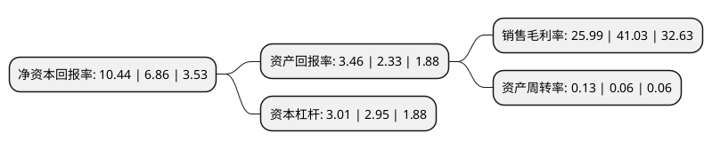

> 本页面由自动化程序生成于 2022年5月20日 01:30
> 内容可能存在错误，如有bug请提交issue至：https://github.com/Eroleice/doc-pi/issues
{.is-warning}

# 上市公司基本情况

## 基本资料

红塔证券股份有限公司（以下简称“红塔证券”）成立于2002年01月31日，昆明市。于2019年07月05日在上交所主板上市。

红塔证券注册资本471,678.774万元，经中国证监会批准，公司主要从事的业务包括:证券经纪，证券自营，证券承销与保荐;证券投资咨询;与证券交易，证券投资活动有关的财务顾问;证券资产管理;融资融券;证券投资基金代销;为期货公司提供中间介绍业务;代销金融产品业务。以下是详细信息：

- 公司名称: 红塔证券股份有限公司
- 股票代码: 601236.SH
- 所在地: 云南 - 昆明市
- 成立日期: 2002年01月31日
- 注册资本: 471,678.774万元
- 法定代表人: 沈春晖
- 主营业务: 经中国证监会批准，公司主要从事的业务包括:证券经纪，证券自营，证券承销与保荐;证券投资咨询;与证券交易，证券投资活动有关的财务顾问;证券资产管理;融资融券;证券投资基金代销;为期货公司提供中间介绍业务;代销金融产品业务
- 公司官网: www.hongtastock.com
- 公司介绍: 公司是在对云南省三家信托投资公司(云南省国际信托投资公司、云南金旅信托投资有限公司、昆明国际信托投资公司)证券业务重组的基础上，由红塔集团等13家国内知名企业共同发起，并经中国证监会批准设立的综合类证券公司。经中国证监会批准，公司主要从事的业务包括：证券经纪、证券自营、证券承销与保荐；证券投资咨询；与证券交易、证券投资活动有关的财务顾问；证券资产管理；融资融券；证券投资基金代销；为期货公司提供中间介绍业务；代销金融产品业务。2015年12月，经云南省财政厅评定，公司2014年资产运营质量绩效评价类型为优秀(A)；2016年3月，经云南省财贸工会评选，公司工会荣获“2015年重点工作目标责任制考核一等奖”；2016年7月21日，公司在2015年证券公司分类评价中被评为A类A级。

## 股东及高管情况

上市公司第一大股东为云南合和(集团)股份有限公司，持股1,423,110,055股，占比30.17%，为上市公司实际控制人。

截至2022年03月31日，上市公司的前十大股东中，共有8名机构股东，2个产品账户，其中5%以上大股东共有6名。上市公司前十大股东明细如下：

> 截至2022年03月31日，上市公司前十大股东信息如下：

| 股东名称 | 持股数量（股） | 持股比例 |
| --- | --- | --- |
| 云南合和(集团)股份有限公司 | 1,423,110,055 | 30.17% |
| 云南省投资控股集团有限公司 | 817,238,839 | 17.33% |
| 中国双维投资有限公司 | 693,333,333 | 14.7% |
| 云南华叶投资有限责任公司 | 346,666,667 | 7.35% |
| 中国烟草总公司浙江省公司 | 312,000,000 | 6.61% |
| 昆明产业开发投资有限责任公司 | 295,875,826 | 6.27% |
| 云南省工业投资控股集团有限责任公司 | 210,015,347 | 4.45% |
| 深圳平安汇通投资-平安证券股份有限公司-平安汇通海集优选1号单一资产管理计划 | 33,017,000 | 0.7% |
| 昆明万兴房地产开发有限公司 | 30,920,806 | 0.66% |
| 中国建设银行股份有限公司-国泰中证全指证券公司交易型开放式指数证券投资基金 | 17,881,360 | 0.38% |

## 利润表分析

上市公司2021年总收入为67.33亿元，净利润为15.99亿元，实现盈利。

## 杜邦分析

> 数据列示周期：2020年 | 2019年 | 2018年
{.is-info}

上市公司的净资产收益率在近一年有所上升，上升幅度为52.19%，其变化情况分解如下：
- 上市公司的销售毛利率在近一年下降了-36.66%，可能是生产效率的下降、商品原材料价格上涨或商品价格的下跌所致。
- 上市公司的资产周转率在近一年上升了116.67%，可能是源自于更快的销售回款或库存管理效果提升。
- 上市公司的财务杠杆比率在近一年上升了2.03%，可能是增加负债扩大生产规模。

