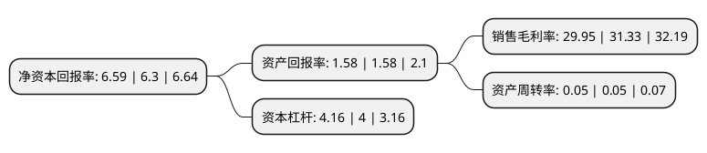

> 本页面由自动化程序生成于 2022年5月20日 01:31
> 内容可能存在错误，如有bug请提交issue至：https://github.com/Eroleice/doc-pi/issues
{.is-warning}

# 上市公司基本情况

## 基本资料

国联证券股份有限公司（以下简称“国联证券”）成立于1999年01月08日，无锡市。于2020年07月31日在上交所主板上市。

国联证券注册资本283,177.317万元，经纪业务，证券投资业务，投资银行业务，资产管理业务，信用交易业务，其他业务以下是详细信息：

- 公司名称: 国联证券股份有限公司
- 股票代码: 601456.SH
- 所在地: 江苏 - 无锡市
- 成立日期: 1999年01月08日
- 注册资本: 283,177.317万元
- 法定代表人: 葛小波
- 主营业务: 经纪业务，证券投资业务，投资银行业务，资产管理业务，信用交易业务，其他业务
- 公司官网: www.glsc.com.cn
- 公司介绍: 公司为无锡领先的综合证券公司之一(以代理买卖证券成交量计)。公司拥有全面的服务网络覆盖和多样化产品组合，支持公司快速增长的业务。公司亦在江苏省及中国其他地区建立了策略性布局。公司向个人、企业、金融机构和政府实体提供广泛的金融产品与服务。其主要业务包括经纪、投资银行、资产管理及投资、信用交易及证券投资。公司已设立良好的企业管治、高效的风险管理及内部控制系统，以管理公司业务运营的风险敞口。中国证监会认可公司风险管理及内部控制系统的有效性，于2014年授予公司「A类A级」的监管评级(2014年中国证监会授予的最高监管评级为「A类AA级」)。

## 股东及高管情况

上市公司第一大股东为无锡市国联发展(集团)有限公司，持股543,901,329股，占比19.21%，**疑似为**上市公司实际控制人。

截至2022年03月31日，上市公司的前十大股东中，共有8名机构股东，1个产品账户，1个海外主体，其中5%以上大股东共有4名。上市公司前十大股东明细如下：

> 未能通过持股比例判定出上市公司实际控制人（持股30%以上）
> 可能存在通过间接持股、联合持股、协议控制等方式拥有实际控制权的主体，具体请参考上市公司定期公告！
{.is-warning}

> 截至2022年03月31日，上市公司前十大股东信息如下：

| 股东名称 | 持股数量（股） | 持股比例 |
| --- | --- | --- |
| 无锡市国联发展(集团)有限公司 | 543,901,329 | 19.21% |
| 香港中央结算(代理人)有限公司 | 442,491,790 | 15.63% |
| 国联信托股份有限公司 | 390,137,552 | 13.78% |
| 无锡市国联地方电力有限公司 | 266,899,445 | 9.43% |
| 无锡民生投资有限公司 | 73,500,000 | 2.6% |
| 无锡一棉纺织集团有限公司 | 72,784,141 | 2.57% |
| 中国银河证券股份有限公司 | 50,907,777 | 1.8% |
| 财通基金-华泰证券股份有限公司-财通基金君享永熙单一资产管理计划 | 35,650,624 | 1.26% |
| 光大证券股份有限公司 | 31,194,295 | 1.1% |
| 中国国际金融股份有限公司 | 30,045,105 | 1.06% |

## 杜邦分析

> 数据列示周期：2021年 | 2020年 | 2019年
{.is-info}

上市公司的净资产收益率在近一年有所上升，上升幅度为4.6%，其变化情况分解如下：
- 上市公司的销售毛利率在近一年下降了-4.4%，可能是生产效率的下降、商品原材料价格上涨或商品价格的下跌所致。
- 上市公司的资产周转率在近一年下降了0%，可能是源自于更慢的销售回款或库存管理效果下降。
- 上市公司的财务杠杆比率在近一年上升了4%，可能是增加负债扩大生产规模。

