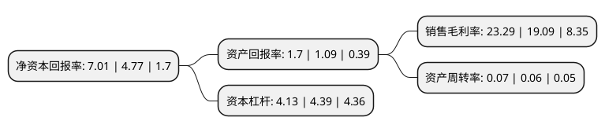

> 本页面由自动化程序生成于 2022年5月20日 01:31
> 内容可能存在错误，如有bug请提交issue至：https://github.com/Eroleice/doc-pi/issues
{.is-warning}

# 上市公司基本情况

## 基本资料

东吴证券股份有限公司（以下简称“东吴证券”）成立于1993年04月10日，苏州市。于2011年12月12日在上交所主板上市。

东吴证券注册资本500,750.265万元，主营业务证券经纪，投资银行，证券自营，资产管理，基金管理，直接投资等。以下是详细信息：

- 公司名称: 东吴证券股份有限公司
- 股票代码: 601555.SH
- 所在地: 江苏 - 苏州市
- 成立日期: 1993年04月10日
- 注册资本: 500,750.265万元
- 法定代表人: 范力
- 主营业务: 主营业务证券经纪，投资银行，证券自营，资产管理，基金管理，直接投资等
- 公司官网: www.dwzq.com.cn
- 公司介绍: 公司是一家各项业务齐头并进、具有自身特色和核心竞争力的综合性证券公司。作为全国第18家上市券商，拥有以证券经纪、资产管理、投资银行服务、投资服务、基金债券代销服务等为基本架构的专业证券服务体系，提供全方位证券理财服务。公司立足证券业务核心，打造金融集团架构，布局海外资本市场。公司证券业务区域优势明显，在立足苏州的基础上，形成了辐射全国的网络格局。依托母公司的全业务牌照，东吴基金、东吴期货、东吴创投、东吴创新资本等子公司均衡发展，形成了全面的金融集团化架构。公司充分利用地处中新苏州工业园区的地缘优势，成功注册了新加坡资产管理子公司，并已取得相关资质，海外业务布局取得实质突破。公司重构形成经纪业务线、证券投资线、投资银行线、资产管理线、互联网金融线、证券金融线六大业务线,推动分公司“小型券商”化。通过组织架构重塑，公司以强大的客户综合服务能力，连通客户的投融资需求，打造包括地方政府、上市公司、金融机构和中小企业等在内的客户全面服务体系，实现抢抓地方客户、服务实体经济发展、满足居民理财需求的目标。

## 股东及高管情况

上市公司第一大股东为苏州国际发展集团有限公司，持股1,192,387,065股，占比23.81%，**疑似为**上市公司实际控制人。

截至2022年03月31日，上市公司的前十大股东中，共有9名机构股东，1个产品账户，其中5%以上大股东共有1名。上市公司前十大股东明细如下：

> 未能通过持股比例判定出上市公司实际控制人（持股30%以上）
> 可能存在通过间接持股、联合持股、协议控制等方式拥有实际控制权的主体，具体请参考上市公司定期公告！
{.is-warning}

> 截至2022年03月31日，上市公司前十大股东信息如下：

| 股东名称 | 持股数量（股） | 持股比例 |
| --- | --- | --- |
| 苏州国际发展集团有限公司 | 1,192,387,065 | 23.81% |
| 张家港市直属公有资产经营有限公司 | 150,527,039 | 3.01% |
| 中国证券金融股份有限公司 | 138,431,788 | 2.76% |
| 中新苏州工业园区投资管理有限公司 | 130,000,000 | 2.6% |
| 苏州营财投资集团有限公司 | 109,137,756 | 2.18% |
| 苏州工业园区国有资本投资运营控股有限公司 | 104,497,381 | 2.09% |
| 苏州物资控股(集团)有限责任公司 | 92,691,160 | 1.85% |
| 苏州高新国有资产经营管理集团有限公司 | 91,000,000 | 1.82% |
| 苏州信托有限公司 | 89,772,800 | 1.79% |
| 中国建设银行股份有限公司-国泰中证全指证券公司交易型开放式指数证券投资基金 | 83,934,536 | 1.68% |

## 利润表分析

上市公司2021年总收入为92.45亿元，净利润为24.12亿元，实现盈利。

## 杜邦分析

> 数据列示周期：2020年 | 2019年 | 2018年
{.is-info}

上市公司的净资产收益率在近一年有所上升，上升幅度为46.96%，其变化情况分解如下：
- 上市公司的销售毛利率在近一年上升了22%，可能是生产效率的提升、商品原材料价格下跌或商品价格的上涨所致。
- 上市公司的资产周转率在近一年上升了16.67%，可能是源自于更快的销售回款或库存管理效果提升。
- 上市公司的财务杠杆比率在近一年下降了-5.92%，可能是减少负债降低财务费用。

