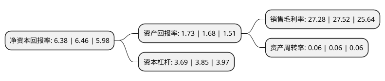

> 本页面由自动化程序生成于 2022年5月20日 01:31
> 内容可能存在错误，如有bug请提交issue至：https://github.com/Eroleice/doc-pi/issues
{.is-warning}

# 上市公司基本情况

## 基本资料

中银国际证券股份有限公司（以下简称“中银证券”）成立于2002年02月28日，上海市。于2020年02月26日在上交所主板上市。

中银证券注册资本277,800万元，投资银行业务，投资者服务业务，证券投资业务，机构销售与研究业务。以下是详细信息：

- 公司名称: 中银国际证券股份有限公司
- 股票代码: 601696.SH
- 所在地: 上海 - 上海市
- 成立日期: 2002年02月28日
- 注册资本: 277,800万元
- 法定代表人: 宁敏
- 主营业务: 投资银行业务，投资者服务业务，证券投资业务，机构销售与研究业务
- 公司官网: www.bocifunds.com
- 公司介绍: 中银国际证券股份有限公司经中国证监会批准于2002年2月28日在上海成立，2020年2月26日在上海证券交易所主板上市,注册资本27.78亿元人民币。中银证券主要股东包括：中银国际控股有限公司、中国石油集团资本有限责任公司、上海金融发展投资基金(有限合伙)、云南省投资控股集团有限公司等。中银证券拥有证券业务全牌照，经营范围包括：证券经纪；证券投资咨询；与证券交易、证券投资活动有关的财务顾问；证券承销与保荐；证券自营；证券资产管理；证券投资基金代销；融资融券；代销金融产品；公开募集证券投资基金管理业务；为期货公司提供中间介绍业务。公司总部位于上海，并在北京、深圳、广州、南京、武汉等全国80多个主要城市设有110多家分支机构。中银证券践行“客户至上、稳健进取”价值观和“科技赋能、转型协同”发展战略，积极发挥股东优势、深化业务协同，努力为客户提供高品质、专业化、个性化的投资银行服务，并在资产管理和投资银行业务领域持续保持行业领先地位。在未来的发展中，中银证券将在“建设新时代一流投行”战略目标指引下，牢牢把握中国经济增长与资本市场发展的机遇，紧紧围绕服务实体经济、防控金融风险、深化金融改革三大任务，努力为客户提供高质量金融服务，为证券市场的健康发展作出新的更大贡献。

## 股东及高管情况

上市公司第一大股东为中银国际控股有限公司，持股928,421,054股，占比33.42%，为上市公司实际控制人。

截至2022年03月31日，上市公司的前十大股东中，共有7名机构股东，3个产品账户，其中5%以上大股东共有2名。上市公司前十大股东明细如下：

> 截至2022年03月31日，上市公司前十大股东信息如下：

| 股东名称 | 持股数量（股） | 持股比例 |
| --- | --- | --- |
| 中银国际控股有限公司 | 928,421,054 | 33.42% |
| 中国石油集团资本有限责任公司 | 397,894,737 | 14.32% |
| 江西铜业股份有限公司 | 131,578,947 | 4.74% |
| 中国通用技术(集团)控股有限责任公司 | 92,126,711 | 3.32% |
| 云南省投资控股集团有限公司 | 86,383,541 | 3.11% |
| 江苏洋河酒厂股份有限公司 | 78,947,368 | 2.84% |
| 上海金融发展投资基金(有限合伙) | 73,027,809 | 2.63% |
| 上海祥众投资合伙企业(有限合伙) | 46,755,503 | 1.68% |
| 华润深国投信托有限公司-华润信托·恒嘉1号集合资金信托计划 | 38,000,000 | 1.37% |
| 信泰人寿保险股份有限公司-传统产品 | 37,831,011 | 1.36% |

## 利润表分析

上市公司2021年总收入为33.33亿元，净利润为9.63亿元，实现盈利。

## 杜邦分析

> 数据列示周期：2020年 | 2019年 | 2018年
{.is-info}

上市公司的净资产收益率在近一年有所下降，下降幅度为-1.24%，其变化情况分解如下：
- 上市公司的销售毛利率在近一年下降了-0.87%，可能是生产效率的下降、商品原材料价格上涨或商品价格的下跌所致。
- 上市公司的资产周转率在近一年下降了0%，可能是源自于更慢的销售回款或库存管理效果下降。
- 上市公司的财务杠杆比率在近一年下降了-4.16%，可能是减少负债降低财务费用。

