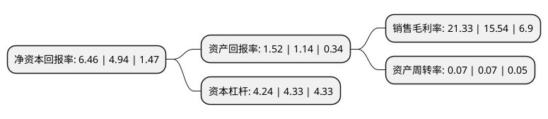

> 本页面由自动化程序生成于 2022年5月20日 01:31
> 内容可能存在错误，如有bug请提交issue至：https://github.com/Eroleice/doc-pi/issues
{.is-warning}

# 上市公司基本情况

## 基本资料

光大证券股份有限公司（以下简称“光大证券”）成立于1996年04月23日，上海市。于2009年08月18日在上交所主板上市。

光大证券注册资本461,078.764万元，证券经纪业务，投资银行业务，证券投资业务及资产管理业务以下是详细信息：

- 公司名称: 光大证券股份有限公司
- 股票代码: 601788.SH
- 所在地: 上海 - 上海市
- 成立日期: 1996年04月23日
- 注册资本: 461,078.764万元
- 法定代表人: 刘秋明
- 主营业务: 证券经纪业务，投资银行业务，证券投资业务及资产管理业务
- 公司官网: www.ebscn.com
- 公司介绍: 光大证券股份有限公司成立于1996年，总部位于上海，是中国证监会批准的首批三家创新试点证券公司之一，也是世界500强企业——中国光大集团股份公司的核心金融服务平台之一。光大证券先后于2009年8月18日和2016年8月18日分别在上海证券交易所及香港联合交易所主板上市(股票代码：601788.SH/06178.HK)，是一家A+H股上市券商。成立25年来，光大证券经历和见证了中国资本市场从无到有、发展创新和改革开放的历程。受益于光大集团的协同效应和品牌优势，光大证券各业务条线均衡发展，各业务板块相互协同，形成了较为完整的产品链，主要业务居行业前列。公司围绕零售客户、机构客户、企业客户等市场主体，构建财富管理、企业融资、机构客户、投资交易、资产管理、股权投资六大业务集群，通过分布于中国内地及港澳地区的分支机构与子公司，向客户提供全方面的综合金融服务。公司于2016年首次入选《财富》中国500强，曾连续三年蝉联“年度最佳证券公司”，连续四年跻身“亚洲品牌500强”和“中国品牌500强”，荣获“2020金融创新百强”“2020年度本土最佳投行”荣誉称号，品牌知名度和社会影响力持续提升。

## 股东及高管情况

上市公司第一大股东为中国光大集团股份公司，持股1,159,456,183股，占比25.15%，**疑似为**上市公司实际控制人。

截至2022年03月31日，上市公司的前十大股东中，共有2名机构股东，8个产品账户，其中5%以上大股东共有1名。上市公司前十大股东明细如下：

> 未能通过持股比例判定出上市公司实际控制人（持股30%以上）
> 可能存在通过间接持股、联合持股、协议控制等方式拥有实际控制权的主体，具体请参考上市公司定期公告！
{.is-warning}

> 截至2022年03月31日，上市公司前十大股东信息如下：

| 股东名称 | 持股数量（股） | 持股比例 |
| --- | --- | --- |
| 中国光大集团股份公司 | 1,159,456,183 | 25.15% |
| 中国证券金融股份有限公司 | 130,090,372 | 2.82% |
| 中国建设银行股份有限公司-国泰中证全指证券公司交易型开放式指数证券投资基金 | 34,325,545 | 0.74% |
| 工银瑞信基金-农业银行-工银瑞信中证金融资产管理计划 | 24,431,977 | 0.53% |
| 博时基金-农业银行-博时中证金融资产管理计划 | 22,716,500 | 0.49% |
| 广发基金-农业银行-广发中证金融资产管理计划 | 22,716,500 | 0.49% |
| 华夏基金-农业银行-华夏中证金融资产管理计划 | 22,716,500 | 0.49% |
| 银华基金-农业银行-银华中证金融资产管理计划 | 22,716,500 | 0.49% |
| 嘉实基金-农业银行-嘉实中证金融资产管理计划 | 22,716,500 | 0.49% |
| 大成基金-农业银行-大成中证金融资产管理计划 | 22,716,500 | 0.49% |

## 利润表分析

上市公司2021年总收入为167.06亿元，净利润为35.63亿元，实现盈利。

## 杜邦分析

> 数据列示周期：2021年 | 2020年 | 2019年
{.is-info}

上市公司的净资产收益率在近一年有所上升，上升幅度为30.77%，其变化情况分解如下：
- 上市公司的销售毛利率在近一年上升了37.26%，可能是生产效率的提升、商品原材料价格下跌或商品价格的上涨所致。
- 上市公司的资产周转率在近一年下降了0%，可能是源自于更慢的销售回款或库存管理效果下降。
- 上市公司的财务杠杆比率在近一年下降了-2.08%，可能是减少负债降低财务费用。

