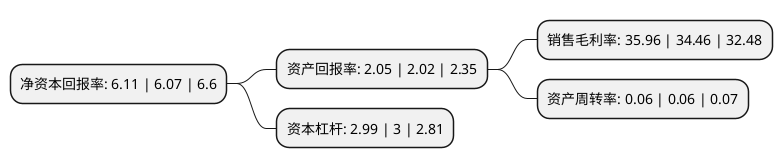

> 本页面由自动化程序生成于 2022年5月20日 01:32
> 内容可能存在错误，如有bug请提交issue至：https://github.com/Eroleice/doc-pi/issues
{.is-warning}

# 上市公司基本情况

## 基本资料

南京证券股份有限公司（以下简称“南京证券”）成立于1990年11月23日，南京市。于2018年06月13日在上交所主板上市。

南京证券注册资本368,636.103万元，主营业务:证券经纪，证券自营，资产管理，投资银行，信用交易等业务。以下是详细信息：

- 公司名称: 南京证券股份有限公司
- 股票代码: 601990.SH
- 所在地: 江苏 - 南京市
- 成立日期: 1990年11月23日
- 注册资本: 368,636.103万元
- 法定代表人: 李剑锋
- 主营业务: 主营业务:证券经纪，证券自营，资产管理，投资银行，信用交易等业务
- 公司官网: www.njzq.com.cn
- 公司介绍: 公司历经多年已逐步成长为一家总部在南京的全国性、综合类证券公司，先后成为全国首批规范类证券公司和创新试点类证券公司。业务范围涵盖证券经纪、证券承销与保荐、证券自营、证券资产管理、信用交易、场外市场、金融衍生品、互联网金融等诸多领域拥有宁证期货(原南证期货)、富安达基金、巨石创投、宁夏股权托管交易中心等成员企业，形成了覆盖证券、期货、基金、私募股权投资、股权托管交易等较为完整的证券金融产业链。公司先后成为证券行业首家“全国文明单位”、首家“全国五一劳动奖状”获得单位，并荣获“全国企业文化优秀奖”、“江苏省文明单位标兵”、“江苏省国有企业‘四好’领导班子先进集体”、“江苏省先进基层党组织”等荣誉称号，形成并彰显“正统、正规、正道”的企业文化。

## 股东及高管情况

上市公司第一大股东为南京紫金投资集团有限责任公司，持股921,952,751股，占比25.01%，**疑似为**上市公司实际控制人。

截至2022年03月31日，上市公司的前十大股东中，共有10名机构股东，其中5%以上大股东共有3名。上市公司前十大股东明细如下：

> 未能通过持股比例判定出上市公司实际控制人（持股30%以上）
> 可能存在通过间接持股、联合持股、协议控制等方式拥有实际控制权的主体，具体请参考上市公司定期公告！
{.is-warning}

> 截至2022年03月31日，上市公司前十大股东信息如下：

| 股东名称 | 持股数量（股） | 持股比例 |
| --- | --- | --- |
| 南京紫金投资集团有限责任公司 | 921,952,751 | 25.01% |
| 南京新工投资集团有限责任公司 | 258,475,359 | 7.01% |
| 南京市交通建设投资控股(集团)有限责任公司 | 240,672,576 | 6.53% |
| 江苏凤凰置业有限公司 | 174,272,700 | 4.73% |
| 南京紫金资产管理有限公司 | 117,454,975 | 3.19% |
| 南京市国有资产经营有限责任公司 | 61,212,128 | 1.66% |
| 南京农垦产业(集团)有限公司 | 61,142,302 | 1.66% |
| 南京颐悦置业发展有限公司 | 60,000,000 | 1.63% |
| 南京东南国资投资集团有限责任公司 | 53,286,093 | 1.45% |
| 南京港(集团)有限公司 | 48,152,468 | 1.31% |

## 利润表分析

上市公司2021年总收入为27.41亿元，净利润为9.85亿元，实现盈利。

## 杜邦分析

> 数据列示周期：2021年 | 2020年 | 2019年
{.is-info}

上市公司的净资产收益率在近一年有所上升，上升幅度为0.66%，其变化情况分解如下：
- 上市公司的销售毛利率在近一年上升了4.35%，可能是生产效率的提升、商品原材料价格下跌或商品价格的上涨所致。
- 上市公司的资产周转率在近一年下降了0%，可能是源自于更慢的销售回款或库存管理效果下降。
- 上市公司的财务杠杆比率在近一年下降了-0.33%，可能是减少负债降低财务费用。

