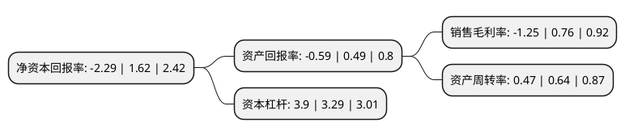

> 本页面由自动化程序生成于 2022年5月20日 01:07
> 内容可能存在错误，如有bug请提交issue至：https://github.com/Eroleice/doc-pi/issues
{.is-warning}

# 上市公司基本情况

## 基本资料

步步高商业连锁股份有限公司（以下简称“步步高”）成立于2003年12月11日，湘潭市。于2008年06月19日在深交所中小板上市。

步步高注册资本86,390.395万元，商品零售业务。以下是详细信息：

- 公司名称: 步步高商业连锁股份有限公司
- 股票代码: 002251.SZ
- 所在地: 湖南 - 湘潭市
- 成立日期: 2003年12月11日
- 注册资本: 86,390.395万元
- 法定代表人: 王填
- 主营业务: 商品零售业务
- 公司官网: www.bbg.com.cn
- 公司介绍: 公司于2008年在深交所上市，成为中国民营连锁超市企业首家上市公司。是中国连锁20强、中国快消品连锁10强。公司属于商品零售行业。主要经营活动为超市、百货、电器等生活消费品的销售。近年来，步步高开启O+O战略，打通线上，回归实体，重建全球供应链，并逐渐向数字化企业转型。2013年，步步高进军电商领域。2015年，步步高开启全球化战略，整合全球供应链资源，目前已在北美洲、欧洲、亚洲、大洋洲设立六大全球采购中心，在商品、物流、仓储、分销等方面建立了完整的供应链体系。公司与众多国际、国内名优品牌供应商建立了良好的合作关系，为公司连锁经营的发展提供了稳定、充足、高品质的商品供应保证。

## 股东及高管情况

上市公司第一大股东为步步高投资集团股份有限公司，持股302,241,133股，占比34.99%，为上市公司实际控制人。

截至2022年04月20日，上市公司的前十大股东中，共有4名自然人股东，5名机构股东，1个产品账户，其中5%以上大股东共有7名。上市公司前十大股东明细如下：

> 截至2022年04月20日，上市公司前十大股东信息如下：

| 股东名称 | 持股数量（股） | 持股比例 |
| --- | --- | --- |
| 步步高投资集团股份有限公司 | 302,241,133 | 34.99% |
| 步步高投资集团股份有限公司 | 302,241,133 | 34.99% |
| 步步高投资集团股份有限公司 | 302,241,133 | 34.99% |
| 张海霞 | 51,958,322 | 6.01% |
| 张海霞 | 51,958,322 | 6.01% |
| 张海霞 | 51,958,322 | 6.01% |
| 林芝腾讯科技有限公司 | 51,834,237 | 6% |
| 江苏京东邦能投资管理有限公司 | 43,195,198 | 5% |
| 蔡金兴 | 4,414,300 | 0.51% |
| 南方基金-农业银行-南方中证金融资产管理计划 | 2,862,000 | 0.33% |

## 杜邦分析

> 数据列示周期：2021年 | 2020年 | 2019年
{.is-info}

上市公司的净资产收益率在近一年有所下降，下降幅度为-241.36%，其变化情况分解如下：
- 上市公司的销售毛利率在近一年下降了-264.47%，可能是生产效率的下降、商品原材料价格上涨或商品价格的下跌所致。
- 上市公司的资产周转率在近一年下降了-26.56%，可能是源自于更慢的销售回款或库存管理效果下降。
- 上市公司的财务杠杆比率在近一年上升了18.54%，可能是增加负债扩大生产规模。

