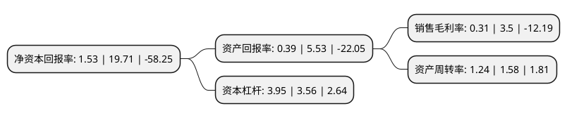

> 本页面由自动化程序生成于 2022年5月20日 01:07
> 内容可能存在错误，如有bug请提交issue至：https://github.com/Eroleice/doc-pi/issues
{.is-warning}

# 上市公司基本情况

## 基本资料

新华都购物广场股份有限公司（以下简称“新华都”）成立于2004年05月17日，厦门市。于2008年07月31日在深交所中小板上市。

新华都注册资本68,456.388万元，大卖场，综合超市及百货的连锁经营。以下是详细信息：

- 公司名称: 新华都购物广场股份有限公司
- 股票代码: 002264.SZ
- 所在地: 福建 - 厦门市
- 成立日期: 2004年05月17日
- 注册资本: 68,456.388万元
- 法定代表人: 倪国涛
- 主营业务: 大卖场，综合超市及百货的连锁经营
- 公司官网: www.nhd-mart.com
- 公司介绍: 公司是福建省大卖场、综合超市以及百货连锁经营行业的龙头企业，主要从事大卖场、综合超市及百货的连锁经营。凭借快速发展而取得的规模优势以及高效便捷的信息操作体系，新华都正逐步建立起具有自身特色的全省性的现代物流配送系统，并通过不断的完善与改进，以优化、改造农产品流通渠道和DC流通方式，建立起可追溯的农产品质量信息安全管理体系，推动了食品安全控制体系的建设，提升食品卫生管理水平，为周边数十万消费者提供健康、安全与超值的日常用品。2016年，公司收购久爱致和100%股权,久爱天津100%股权和泸州致和100%股权，三家公司提供以效果营销为核心电商运营服务，熟悉所服务行业的产业链后开始为供应商提供互联网全渠道销售(主要是B2B)，最后利用互联网销售积累的数据，以互联网消费者需求为核心，与供应商等相关方合作制定产品，并实现定制化产品互联网独家销售。

## 股东及高管情况

上市公司第一大股东为新华都实业集团股份有限公司，持股126,607,339股，占比18.49%，**疑似为**上市公司实际控制人。

截至2022年03月31日，上市公司的前十大股东中，共有5名自然人股东，3名机构股东，2个产品账户，其中5%以上大股东共有4名。上市公司前十大股东明细如下：

> 未能通过持股比例判定出上市公司实际控制人（持股30%以上）
> 可能存在通过间接持股、联合持股、协议控制等方式拥有实际控制权的主体，具体请参考上市公司定期公告！
{.is-warning}

> 截至2022年03月31日，上市公司前十大股东信息如下：

| 股东名称 | 持股数量（股） | 持股比例 |
| --- | --- | --- |
| 新华都实业集团股份有限公司 | 126,607,339 | 18.49% |
| 倪国涛 | 86,074,988 | 12.57% |
| 陈发树 | 58,778,367 | 8.59% |
| 福建新华都投资有限责任公司 | 42,282,000 | 6.18% |
| 阿里巴巴(成都)软件技术有限公司 | 34,228,194 | 5% |
| 杭州瀚云新领股权投资基金合伙企业(有限合伙) | 34,228,194 | 5% |
| 洪泽君 | 34,000,000 | 4.97% |
| 陈志勇 | 17,415,172 | 2.54% |
| 新华都购物广场股份有限公司-第二期员工持股计划 | 10,380,003 | 1.52% |
| 黄建武 | 9,681,600 | 1.41% |

## 利润表分析

上市公司2021年总收入为50.32亿元，净利润为0.15亿元，实现盈利。

## 杜邦分析

> 数据列示周期：2021年 | 2020年 | 2019年
{.is-info}

上市公司的净资产收益率在近一年有所下降，下降幅度为-92.24%，其变化情况分解如下：
- 上市公司的销售毛利率在近一年下降了-91.14%，可能是生产效率的下降、商品原材料价格上涨或商品价格的下跌所致。
- 上市公司的资产周转率在近一年下降了-21.52%，可能是源自于更慢的销售回款或库存管理效果下降。
- 上市公司的财务杠杆比率在近一年上升了10.96%，可能是增加负债扩大生产规模。

