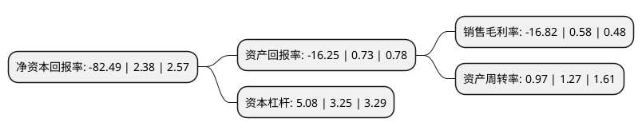

> 本页面由自动化程序生成于 2022年5月20日 01:08
> 内容可能存在错误，如有bug请提交issue至：https://github.com/Eroleice/doc-pi/issues
{.is-warning}

# 上市公司基本情况

## 基本资料

人人乐连锁商业集团股份有限公司（以下简称“人人乐”）成立于1996年04月01日，深圳市。于2010年01月13日在深交所中小板上市。

人人乐注册资本44,000万元，主营业务:从事大卖场，综合超市及百货的连锁经营业务。以下是详细信息：

- 公司名称: 人人乐连锁商业集团股份有限公司
- 股票代码: 002336.SZ
- 所在地: 广东 - 深圳市
- 成立日期: 1996年04月01日
- 注册资本: 44,000万元
- 法定代表人: 何浩
- 主营业务: 主营业务:从事大卖场，综合超市及百货的连锁经营业务
- 公司官网: www.renrenle.cn
- 公司介绍: 公司前身为深圳市人人乐连锁商业有限公司，成立于1996年4月。公司的主营业务为商品零售连锁经营，通过自营大卖场、精品超市Le super、社区生活超市Le life、社区生鲜超市Le fresh、百货及购物中心，配合人人乐购商务平台、人人乐园APP等公司自主研发的线上销售平台，共同经营生鲜、食品、洗化、日杂、针纺、百货、家电等类别商品。公司经过多年的发展，实现了立足深圳，面向广东，走向全国的初衷，已成为一个获得中国驰名商标的跨区域、全国性的知名零售上市企业。良好的商业运营管理和顾客服务水平，赢得了消费者和市场的认可与美誉，成为零售行业优秀品牌。此外，公司与互联网巨头企业合作，实现优势互补，全面推动新零售经营模式，促进多业态协同发展。

## 股东及高管情况

上市公司第一大股东为深圳市浩明投资控股集团有限公司，持股100,579,100股，占比22.86%，**疑似为**上市公司实际控制人。

截至2022年03月31日，上市公司的前十大股东中，共有7名自然人股东，3名机构股东，其中5%以上大股东共有5名。上市公司前十大股东明细如下：

> 未能通过持股比例判定出上市公司实际控制人（持股30%以上）
> 可能存在通过间接持股、联合持股、协议控制等方式拥有实际控制权的主体，具体请参考上市公司定期公告！
{.is-warning}

> 截至2022年03月31日，上市公司前十大股东信息如下：

| 股东名称 | 持股数量（股） | 持股比例 |
| --- | --- | --- |
| 深圳市浩明投资控股集团有限公司 | 100,579,100 | 22.86% |
| 西安曲江文化产业投资(集团)有限公司 | 93,038,866 | 21.15% |
| 何金明 | 89,100,000 | 20.25% |
| 深圳市人人乐咨询服务有限公司 | 26,400,000 | 6% |
| 张政 | 23,600,000 | 5.36% |
| 王坚宏 | 5,426,791 | 1.23% |
| 徐贤笑 | 2,420,000 | 0.55% |
| 李志军 | 2,242,300 | 0.51% |
| 徐开东 | 1,746,330 | 0.4% |
| 王秀荣 | 1,732,500 | 0.39% |

## 利润表分析

上市公司2021年总收入为50.95亿元，净利润为-8.58亿元，**未实现盈利**。

## 杜邦分析

> 数据列示周期：2021年 | 2020年 | 2019年
{.is-info}

上市公司的净资产收益率在近一年有所下降，下降幅度为-3565.97%，其变化情况分解如下：
- 上市公司的销售毛利率在近一年下降了-3000%，可能是生产效率的下降、商品原材料价格上涨或商品价格的下跌所致。
- 上市公司的资产周转率在近一年下降了-23.62%，可能是源自于更慢的销售回款或库存管理效果下降。
- 上市公司的财务杠杆比率在近一年上升了56.31%，可能是增加负债扩大生产规模。

