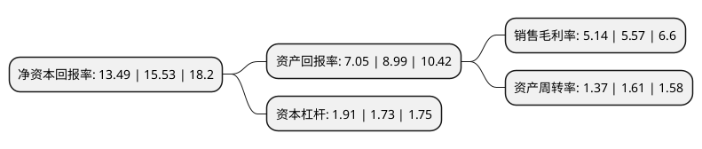

> 本页面由自动化程序生成于 2022年5月20日 01:11
> 内容可能存在错误，如有bug请提交issue至：https://github.com/Eroleice/doc-pi/issues
{.is-warning}

# 上市公司基本情况

## 基本资料

成都红旗连锁股份有限公司（以下简称“红旗连锁”）成立于2000年06月22日，成都市。于2012年09月05日在深交所中小板上市。

红旗连锁注册资本136,000万元，主营业务为便利超市的连锁经营。以下是详细信息：

- 公司名称: 成都红旗连锁股份有限公司
- 股票代码: 002697.SZ
- 所在地: 四川 - 成都市
- 成立日期: 2000年06月22日
- 注册资本: 136,000万元
- 法定代表人: 曹世如
- 主营业务: 主营业务为便利超市的连锁经营
- 公司官网: www.hqls.com
- 公司介绍: 公司是中国西部地区最具规模的以连锁经营、物流配送、电子商务为一体的商业连锁企业。主营业务为便利超市的连锁经营，有日用百货，烟酒，食品等业务。为给广大消费者带来更加轻松便捷的生活享受，公司勇担责任、创新发展，利用公司庞大的市场网络和信息技术资源优势，采用商品+服务经营策略，率先致力于多功能便民服务平台建设。目前已开展公交卡消费和充值、电信缴费、电费充值、燃气收费等多项便民服务。公司充分利用大数据、云平台，实现数据分析可视化、移动化、动态智能化，不断满足消费升级的需求。公司曾荣获中国服务业企业500强、全国商业企业百强、中国零售百强企业等荣誉称号。

## 股东及高管情况

上市公司第一大股东为曹世如，持股327,420,000股，占比24.08%，**疑似为**上市公司实际控制人。

截至2022年03月31日，上市公司的前十大股东中，共有3名自然人股东，2名机构股东，4个产品账户，1个海外主体，其中5%以上大股东共有2名。上市公司前十大股东明细如下：

> 未能通过持股比例判定出上市公司实际控制人（持股30%以上）
> 可能存在通过间接持股、联合持股、协议控制等方式拥有实际控制权的主体，具体请参考上市公司定期公告！
{.is-warning}

> 截至2022年03月31日，上市公司前十大股东信息如下：

| 股东名称 | 持股数量（股） | 持股比例 |
| --- | --- | --- |
| 曹世如 | 327,420,000 | 24.08% |
| 永辉超市股份有限公司 | 285,600,000 | 21% |
| 曹曾俊 | 48,280,000 | 3.55% |
| 中民财智有限公司 | 32,560,710 | 2.39% |
| 香港中央结算有限公司(陆股通) | 18,154,276 | 1.33% |
| 方金格 | 12,590,000 | 0.93% |
| 中国银行股份有限公司-嘉实沪港深精选股票型证券投资基金 | 10,235,249 | 0.75% |
| 中国建设银行股份有限公司-嘉实新消费股票型证券投资基金 | 9,532,232 | 0.7% |
| 中国银行股份有限公司-嘉实瑞享定期开放灵活配置混合型证券投资基金 | 8,706,409 | 0.64% |
| 中国工商银行股份有限公司-嘉实瑞成两年持有期混合型证券投资基金 | 8,273,912 | 0.61% |

## 利润表分析

上市公司2021年总收入为93.51亿元，净利润为4.8亿元，实现盈利。

## 杜邦分析

> 数据列示周期：2021年 | 2020年 | 2019年
{.is-info}

上市公司的净资产收益率在近一年有所下降，下降幅度为-13.14%，其变化情况分解如下：
- 上市公司的销售毛利率在近一年下降了-7.72%，可能是生产效率的下降、商品原材料价格上涨或商品价格的下跌所致。
- 上市公司的资产周转率在近一年下降了-14.91%，可能是源自于更慢的销售回款或库存管理效果下降。
- 上市公司的财务杠杆比率在近一年上升了10.4%，可能是增加负债扩大生产规模。

