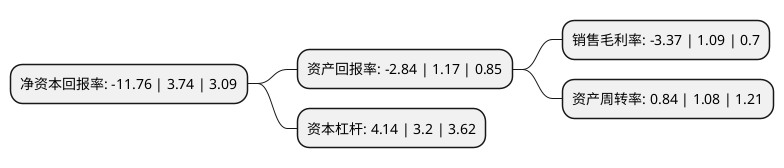

> 本页面由自动化程序生成于 2022年5月20日 01:26
> 内容可能存在错误，如有bug请提交issue至：https://github.com/Eroleice/doc-pi/issues
{.is-warning}

# 上市公司基本情况

## 基本资料

北京华联综合超市股份有限公司（以下简称“华联综超”）成立于1996年06月07日，北京市。于2001年11月29日在上交所主板上市。

华联综超注册资本66,580.792万元，主要业务:经营大型综合超市和百货店。以下是详细信息：

- 公司名称: 北京华联综合超市股份有限公司
- 股票代码: 600361.SH
- 所在地: 北京 - 北京市
- 成立日期: 1996年06月07日
- 注册资本: 66,580.792万元
- 法定代表人: 陈琳
- 主营业务: 经营大型综合超市和百货店
- 公司官网: zc.beijing-hualian.com
- 公司介绍: 公司为一家全国性扩张的超市连锁企业，主营大型综合连锁超市和生鲜超市，在全国多个省市均拥有店面，向顾客提供物美价廉，品质优良的生鲜、食品、百货等民生必需品，经营品项多种多样。生鲜业务作为经营的核心，公司建立了生鲜商品基地及生鲜加工配送中心，直接采购上柜，保证了生鲜商品价格低廉、新鲜美味。公司还建立了全国连锁超市的VPN网络信息系统，实现全国门店销售数据的实时通讯，为加强预测及正确决策提供保障。

## 股东及高管情况

上市公司第一大股东为北京华联集团投资控股有限公司，持股194,195,951股，占比29.17%，**疑似为**上市公司实际控制人。

截至2022年03月31日，上市公司的前十大股东中，共有6名自然人股东，4名机构股东，其中5%以上大股东共有3名。上市公司前十大股东明细如下：

> 未能通过持股比例判定出上市公司实际控制人（持股30%以上）
> 可能存在通过间接持股、联合持股、协议控制等方式拥有实际控制权的主体，具体请参考上市公司定期公告！
{.is-warning}

> 截至2022年03月31日，上市公司前十大股东信息如下：

| 股东名称 | 持股数量（股） | 持股比例 |
| --- | --- | --- |
| 北京华联集团投资控股有限公司 | 194,195,951 | 29.17% |
| 海南亿雄商业投资管理有限公司 | 90,248,350 | 13.55% |
| 洋浦万利通科技有限公司 | 78,063,470 | 11.72% |
| 陈素青 | 8,026,301 | 1.21% |
| 北京华联商厦股份有限公司 | 3,549,000 | 0.53% |
| 孙海涛 | 3,350,000 | 0.5% |
| 沈成荣 | 2,575,100 | 0.39% |
| 周学红 | 2,495,500 | 0.37% |
| 李继芳 | 2,207,600 | 0.33% |
| 靖鸽 | 1,813,600 | 0.27% |

## 利润表分析

上市公司2021年总收入为83.53亿元，净利润为-2.82亿元，**未实现盈利**。

## 杜邦分析

> 数据列示周期：2021年 | 2020年 | 2019年
{.is-info}

上市公司的净资产收益率在近一年有所下降，下降幅度为-414.44%，其变化情况分解如下：
- 上市公司的销售毛利率在近一年下降了-409.17%，可能是生产效率的下降、商品原材料价格上涨或商品价格的下跌所致。
- 上市公司的资产周转率在近一年下降了-22.22%，可能是源自于更慢的销售回款或库存管理效果下降。
- 上市公司的财务杠杆比率在近一年上升了29.37%，可能是增加负债扩大生产规模。

