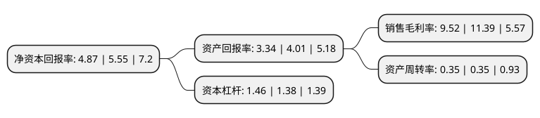

> 本页面由自动化程序生成于 2022年5月20日 01:30
> 内容可能存在错误，如有bug请提交issue至：https://github.com/Eroleice/doc-pi/issues
{.is-warning}

# 上市公司基本情况

## 基本资料

文峰大世界连锁发展股份有限公司（以下简称“文峰股份”）成立于1995年09月27日，南通市。于2011年06月03日在上交所主板上市。

文峰股份注册资本184,800万元，公司的主营业务是百货，超市及电器专业销售店的连锁经营业务。公司的主要运营方式是在大型商场中组合经营百货，超市(包括精品超市或综合超市)和电器专业销售三种业态，同时也以单店运营方式经营综合超市和电器专业销售店。以下是详细信息：

- 公司名称: 文峰大世界连锁发展股份有限公司
- 股票代码: 601010.SH
- 所在地: 江苏 - 南通市
- 成立日期: 1995年09月27日
- 注册资本: 184,800万元
- 法定代表人: 贾云博
- 主营业务: 公司的主营业务是百货，超市及电器专业销售店的连锁经营业务公司的主要运营方式是在大型商场中组合经营百货，超市(包括精品超市或综合超市)和电器专业销售三种业态，同时也以单店运营方式经营综合超市和电器专业销售店
- 公司官网: www.wfdsj.cn
- 公司介绍: 公司是南通市领先的零售企业，也是江苏省领先的零售企业之一，主要从事百货、超市、电器销售专业店的连锁经营业务。公司主要经营地为江苏省南通市和上海市，服务于二、三线城市和一线城市的成熟社区，现有多家直营门店，分布于华东沿海地区的上海、南通、盐城、泰州、连云港、扬州等多个市县，旗下拥有以“文峰大世界”为品牌的百货商场、以“文峰千家惠”为品牌的大型卖场、以“文峰电器”为品牌的电器店、以“文峰超市”为品牌的超市店。励精图治求发展，公司先后获得“全国文明单位”、“全国商务系统先进集体”、“全国实施满意工程先进单位”、“百城万店无假货全国示范店”、“中国商业名牌企业”、“全国工人先锋号”等多项殊荣。

## 股东及高管情况

上市公司第一大股东为江苏文峰集团有限公司，持股544,724,567股，占比29.48%，**疑似为**上市公司实际控制人。

截至2022年03月31日，上市公司的前十大股东中，共有8名自然人股东，2名机构股东，其中5%以上大股东共有3名。上市公司前十大股东明细如下：

> 未能通过持股比例判定出上市公司实际控制人（持股30%以上）
> 可能存在通过间接持股、联合持股、协议控制等方式拥有实际控制权的主体，具体请参考上市公司定期公告！
{.is-warning}

> 截至2022年03月31日，上市公司前十大股东信息如下：

| 股东名称 | 持股数量（股） | 持股比例 |
| --- | --- | --- |
| 江苏文峰集团有限公司 | 544,724,567 | 29.48% |
| 郑素贞 | 275,000,000 | 14.88% |
| 张泉 | 150,000,000 | 8.12% |
| 中央汇金资产管理有限责任公司 | 21,950,000 | 1.19% |
| 杜瑞萍 | 6,650,000 | 0.36% |
| 汪杰 | 5,177,123 | 0.28% |
| 郭强 | 3,395,450 | 0.18% |
| 陈蘸木 | 3,254,825 | 0.18% |
| 刘豪廷 | 2,866,300 | 0.16% |
| 洪国粦 | 2,635,500 | 0.14% |

## 利润表分析

上市公司2021年总收入为24.73亿元，净利润为2.35亿元，实现盈利。

## 杜邦分析

> 数据列示周期：2021年 | 2020年 | 2019年
{.is-info}

上市公司的净资产收益率在近一年有所下降，下降幅度为-12.25%，其变化情况分解如下：
- 上市公司的销售毛利率在近一年下降了-16.42%，可能是生产效率的下降、商品原材料价格上涨或商品价格的下跌所致。
- 上市公司的资产周转率在近一年下降了0%，可能是源自于更慢的销售回款或库存管理效果下降。
- 上市公司的财务杠杆比率在近一年上升了5.8%，可能是增加负债扩大生产规模。

